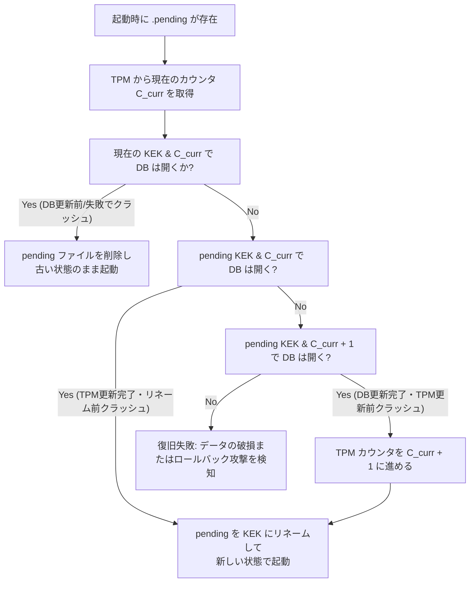

<!--
  本書は at-rest レイヤの anti-rollback（巻き戻し）保護の設計依頼を Gemini(agy) に
  出した成果物です（人手レビュー前のドラフト）。SECURITY_PROFILE.md §7.5 の
  「anti-rollback 不在」の将来作業に対応します。実装着手前に、本書の前提が現行
  コード（src/group/at_rest.rs, src/key/tpm.rs, src/network/inbox.rs）と一致するか
  検証してください。
-->

# 設計提案書: at-rest レイヤにおける anti-rollback（巻き戻し）保護対策

本ドキュメントは、`nkCryptoTool-rust` プロジェクトにおける at-rest ストレージへのロールバック（巻き戻し）攻撃に対処するための、暗号学的・ハードウェア的防衛メカニズムの設計提案書です。

---

## 1. 脅威モデルの精緻化

攻撃者がローカルストレージディレクトリへの書き込み権限を持っている場合、過去の暗号的に整合した状態（`groups.db`、`groups.db.kek`、`at-rest.key` の一式）で現在のファイルを丸ごと置き換える「巻き戻し（ロールバック）攻撃」が可能になります。

攻撃者の能力を以下の3段階に分類し、それぞれの対策限界を定義します。

### レベル1: 読み取り専用攻撃者 (Read-Only Adversary)
*   **前提条件**: ストレージディレクトリの読み取り権限（物理的持ち出し、バックアップの窃取など）を持つが、書き込み・変更権限はない。
*   **防御状況**: **既存の at-rest アーキテクチャで完全に防御済み**。X-Wing (X25519 + ML-KEM-768) および AES-256-GCM により、鍵およびパスフレーズなしでの解読は不可能です。

### レベル2: 書き込み権限を持つ攻撃者 (Snapshot / Write Adversary)
*   **前提条件**: ストレージディレクトリ内のファイルを自由に書き換え可能。過去の正当な一式（スナップショット）で現在のファイルを上書きできる。パスフレーズ自体は知らない。
*   **防御状況**: **既存の at-rest アーキテクチャでは防御不可能**。過去の一式は内部的に完全に整合しているため、アプリケーションはそれを「正当な最新状態」と誤認して起動し、失効した鍵の復活や削除メッセージの復元、除名したはずのメンバーの復活などの被害が発生します。
*   **本設計の主目標**: このレベルの攻撃を検知・防御すること。

### レベル3: ハードウェア操作・プラットフォーム特権を持つ攻撃者 (Hardware-Present / System-compromised Adversary)
*   **前提条件**: デバイスへの物理アクセス権、またはOSのルート（管理者）権限を持つ。TPM 2.0 への直接アクセスや、TPM リセット、NV インデックスの強制消去が可能。
*   **防御状況**: ハードウェア root を導入することで、ストレージディレクトリの上書きだけでは巻き戻せなくなります。ただし、TPM チップ自体の物理的な解析や、管理者権限によるプラットフォームの完全な侵害に対しては防御に限界があります。

---

## 2. 設計候補の比較と評価

anti-rollback を実現するための 4 つの設計アプローチを比較します。

| 評価軸 | 案A: TPM NV 単調カウンタと KEK 結合 (推奨) | 案B: OSキーストアでの状態管理 | 案C: リモートチェックポイント (Inbox) | 案D: ソフトウェア単体検知 (分散メタデータ) |
| :--- | :--- | :--- | :--- | :--- |
| **保護強度** | **極めて高い** (ハードウェア強制) | **高い** (ディレクトリ分離) | **極めて高い** (独立信頼境界) | **低い** (ディレクトリ分離のみ) |
| **移植性** | **中** (OS/ハードウェア依存) | **中** (デスクトップOS依存) | **極めて高い** (ネットワーク依存) | **極めて高い** (ファイルシステムのみ) |
| **実装コスト** | **中** (CLI経由のTPM制御) | **高** (マルチプラットフォーム API) | **高** (同期プロトコル拡張) | **低い** (ローカルファイル制御) |
| **クラッシュ安全性** | **高** (復旧アルゴリズムで確保) | **低** (アトミック更新が困難) | **高** (サーバ側での整合性保証) | **中** (複数ファイルの不整合リスク) |
| **ハードウェア依存** | **あり** (TPM 2.0) | **なし** (OS API依存) | **なし** (ネットワーク依存) | **なし** |
| **UX影響** | **なし** | **中** (認証ダイアログ表示等) | **高** (オフライン起動の制限) | **なし** |

### 各案の評価詳細

*   **案A（TPM NV 単調カウンタ結合）**: TPM 2.0 の単調カウンタをインクリメントし、その値を KEK の HPKE `info` または AAD に組み込みます。ハードウェアがカウントアップを保証するため、過去の KEK を持ち込んでも復号できず、最も強固なローカル保護を提供します。
*   **案B（OSキーストア管理）**: デスクトップ向けの Keychain や DPAPI 等にバージョンを保存します。しかし、ヘッドレスサーバー（`inbox`）など GUI のない環境では動作しないか、ユーザーセッションが乗っ取られた場合に容易に書き換えられてしまう弱点があります。
*   **案C（リモートチェックポイント）**: `inbox` サーバーやピアが「最新のエポック」を記憶し、起動時に突合します。オンライン時は最強の防衛策ですが、完全なオフライン起動時に機能しない、または起動を制限するという UX 上のトレードオフが発生します。
*   **案D（ソフトウェア単体検知）**: ホームディレクトリの別領域（`~/.config/nkct/rollback.meta` など）に隠しエポックを保存します。同一ストレージ内のスナップショット差し替えには有効ですが、攻撃者がシステム全体のスナップショットを戻した場合、防ぐことができません。

---

## 3. 推奨設計とデータフォーマットの拡張

### ハイブリッドアプローチ (推奨案)
**「案A: TPM NV 単調カウンタと KEK 結合」を主軸**とし、TPM非搭載時のフォールバックとして**「案C: リモートチェックポイント」および「案D: ソフトウェア単体検知」を組み合わせたグレースフルデグレード**を推奨します。

### KEK フォーマットおよび binding ロジックの拡張

現在の KEK バージョン `0x02`（per-DB binding）を `0x03`（TPM Counter Binding）へ拡張します。

```text
  [KEK ファイルフォーマット (version 0x03)]
  offset size  field
    0    8     magic = b"NKCT-KEK"
    8    1     version = 0x03 (TPM Counter Bound)
    9    1     suite   = 0x02 (X-Wing X25519+ML-KEM-768 + AES-256-GCM)
   10    ...   MLS-codec encoded HpkeCiphertext
```

#### 暗号的結合ロジック
HPKE の `info` パラメータ（`db_binding`）に、現在の TPM NV カウンタ値（u64）を結合します。

```rust
// info 構築ロジックの拡張
fn db_binding_v3(db_path: &Path, counter_value: u64) -> Vec<u8> {
    let mut binding = Vec::new();
    binding.extend_from_slice(HPKE_INFO); // b"nkct-mls-at-rest-v1"
    
    // DBファイル名のバインド (KEK差し替え攻撃対策)
    let db_name = db_path.file_name().and_then(|n| n.to_str()).unwrap_or("");
    binding.extend_from_slice(db_name.as_bytes());
    
    // 単調カウンタ値のバインド (巻き戻し攻撃対策)
    binding.extend_from_slice(&counter_value.to_be_bytes());
    binding
}
```

これにより、攻撃者が過去の `groups.db.kek` をコピーして戻したとしても、TPM の現在カウンタ値が既に進んでいるため、`decapsulate_dek` 時の `info`（カウンタ値の不一致）が原因で HPKE AEAD 復号チェックが失敗し、DEK を解読できなくなります。

---

## 4. カウンタ更新と DB 書き込みの順序とクラッシュ安全性

TPM NV カウンタのインクリメント（不可逆）と、SQLCipher DB の暗号化（ロールバック可能なトランザクション）という 2 つの異なる物理リソースの更新順序において、クラッシュ安全性を担保する必要があります。

既存の `rotate_dek` における `.pending` ステージングパターンを拡張し、以下のライフサイクルで整合性を保ちます。

### REKEY (rotate_dek) 時のステップ

1.  **次期カウンタ値の決定**:
    TPM から現在のカウンタ値 $C_{curr}$ を読み取り、次期値 $C_{new} = C_{curr} + 1$ を決定する。
2.  **新 KEK のステージング**:
    $C_{new}$ をバインドした新 KEK を作成し、`groups.db.kek.pending` に書き出す。
3.  **SQLCipher DB の更新**:
    `PRAGMA rekey` を実行し、新 DEK で DB を再暗号化する。
4.  **TPM カウンタのインクリメント**:
    `tpm2_nvincrement` を実行し、TPM 側のカウンタ値を $C_{new}$ に進める。
5.  **KEK のアトミックプロモート**:
    `groups.db.kek.pending` を `groups.db.kek` にアトミックにリネームする。

### クラッシュからの復旧ロジック (finalize_pending_rekey)

起動時、`.pending` ファイルが存在する場合、以下のフローチャートに沿って自動復旧（ロールフォワードまたはロールバック）を行います。



#### 統合コードシグネチャ案 (src/group/at_rest.rs)

```rust
/// TPM NV カウンタを考慮したクラッシュ安全な REKEY 復旧
fn finalize_pending_rekey(
    paths: &AtRestPaths,
    at_rest_key: &AtRestKey,
    current_dek: Zeroizing<[u8; DEK_LEN]>,
) -> Result<Zeroizing<[u8; DEK_LEN]>, GroupError> {
    let pending = kek_pending_path(&paths.kek);
    if !pending.exists() || !paths.db.exists() || is_plaintext_sqlite(&paths.db) {
        return Ok(current_dek);
    }

    let c_curr = tpm::read_counter().map_err(|e| GroupError::Storage(e.to_string()))?;

    // パターン 1: DBはまだ古い DEK で開く (DB Rekey 前のクラッシュ)
    if dek_opens_db(&paths.db, &current_dek) {
        let _ = fs::remove_file(&pending);
        return Ok(current_dek);
    }

    let pending_bytes = fs::read(&pending)?;

    // パターン 2: TPM カウンタは既にインクリメントされていた場合 (インクリメント後・リネーム前のクラッシュ)
    if let Ok(pending_dek) = at_rest_key.decapsulate_dek(&pending_bytes, &db_binding_v3(&paths.db, c_curr)) {
        if dek_opens_db(&paths.db, &pending_dek) {
            fs::rename(&pending, &paths.kek)?;
            return Ok(pending_dek);
        }
    }

    // パターン 3: DB rekey は完了したが、TPM インクリメント前にクラッシュした場合
    let c_next = c_curr + 1;
    if let Ok(pending_dek) = at_rest_key.decapsulate_dek(&pending_bytes, &db_binding_v3(&paths.db, c_next)) {
        if dek_opens_db(&paths.db, &pending_dek) {
            // ロールフォワード: カウンタを進めてから KEK をプロモート
            tpm::increment_counter().map_err(|e| GroupError::Storage(e.to_string()))?;
            fs::rename(&pending, &paths.kek)?;
            return Ok(pending_dek);
        }
    }

    // いずれの方法でも DB が開かない場合
    Err(GroupError::Storage(
        "interrupted rekey recovery failed: rollback attack detected or database corrupted".into()
    ))
}
```

---

## 5. ハードウェア root 不在時の挙動とグレースフルデグレード

TPM が無効、あるいはデバイスパーミッションがない環境での動作ポリシーとフォールバック設計です。

### 動作ポリシー (NK_ROLLBACK_POLICY)
環境変数または設定ファイルで以下のポリシーを選択可能にします。

1.  **`Strict` (高セキュリティ要件)**:
    TPM が検出できない場合、または動作しない場合は即座にエラーとし、アプリケーションの起動を拒否する。
2.  **`Permissive` (デフォルト・一般環境向け)**:
    TPM 不在時は警告ログを出力し、ソフトウェアベースの検知緩和策にフォールバックして実行を継続する。

### ソフトウェアフォールバック時の緩和策
*   **分散メタデータファイル**:
    ホームディレクトリ（例: `~/.config/nkct/rollback.meta`）や OS テンポラリディレクトリなど、ストレージディレクトリとは異なる場所に最新の `Epoch` および `RekeyCount` を記録する。起動時に `groups.db` 内部の Epoch と比較し、巻き戻しを検知する。
*   **リモートチェックポイント（Inboxアンカー）**:
    `network/inbox` サーバへ接続する際、サーバ側が保持する「当該クライアントの最終既知エポック」をチェックする。ローカル状態がそれより古い場合、サーバは接続を拒否し、クライアントにロールバック警告を発報する。

### 残存リスクの明示
> [!WARNING]
> TPM 等のハードウェア root が存在せず、かつオフライン状態で動作させる場合、攻撃者がストレージディレクトリ（`groups.db` 一式）とローカルの分散メタデータファイルをすべて過去の同じスナップショットに差し替えた場合、**ソフトウェア単体でこの巻き戻しを検知することは原理的に不可能**です。

### 5.1 プラットフォーム別のハードウェアカウンタ可用性（2026-06-13 調査で確定）

当初フェーズ2（§6）は macOS / Windows 向けハードウェアカウンタの抽象化を計画したが、**一次情報調査の結果、非特権デスクトップアプリが使えるオフラインのハードウェアモノトニックカウンタは Linux/TPM のみ**と確定した。`Strict` は **Linux 限定**とし、他 OS では正直にエラーとする（`src/group/rollback.rs::strict_counter` を `cfg(target_os)` で分岐）。

| OS | ハードウェアモノトニックカウンタ | 根拠 | `Strict` の挙動 |
|---|---|---|---|
| **Linux** | ✅ あり | TPM 2.0 NV カウンタ（`/dev/tpmrm0` + tpm2-tools）。OS はブロックしない。 | TPM カウンタを使用 |
| **macOS** | ❌ なし | Secure Enclave はモノトニックカウンタを**内部利用のみ**で公開 API 皆無（CryptoKit `SecureEnclave` は鍵操作だけ、`kSecAttrTokenIDSecureEnclave` は鍵保管場所属性）。DeviceCheck は Mac で `isSupported=false`、App Attest（macOS 27+）のカウンタは**サーバ検証前提**でオフライン局所カウンタにならない。→ **「Secure Enclave 永続カウンター」は誤認だった。** | 正直にエラー（後述） |
| **Windows** | ❌ 実質なし | TPM は TBS（`windows-sys::TpmBaseServices`）で到達できるが、`NV_Increment`/`NV_DefineSpace` は **TPM ドライバが owner hierarchy 向けにブロック**（Windows 10 1809 以降ハードコード、管理者でも `TbsCommandBlocked`、レジストリ回避不可）。owner auth も OS 管理。 | 正直にエラー（後述） |

**macOS/Windows の代替（局所手段）**: Keychain `…ThisDeviceOnly` / DPAPI による**端末バインド**は、ファイルコピー・別端末復元は防ぐが、**同一端末のスナップショット巻き戻しは検知できない**（鍵ごと巻き戻る）。したがって端末バインドは anti-rollback の代替にならない。

**macOS/Windows の anti-rollback の本筋 = オンライン**: これらの OS では §5「ソフトウェアフォールバック緩和策」の **`Permissive`（ソフトカウンタ）＋ リモートチェックポイント（inbox CHECKPOINT, フェーズ3 実装済み）** が現実的な巻き戻し検知手段となる。`Strict` 選択時は黙ってソフトカウンタへ降格せず、上記事実を説明して**エラーで拒否**する（ハードウェアを名乗る名前でソフトに降格しない）。

---

## 6. 段階的実装計画とテスト戦略

### 段階的実装計画 (Roadmap)

#### フェーズ 1: MVP (Linux TPM 2.0 連携と KEK バインディング)
*   **TPM CLI 拡張**:
    `src/key/tpm.rs` に `tpm2_nvincrement` / `tpm2_nvread` / `tpm2_nvdefine` などの単調カウンタ操作コマンドを追加。
*   **KEK バージョンアップ**:
    `src/group/at_rest.rs` に `db_binding_v3` を実装し、ローカル TPM カウンタと KEK を結合。
*   **クラッシュリカバリの実装**:
    上記 `finalize_pending_rekey` の3パターン検証ロジックの実装。

#### フェーズ 2: グレースフルデグレードとマルチプラットフォーム
*   `Permissive` ポリシーと分散メタデータファイルによるフォールバック検知の実装。
*   ~~macOS (Secure Enclave 永続カウンター) および Windows (TPM 2.0 / TBS API) 向けのハードウェアプロバイダの抽象化レイヤの実装。~~
    → **2026-06-13 調査により撤回（§5.1）**。macOS は公開カウンタ API が無く、Windows は TPM NV を OS がブロックするため、非特権アプリのオフライン HW カウンタは実現不可。`Strict` は Linux 限定とし、macOS/Windows では `cfg(target_os)` 分岐で正直にエラー（代替は `Permissive` ＋ オンライン CHECKPOINT）。`RollbackCounter` 抽象自体は維持し、将来 OS 側が公開カウンタを提供した時点でプロバイダを追加できる形にしてある。

#### フェーズ 3: リモートチェックポイント (Inbox) 統合
*   `network/inbox` プロトコルへのエポック検証シーケンスの追加。

---

### テスト戦略

#### 1. 単体テストおよびモックテスト
*   CI（TPM非搭載環境）でのテスト実行のため、`TpmKeyProvider` に Mock 実装（メモリ上の擬似カウンタ）を導入し、クラッシュリカバリロジック（`finalize_pending_rekey`）が各フェーズのクラッシュから正しくロールフォワード / ロールバックすることを確認するテストを記述します。

#### 2. ロールバック攻撃再現テスト (`tests/security.rs` への追加案)
```rust
#[test]
fn test_at_rest_anti_rollback_tpm() {
    // 1. 初期化とメッセージ送信 (状態 A)
    let (paths, at_rest_key) = setup_test_env();
    let old_dek = resolve_dek(&paths, &passphrase).unwrap();
    write_test_messages(&paths, 5); // MLS epoch = 5
    
    // 状態 A のスナップショットを取得 (groups.db と KEK)
    let snap_a_db = fs::read(&paths.db).unwrap();
    let snap_a_kek = fs::read(&paths.kek).unwrap();

    // 2. さらに状態を進めて DEK ローテーションを実行 (状態 B, TPM カウンタがインクリメントされる)
    write_test_messages(&paths, 5); // MLS epoch = 10
    rotate_dek(&paths, &passphrase).unwrap();
    
    // 3. 巻き戻し攻撃のシミュレーション: ディレクトリのファイルを状態 A で上書き
    fs::write(&paths.db, &snap_a_db).unwrap();
    fs::write(&paths.kek, &snap_a_kek).unwrap();

    // 4. 再度 DB を開くことを試みる
    let result = resolve_dek(&paths, &passphrase);
    
    // 5. カウンタ値のミスマッチにより復号が拒否されることを検証
    assert!(result.is_err());
    if let Err(GroupError::Storage(msg)) = result {
        assert!(msg.contains("rollback attack"));
    }
}
```

---

## 7. 既知の限界

### TPM NV メモリの寿命（書き込み回数制限）
TPM の NV フラッシュメモリには通常 10万〜100万回程度の書き換え寿命制限があります。そのため、メッセージの送受信ごとに TPM をインクリメントすると、数ヶ月で TPM が物理的に破壊されるリスクがあります。
*   **対策**: TPM カウンタのインクリメントは、メッセージ単位ではなく、**DEKの定期ローテーション（`rotate_dek`）実行時、または MLS エポックが大きく前進したタイミング、あるいは一定時間経過後の終了時**に限定し、更新頻度を適切に抑制します。

### マルチデバイス同期シナリオ
同一アカウントを複数デバイスで利用し、同期フォルダで `groups.db` を同期する運用の場合、デバイスごとに TPM カウンタが独立しているため、単純な同期のみでは競合が発生します。
*   **対策**: 本設計は「単一ユーザー・単一プロセス」のローカルストレージ保護を前提としています。マルチデバイス環境では、デバイスごとの一意な `DeviceID` を `db_binding` に含め、DBファイル自体をデバイス固有にする設計が必要です。
