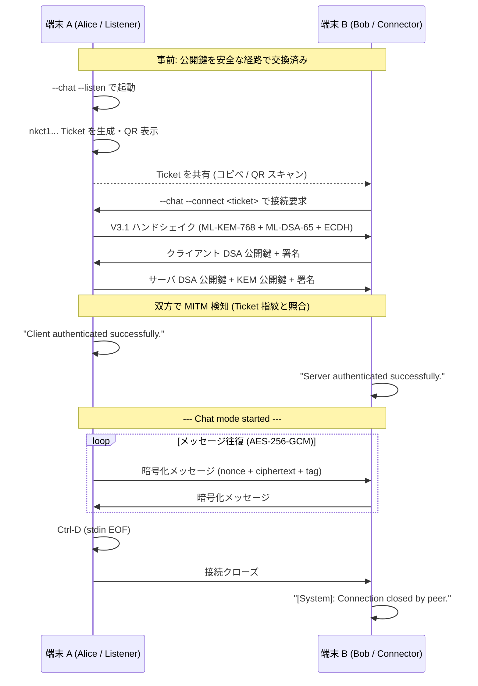

# nkCryptoTool-rust 2 端末チャット手順書

作成日: 2026-05-06
対象: Iroh トランスポート + PQC 認証チャット (V3.1 ハンドシェイク)

---

## 前提

- 同一 LAN または NAT 越え可能なネットワーク
- 両端末に `nkCryptoTool-rust` のリポジトリがある (or バイナリを共有)
- Linux/macOS (Windows は要検証)

---

## Step 1: ビルド (両端末で実施)

```bash
cd /path/to/nkCryptoTool-rust
cargo build --release
```

成果物: `target/release/nk-crypto-tool` (約 30-50 MB)

---

## Step 2: 鍵生成 (両端末で実施)

各端末に **署名鍵ペア** を作成。`NK_PASSPHRASE` でパスフレーズを指定 (空文字なら平文保存)。

### 端末 A (Alice)

```bash
mkdir -p ~/nkct/alice
NK_PASSPHRASE="" ./target/release/nk-crypto-tool \
  --mode pqc --gen-sign-key \
  --key-dir ~/nkct/alice \
  --dsa-algo ML-DSA-65
# 生成: ~/nkct/alice/private_sign_pqc.key (秘密鍵)
#       ~/nkct/alice/public_sign_pqc.key  (公開鍵)
```

### 端末 B (Bob)

```bash
mkdir -p ~/nkct/bob
NK_PASSPHRASE="" ./target/release/nk-crypto-tool \
  --mode pqc --gen-sign-key \
  --key-dir ~/nkct/bob \
  --dsa-algo ML-DSA-65
```

---

## Step 3: 公開鍵交換 (事前共有)

**安全な経路** (対面 / Signal / 既存暗号メッセンジャー等) で公開鍵を交換。

```bash
# Alice → Bob: alice の public key を bob に送る
scp ~/nkct/alice/public_sign_pqc.key bob@host:~/nkct/alice_public.key

# Bob → Alice: bob の public key を alice に送る
scp ~/nkct/bob/public_sign_pqc.key alice@host:~/nkct/bob_public.key
```

両端末で:

- 自分の秘密鍵 (`private_sign_pqc.key`)
- 相手の公開鍵 (`alice_public.key` / `bob_public.key`)

の **2 ファイル** が揃った状態にする。

---

## Step 4: Listener 起動 (端末 A — Alice)

```bash
NK_PASSPHRASE="" ./target/release/nk-crypto-tool \
  --mode pqc --chat \
  --listen 0.0.0.0:0 \
  --signing-privkey ~/nkct/alice/private_sign_pqc.key \
  --signing-pubkey  ~/nkct/bob_public.key \
  --transport iroh
```

> **注意**: `--listen 0.0.0.0:0` はダミー値。Iroh モードでは無視されるが、引数として必須 (CLI 仕様の名残)。

### 出力例

```
AES-NI is available!
[nkct] Listening as NodeId: 936df7a46ee11528b9c53ee9af0edd3934744fc9cb...
[nkct] Ticket: nkct1AGJW355EN3QRKKFZYU7OTLYO3U4TI5C... (長い)

[nkct] Scan QR to connect:
█████████████████████
██ ▄▄▄▄▄ █▀ ▀▄█ ██ █
... (QR コード)
█████████████████████
```

→ **`nkct1...` の Ticket をコピー**。QR コードはモバイル接続時に便利。

---

## Step 5: Connector で接続 (端末 B — Bob)

```bash
NK_PASSPHRASE="" ./target/release/nk-crypto-tool \
  --mode pqc --chat \
  --connect 'nkct1AGJW355EN3QRKKFZYU7OTLYO3U4TI5C...' \
  --signing-privkey ~/nkct/bob/private_sign_pqc.key \
  --signing-pubkey  ~/nkct/alice_public.key \
  --transport iroh
```

> Ticket は **シングルクォートで囲む** (BASE32 文字列が長く、シェル展開を防ぐため)。

### 成功時の出力

両端末で以下が表示されれば成功:

```
[nkct] Connecting to NodeId: 936df7a46ee11528...
Server authenticated successfully.        ← Bob 側
--- Chat mode started ---
> 
```

```
Client authenticated successfully.        ← Alice 側
--- Chat mode started ---
> 
```

---

## Step 6: チャット

両端末でメッセージを入力 → Enter で送信 → 相手側に `[Peer]: <message>` で表示される。

```
> hello
> [Peer]: hi alice!
> how are you?
> [Peer]: doing great
```

**終了**: `Ctrl-D` で stdin を閉じる → clean exit (F-IROH-39 修正後)

---

## オプション

### relay 不使用 (LAN 内 / メタデータ漏洩防止)

```bash
--no-relay  # Iroh 公式 relay を使わない、direct connection のみ
```

LAN 内なら問題なく接続。NAT 越えは hole-punching のみで relay フォールバックなし → 接続失敗の可能性あり。

### 自前 relay 指定

```bash
--relay-url https://my-relay.example.com
```

### 認証なしチャット (テスト用、本番非推奨)

```bash
# 両端末とも:
... --chat --listen 0.0.0.0:0 --allow-unauth
... --chat --connect <ticket> --allow-unauth
```

`--signing-privkey` / `--signing-pubkey` を省略可能。MITM 検知不能なので **テスト用途のみ**。

### Allowlist で複数ピアを認証

listener 側に許可リストを準備:

```bash
# bob と charlie の指紋を hex で書く (各 32B = 64 hex chars)
cat > ~/nkct/allowlist.txt <<EOF
# bob
ee15...90b7
# charlie
8a91...c2d4
EOF

./target/release/nk-crypto-tool --chat --listen 0.0.0.0:0 \
  --signing-privkey ~/nkct/alice/private_sign_pqc.key \
  --peer-allowlist ~/nkct/allowlist.txt \
  --transport iroh
# signing-pubkey は不要 (allowlist で複数ピアを許可)
```

公開鍵指紋の取得:

```bash
./target/release/nk-crypto-tool --mode pqc --fingerprint \
  --signing-pubkey ~/nkct/bob_public.key
```

---

## トラブルシューティング

| 症状 | 原因 / 対処 |
|---|---|
| `Ticket decode: ...` | Ticket が途切れている / 改行混入。シングルクォートで囲む。 |
| `Server PQC public key fingerprint mismatch (MITM detected!)` | Ticket と公開鍵が不一致。Ticket と公開鍵を再共有。 |
| `Signature verification failed` | `--signing-pubkey` で指定した公開鍵が相手の秘密鍵と対応していない |
| `Peer not in allowlist` | allowlist の指紋が間違っている / 改行不正 |
| `Handshake timed out` | `--no-relay` で NAT 越えできていない。relay 有効化、または LAN 内で再試行。 |
| 接続後すぐ `[System]: Connection closed by peer.` | 相手側で stdin EOF (Ctrl-D 等)。F-IROH-39 修正後の clean exit。 |
| パスフレーズ入力プロンプトで止まる | `NK_PASSPHRASE=""` (空) または `NK_PASSPHRASE="yourpass"` を環境変数で指定 |

---

## ファイル転送 (おまけ)

`--chat` を外すとファイル転送モード。Listener 側は受信、Connector 側は送信:

```bash
# 受信 (端末 A)
nkct ... --listen 0.0.0.0:0 --signing-privkey ... > received_file.bin

# 送信 (端末 B)
cat my_file.bin | nkct ... --connect <ticket> --signing-privkey ...
```

> 現状は **stdin/stdout 経由のみ**。ファイルパス直接指定は未対応 (F-IROH-37)。

---

## ワンライナー版 (簡易テスト)

同一マシンで動作確認したい場合、`/tmp` に鍵を作って 2 ターミナルで:

```bash
# Terminal 1 (listener)
NK_PASSPHRASE="" /path/to/nk-crypto-tool --mode pqc --chat --listen 0.0.0.0:0 \
  --allow-unauth --no-relay --transport iroh

# Ticket をコピー、Terminal 2 へ:

# Terminal 2 (connector)
NK_PASSPHRASE="" /path/to/nk-crypto-tool --mode pqc --chat --connect '<TICKET>' \
  --allow-unauth --no-relay --transport iroh
```

---

## 接続フロー (参考)



---

## 関連ドキュメント

- `IROH_MIGRATION_PLAN.md` — Iroh 移行の全体計画
- `IROH_MIGRATION_COMPLETION_REPORT.md` — 全フェーズ完了報告
- `F-IROH-39_FIX_REPORT.md` — stdin EOF 無限ループ修正 (このガイドの Ctrl-D clean exit が機能する理由)
- `SPEC.md` (リポジトリルート) — V3 ハンドシェイクと Ticket フォーマットの技術仕様
- `README.md` (リポジトリルート) — プロジェクト概要
