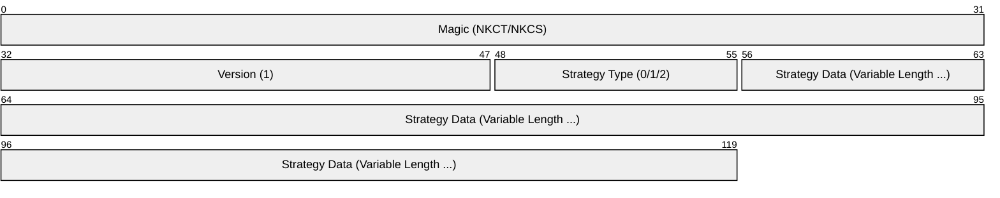

# **nkCryptoTool (Rust Version)**

> **🚧 現在開発中（Alpha段階）**  
> CLIのみ対応です。本格的な利用はまだおすすめしていません。  
> C++版とRust版で完全な相互互換性があります。

**nkCryptoToolは、次世代暗号技術を含む高度な暗号処理をコマンドラインで手軽にセキュアに実行できるツールです。**

Rust版は、C++版の設計思想を継承しつつ、Rustのメモリ安全性とTokioによる高性能な非同期パイプラインを組み合わせて再構築されました。

* **データの暗号化・復号**: 秘密の情報を安全にやり取りできます。
* **認証付き暗号 (AES-256-GCM)**: すべての暗号化処理において、データの機密性に加え、改ざんを検知する完全性も保証するAES-256-GCMモードを採用。
* **デジタル署名・検証**: ファイルの改ざんを検出し、作成者を証明できます。
* **マルチバックエンド構成**: 高性能な **OpenSSL** バックエンドと、ポータブルな **純 Rust (RustCrypto)** バックエンドを選択可能。
* **ECC (楕円曲線暗号) & PQC (耐量子計算機暗号)**: NIST標準の P-256 および ML-KEM/ML-DSA に対応。さらにこれらを組み合わせた **ハイブリッド暗号** もサポート。
* **TPM (Trusted Platform Module) による秘密鍵の保護**: 秘密鍵をマシンのハードウェア (TPM 2.0) に紐付けて安全に保護。
* **超高速ストリーミング処理**: 3段並列パイプラインにより、9GB以上の巨大ファイルも **2.5GB/s 〜 3GB/s の圧倒的な速度** で処理。

## **マルチバックエンド・アーキテクチャ**

本ツールは、用途に応じて2つの暗号エンジンを切り替えてビルドできます。**どちらのバックエンドで作成された鍵や暗号化データも、もう一方のバックエンドで相互に利用可能です。**

| バックエンド | 特徴 | 推奨ユースケース |
| :--- | :--- | :--- |
| **OpenSSL** (デフォルト) | 高度に最適化されたアセンブリ実装を使用。 | サーバー、大規模データ処理、既存のC++版との併用。 |
| **RustCrypto** (純 Rust) | 外部ライブラリ不要でポータビリティが高い。 | コンテナ、OpenSSL未導入環境、セキュリティ監査重視。 |

## **ビルド方法**

### **1. OpenSSL バックエンド (Default)**
ビルドには OpenSSL 3.0 以降の開発用ライブラリが必要です。

```bash
cargo build --release
```

### **2. 純 Rust バックエンド (RustCrypto)**
外部のCライブラリに依存せず、Cargoのみでビルド可能です。

```bash
cargo build --release --no-default-features --features backend-rustcrypto
```

## **使用法**

### **鍵ペアの生成**

* 暗号化鍵ペア:
  `nk-crypto-tool --mode ecc --gen-enc-key` (ECC)
  `nk-crypto-tool --mode pqc --gen-enc-key` (ML-KEM)
* TPM保護を有効にする場合 (`--use-tpm`):
  `nk-crypto-tool --mode ecc --gen-enc-key --use-tpm`

### **暗号化・復号**

* 暗号化:
  `nk-crypto-tool --mode ecc --encrypt --recipient-pubkey <pub.key> --output-file <enc.bin> <input.txt>`
* 復号:
  `nk-crypto-tool --mode ecc --decrypt --user-privkey <priv.key> --output-file <dec.txt> <enc.bin>`

### **署名・検証**

* 署名:
  `nk-crypto-tool --mode ecc --sign --signing-privkey <priv.key> --signature <file.sig> <input.txt>`
* 検証:
  `nk-crypto-tool --mode ecc --verify --signing-pubkey <pub.key> --signature <file.sig> <input.txt>`

## **鍵の互換性と標準フォーマット**

本ツールで生成される鍵ペアは、異なる実装（C++版/Rust版）や異なるバックエンド（OpenSSL/WolfSSL/RustCrypto）の間で、変換なしにそのまま相互利用可能です。

### **1. ECC (楕円曲線暗号)**
*   **構造**: NIST P-256 (prime256v1) 曲線を使用。
*   **形式**: 業界標準の **PEM (Privacy-Enhanced Mail)** 形式で保存。
    *   **秘密鍵**: PKCS#8 構造（TPM保護なしの場合）
    *   **公開鍵**: SubjectPublicKeyInfo (SPKI) 構造
*   これにより、`ssh-keygen` や `openssl` コマンド等、標準的なツールとの高い親和性を確保しています。

### **2. PQC (耐量子計算機暗号)**
*   **アルゴリズム**: NIST標準の ML-KEM (Kyber) および ML-DSA (Dilithium) を採用。
*   **ASN.1 構造**: IETFドラフトに基づいた標準的なデータ構造を共通採用しています。
    *   **公開鍵 (SubjectPublicKeyInfo)**:
        ```asn1
        SEQUENCE {
          algorithm        AlgorithmIdentifier, -- 種類 (OID: 2.16.840.1.101.3.4.4.2 等)
          subjectPublicKey BIT STRING           -- 生の公開鍵バイナリ
        }
        ```
    *   **秘密鍵 (PKCS#8 / OneAsymmetricKey)**:
        ```asn1
        SEQUENCE {
          version           INTEGER (0),
          privateKeyAlgorithm AlgorithmIdentifier,
          privateKey        OCTET STRING {
            SEQUENCE {
              seed          OCTET STRING,       -- 鍵生成シード (xi / d,z)
              rawKey        OCTET STRING        -- 生の秘密鍵バイナリ
            }
          }
        }
        ```
*   **OID (Object Identifier)**: 全実装で以下の標準識別子を使用します（出典: **NIST CSOR**, **FIPS 203/204**）。
    *   ML-KEM-768: `2.16.840.1.101.3.4.4.2` (id-alg-ml-kem-768)
    *   ML-DSA-65: `2.16.840.1.101.3.4.3.18` (id-ml-dsa-65)
*   これにより、Rust版で生成した PQC 鍵を C++版で直接読み込むといった、バイナリレベルの相互運用性を実現しています。


### **3. TPM 保護**
*   秘密鍵を TPM 2.0 で保護する場合、独自の **TPM Wrapped Blob** 形式（PEMラップ）を採用していますが、このパースロジックも C++/Rust 間で統一されています。

## **パフォーマンス**

2.0 GiB の大容量ファイルを用いた最新のベンチマーク結果（Gen4 NVMe / x86_64 環境）。
Tokio による非同期 I/O パイプラインにより、ディスク I/O の限界に近い性能を発揮します。

| 実装 | バックエンド | モード | 暗号化速度 | 復号速度 |
| :--- | :--- | :--- | :--- | :--- |
| **Rust** | **OpenSSL** | **Hybrid (PQC+ECC)** | **~3.4 GiB/s** | **~3.8 GiB/s** |
| **Rust** | **OpenSSL** | ECC (P-256) | ~3.4 GiB/s | ~3.7 GiB/s |
| **Rust** | **RustCrypto** | ECC (P-256) | ~1.6 GiB/s | ~1.9 GiB/s |
| C++ | OpenSSL | Hybrid (PQC+ECC) | ~3.0 GiB/s | ~2.9 GiB/s |
| C++ | wolfSSL | Hybrid (PQC+ECC) | ~2.1 GiB/s | ~2.0 GiB/s |

*   **OpenSSL バックエンド**: 暗号化エンジンに OpenSSL の高度なアセンブリ最適化を使用し、最も高いスループットを実現します。
*   **RustCrypto バックエンド**: 外部依存のない純 Rust 実装。最適化により wolfSSL に迫る 1.6 GiB/s 超を達成しています。
*   **非同期パイプライン**: Rust 版では I/O と暗号化を分離して並列実行するため、特に巨大ファイルにおいて C++ 版を上回る効率を実現しています。

## **統一ヘッダーフォーマット (Unified Header Format)**

本ツールで暗号化されたファイル (`.nkct`) および署名ファイル (`.nkcs`) は、C++/Rust間および全バックエンド間での完全な相互運用性を確保するため、以下の **Version 1 統一ヘッダー形式** を採用しています。

### **バイナリレイアウト (Version 1)**



すべての数値は**リトルエンディアン (Little-Endian)** で記録されます。

※ 文字列やバイナリ配列は、`[4バイトの長さ(uint32_t)][実データ]` の形式で連続して格納されます。

## **相互運用性 (Interoperability)**

* **C++版との互換性**: 既存の `nkCryptoTool` (C++) とバイナリレベルで完全な互換性があります。
* **クロスバックエンド**: OpenSSL版で暗号化したファイルをRustCrypto版で復号（およびその逆）が可能です。
* **標準フォーマット**: 鍵は PKCS#8/SPKI、署名は ASN.1 DER 形式を採用しています。

## **ライセンス**

This software is licensed under the MIT License.
See the LICENSE.txt file for details.
