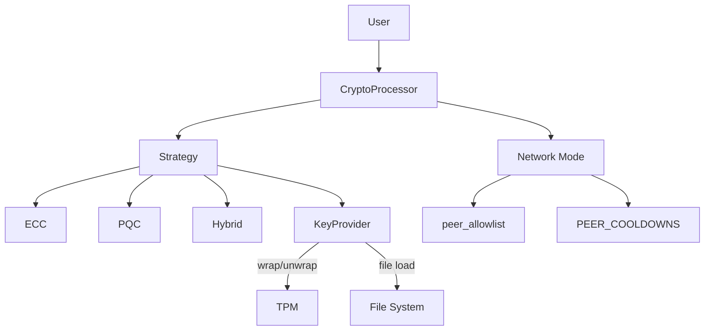
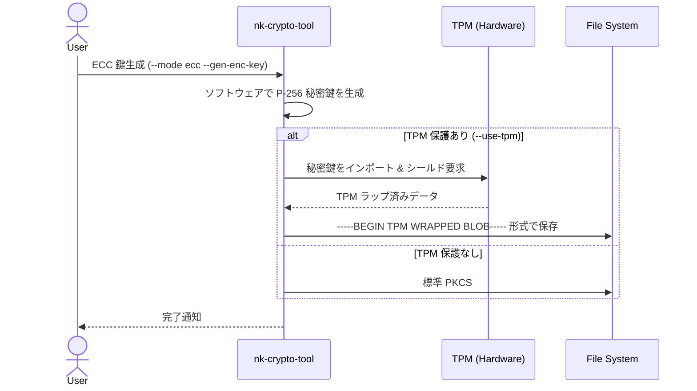
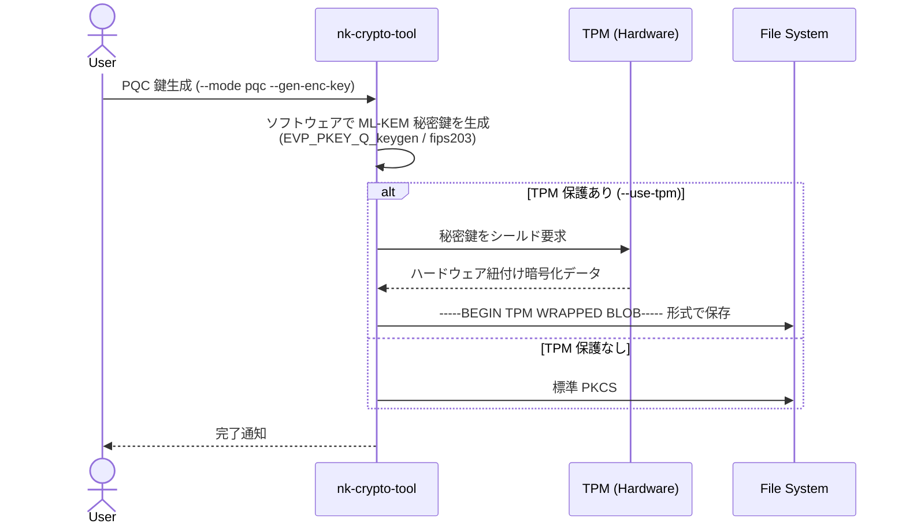
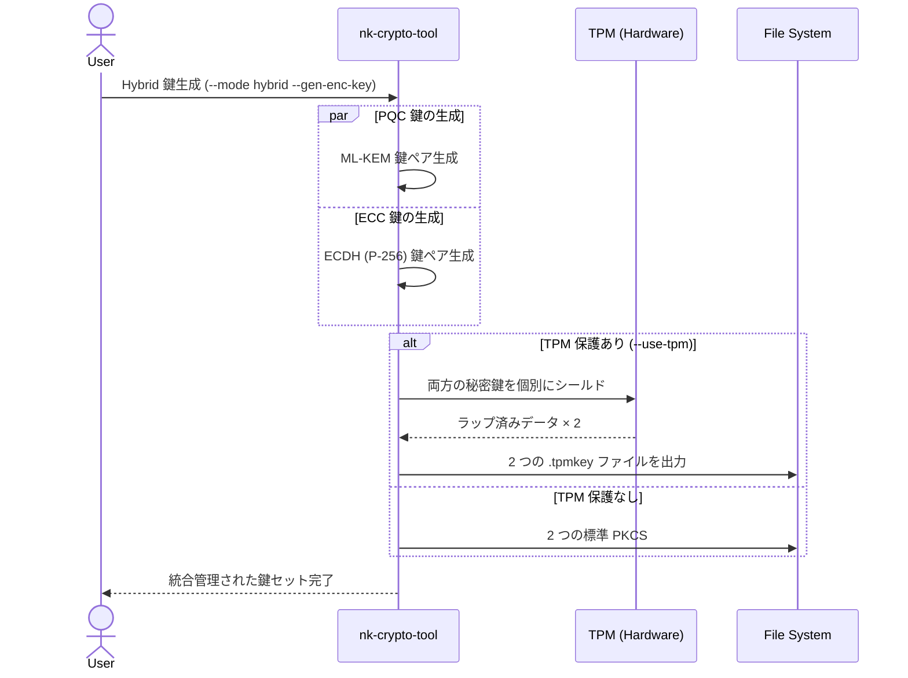
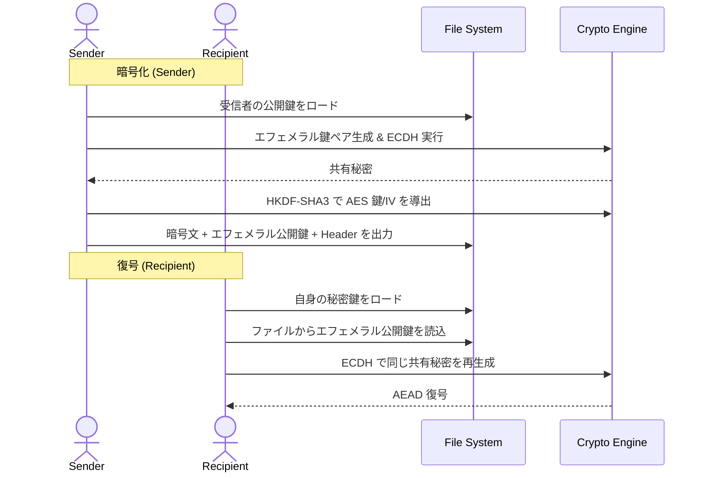
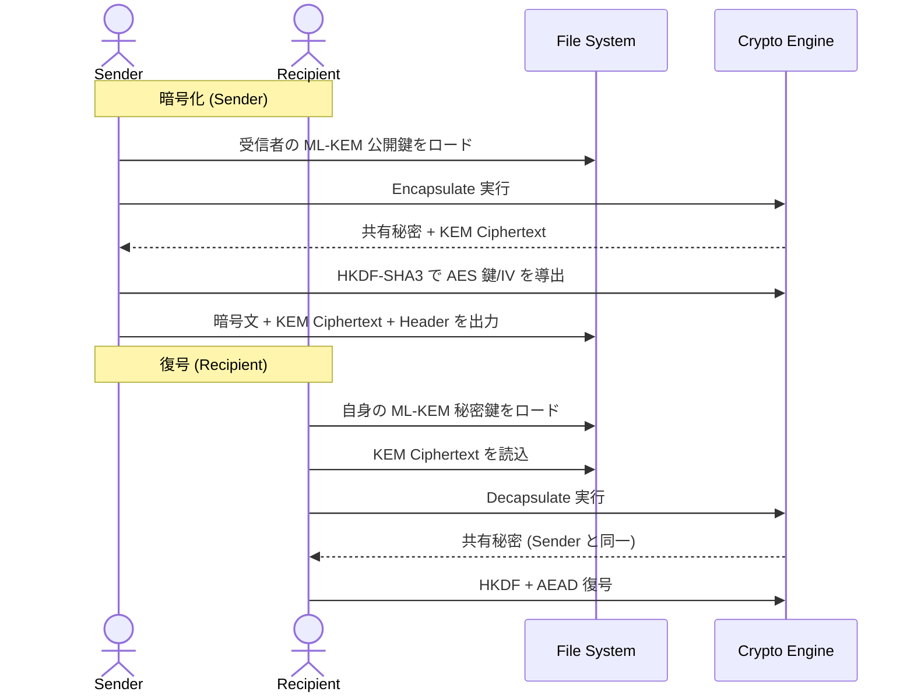
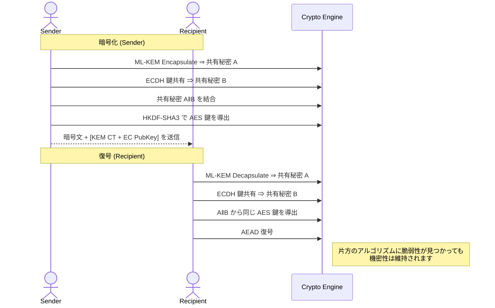
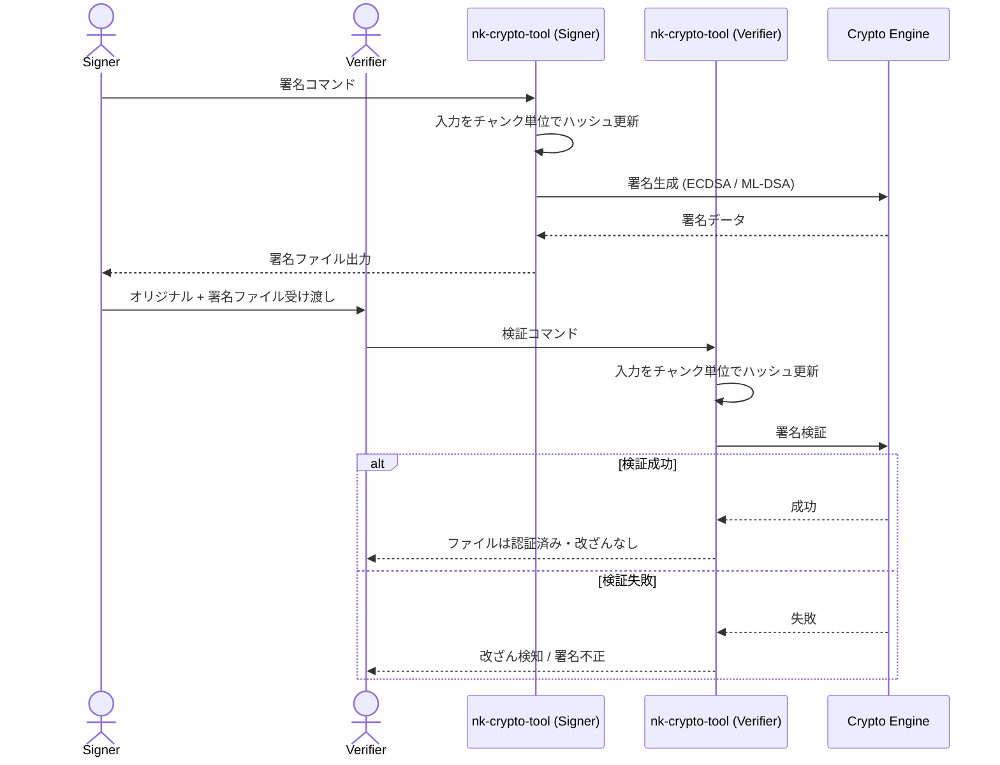
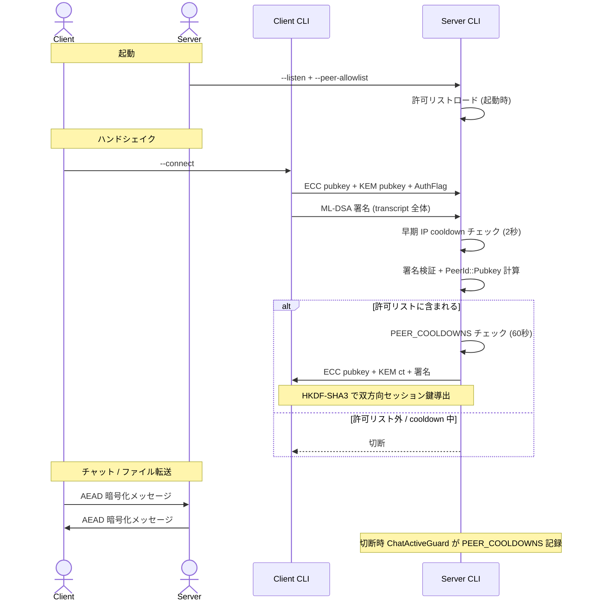
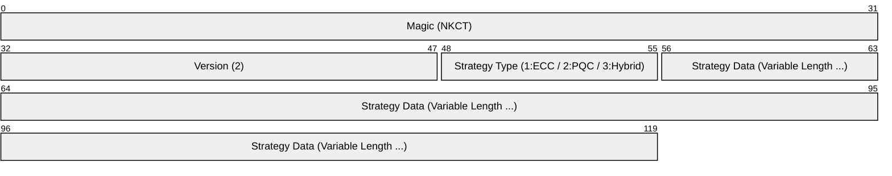

# **nkCryptoTool (Rust Version)**

> ## **📌 本実装の位置付け**
>
> **本 Rust 版が nkCryptoTool プロジェクトのプライマリ実装です**。新機能・性能改善・運用機能の追加は本版で行われます。CLI のみ対応。[C++ 版](../nkCryptoTool/) とバイナリレベルの相互互換性を維持しています。
>
> ### 開発・保守ポリシー
>
> - **新規開発・機能追加は本 Rust 版で行います**。
>   - 性能最適化 (10 GiB ファイルでも C++ 版同等の ~3 GiB/s)
>   - チャットモード、`--peer-allowlist`、PeerId ベース DoS 防御
>   - Lazy Loading 秘密鍵によるメモリダンプ攻撃耐性
>   - ASN.1 構造的パースによる堅牢な鍵検証
> - **[C++ 版](../nkCryptoTool/) は歴史的リファレンス実装として維持**されています。
>   - 致命的なセキュリティ脆弱性 (CVE 級) は両方に適用
>   - 一般的な機能追加・最適化は本 Rust 版のみ
>   - C++ 版は wolfSSL バックエンド利用や C/C++ 既存アプリ統合用途で残存
> - **新規プロジェクトには本 Rust 版を推奨します**。

**nkCryptoToolは、次世代暗号技術を含む高度な暗号処理をコマンドラインで手軽にセキュアに実行できるツールです。**

Rust版は、C++版の設計思想を継承しつつ、Rustのメモリ安全性とTokioによる高性能な非同期パイプラインを組み合わせて再構築されました。

## **主な機能**

* **データの暗号化・復号**: 秘密の情報を安全にやり取りできます。
* **柔軟な認証付き暗号 (AEAD) の選択**:
    * **AES-256-GCM (デフォルト)**: ハードウェア加速 (AES-NI 等) が利用可能な環境で最高のパフォーマンスを発揮します。
    * **ChaCha20-Poly1305**: ハードウェア支援がない低電力デバイスや古い CPU 環境において、AES を上回る高速なソフトウェア処理が可能です。
    * 実行時に `--aead-algo` オプションで動的に切り替え可能。
* **デジタル署名・検証**: ファイルの改ざんを検出し、作成者を証明できます。
* **マルチバックエンド構成**:
    * **OpenSSL** (デフォルト): OpenSSL 3.5+ のネイティブ PQC (ML-KEM/ML-DSA) サポートを利用。
    * **RustCrypto** (純 Rust): 外部 C ライブラリ非依存で `fips203` / `fips204` 等を採用。コンテナや監査重視環境に最適。
* **ECC (楕円曲線暗号) & PQC (耐量子計算機暗号)**: NIST 標準の P-256、ML-KEM (FIPS 203)、ML-DSA (FIPS 204) に対応。さらに RFC 9180 の設計思想に基づき PQC + ECC を組み合わせた **ハイブリッド暗号** もサポート。
* **TPM (Trusted Platform Module) による秘密鍵の保護**: 秘密鍵をマシンのハードウェア (TPM 2.0) に紐付けて安全にラッピング保存。原本からの再ラッピングやアンラップにも対応。
* **超高速ストリーミング処理**: 同期 I/O パイプラインとバッファ再利用設計により、10 GiB 以上の巨大ファイルでも **3 GiB/s を超える安定したスループット**を実現。低メモリ消費 (常時 10 MiB 程度) で動作します。
* **セキュアなネットワークモード**: PQC 認証付きのチャット・ファイル転送機能。**`--peer-allowlist` による許可制接続**、**PeerId ベースの DoS 防御**、Lazy Loading で秘密鍵の長期メモリ常駐を回避。

## **セキュリティ (Security)**

本プロジェクトは、強力なセキュリティ保証を念頭に設計されています。

### **設計上の主要な保証**

* **メモリ安全性**: Rust の所有権システムにより、バッファオーバーフロー・use-after-free 等のメモリ破壊系脆弱性が原理的に発生しません。
* **秘密情報のゼロ化**: 平文・鍵・共有秘密などすべての機密情報は `Zeroizing<T>` でラップされ、Drop 時に自動でメモリゼロクリア。
* **swap 防止**: 重要鍵領域は `mlock(2)` でディスクへのスワップを禁止。
* **コアダンプ無効化**: プロセス起動時に `setrlimit(RLIMIT_CORE, 0)` でコアダンプを禁止し、異常終了時のディスク露出を防止。
* **Lazy Loading 鍵管理**: ネットワークモードの署名秘密鍵は**毎ハンドシェイクごとに必要時のみロード**し、即座に破棄。プロセス全期間メモリ常駐させず、`/proc/<pid>/mem` 等の攻撃面を最小化。
* **ASN.1 構造的パース**: PKCS#8/SPKI の鍵読み込みは `pkcs8` / `spki` クレートによる厳格な構造検証で行われ、OID 不一致などの異常は明示的に拒否。

詳細は [`SECURITY.md`](./SECURITY.md) と [`SPEC.md`](./SPEC.md) を参照してください。

### **プロセス終了時の鍵保護**

`SIGKILL`、`abort`、OOM killer 等の強制終了が発生した場合、Rust の `Drop` ベースのクリーンアップは実行されません。このシナリオにおける本ツールの安全性は以下のように担保されています:

1. **OS レベルのプロセス隔離**: 終了したプロセスのメモリは、再割り当て前にカーネルがクリアするため、他プロセスへ漏洩しません。
2. **コアダンプ無効化**: `setrlimit` で `RLIMIT_CORE = 0` を設定済み。異常終了時にメモリ内容がディスクに書き出されません。
3. **swap 防止**: `mlock` により、機密データがスワップ領域 (ディスク) に書き出されることを防ぎます。
4. **物理メモリ攻撃 (cold boot 等) は対象外**: ハードウェアレベルの攻撃はソフトウェアでは防御不可能なため、本ツールの脅威モデル外。

ユーザー空間で動作する暗号化アプリケーションにおける**実用的なセキュリティ境界**を体現した設計となっています。

## **マルチバックエンド・アーキテクチャ**

本ツールは、用途に応じて 2 つの暗号エンジンを切り替えてビルドできます。**どちらのバックエンドで作成された鍵や暗号化データも、もう一方のバックエンドで相互に利用可能です。**

| バックエンド | 特徴 | 推奨ユースケース |
| :--- | :--- | :--- |
| **OpenSSL** (デフォルト) | 高度に最適化されたアセンブリ実装。OpenSSL 3.5+ で PQC (ML-KEM/ML-DSA) もネイティブサポート。 | サーバー、大規模データ処理、既存の C++ 版との併用 |
| **RustCrypto** (純 Rust) | 外部 C ライブラリ非依存。`fips203` / `fips204` クレート使用。 | コンテナ、OpenSSL 未導入環境、セキュリティ監査重視 |

## **ビルド方法**

### **依存関係**

* **Rust**: 1.75 以上 (Edition 2021)
* **OpenSSL バックエンド使用時**: OpenSSL **3.0 以降** (PQC を使う場合は **3.5 以降** を強く推奨)
* **TPM 機能を使用する場合**: `tpm2-tools` パッケージ

### **ビルド手順**

#### **1. OpenSSL バックエンド (Default)**
ビルドには OpenSSL 3.0 以降の開発用ライブラリが必要です。

* **Ubuntu/Debian:**
    ```bash
    sudo apt update && sudo apt install build-essential libssl-dev
    cargo build --release
    ```
* **Fedora/RHEL:**
    ```bash
    sudo dnf install gcc openssl-devel
    cargo build --release
    ```
* **macOS (Homebrew):**
    ```bash
    brew install openssl@3
    cargo build --release
    ```

ビルド成果物: `target/release/nk-crypto-tool`

#### **2. 純 Rust バックエンド (RustCrypto)**
外部の C ライブラリに依存せず、Cargo のみでビルド可能です。

```bash
cargo build --release --no-default-features --features backend-rustcrypto
```

ビルド成果物: `target/release/nk-crypto-tool` (RustCrypto バックエンド版)

## **鍵管理アーキテクチャ**



- **KeyProvider による抽象化**: 暗号操作を鍵ストレージの実装から分離。メインロジックは具体的な保護メカニズム (TPM, ファイル, etc.) に依存しません。
- **セキュアな TPM バックエンド**: TPM 2.0 HMAC セッションと `posix_spawn` ベースの安全なプロセス実行 (シェル排除) を活用。
- **ネットワーク層の DoS 防御**: peer_allowlist + PeerId-based cooldown による多層防御 (詳細は SECURITY.md / SPEC.md)。

## **TPM による秘密鍵の保護**

本ツールは、TPM (Trusted Platform Module) を使用して秘密鍵を安全にラッピング (暗号化) して保存する機能を備えています。

### **特徴**

* **TPM 2.0 HMAC セッション**: パスワードを TPM に直接送るのではなく、HMAC セッションによるセキュアな通信路を確立。マザーボード上のバス盗聴やリプレイ攻撃から保護されます。
* **独自ラッピング方式**: ECC および PQC の秘密鍵を `-----BEGIN TPM WRAPPED BLOB-----` という独自ヘッダーを持つ形式で保存します。
* **ポータビリティの確保**: 秘密鍵を TPM 内部で生成するのではなく、ソフトウェアで生成した鍵を TPM でシールドする方式。原本 (生鍵) を安全に保管しておけば、故障時や他環境への移行時に再ラッピングが可能です。
* **シェル排除による安全性**: `tpm2-tools` の呼び出しに `system()` や `/bin/sh` を一切使用せず、`std::process::Command` の引数ベクター直接渡しにより OS コマンドインジェクションを物理的に遮断。

### **TPM 関連の操作**

* **TPM 保護鍵ペアの生成**:
    ```bash
    nk-crypto-tool --mode pqc --gen-enc-key --use-tpm --key-dir ~/.keys
    ```
* **既存の生鍵を TPM でラッピング**:
    ```bash
    nk-crypto-tool --mode ecc --use-tpm --wrap-existing <raw_private_key.key>
    ```
* **TPM 保護鍵を解除 (アンラップ)**:
    ```bash
    nk-crypto-tool --mode ecc --use-tpm --unwrap-key <tpm_wrapped_key.key>
    ```

### **注意点 (Linux)**

Linux 環境では、TPM デバイス (`/dev/tpmrm0` 等) へのアクセス権限が必要です。通常、これらのデバイスは `tss` グループに属しているため、TPM 機能を利用するには以下のいずれかが必要です。

* `sudo` による実行 (root 権限)
* 実行ユーザーを `tss` グループに追加: `sudo usermod -aG tss $USER` を実行後、再ログイン

### **TPM とネットワークモードについて**

現バージョンでは、**TPM 保護された鍵はネットワークモード (リスナー側) では未サポート**です。ローカル操作 (`--encrypt`/`--decrypt`/`--sign`/`--verify`) のみで TPM が利用できます。ネットワーク用途では PBES2 暗号化 PEM を利用してください。

## **使用法**

`nk-crypto-tool` は、ECC モード (`--mode ecc`)、PQC モード (`--mode pqc`)、Hybrid モード (`--mode hybrid`) の 3 つのモードで動作します。

### **鍵ペアの生成**

* **暗号化鍵ペア (ECC)**: `nk-crypto-tool --mode ecc --gen-enc-key`
* **署名鍵ペア (ECC)**: `nk-crypto-tool --mode ecc --gen-sign-key`
* **暗号化鍵ペア (PQC, ML-KEM)**: `nk-crypto-tool --mode pqc --gen-enc-key`
* **署名鍵ペア (PQC, ML-DSA)**: `nk-crypto-tool --mode pqc --gen-sign-key`
* **暗号化鍵ペア (Hybrid)**: `nk-crypto-tool --mode hybrid --gen-enc-key`
    * これにより、ML-KEM と ECDH の鍵ペアがそれぞれ生成されます (例: `public_enc_hybrid_mlkem.key`, `private_enc_hybrid_mlkem.key`, `public_enc_hybrid_ecdh.key`, `private_enc_hybrid_ecdh.key`)
* **TPM 保護を有効化**: `--use-tpm` を追加
* **アルゴリズム選択**: `--kem-algo ML-KEM-768` (デフォルト) / `--dsa-algo ML-DSA-65` (デフォルト)
* **保存先指定**: `--key-dir <path>`

**Note**: パスフレーズはデフォルトで対話入力されます。CI 等の自動化用途では `NK_PASSPHRASE` 環境変数で指定可能 (セキュリティ警告が表示されます)。

### **暗号化**

* **ECC モード**:
    ```bash
    nk-crypto-tool --mode ecc --encrypt --recipient-pubkey <pub.key> -o <encrypted.bin> <input.txt>
    ```
* **PQC モード**:
    ```bash
    nk-crypto-tool --mode pqc --encrypt --recipient-pubkey <pub.key> -o <encrypted.bin> <input.txt>
    ```
* **Hybrid モード** (RFC 9180 的設計):
    ```bash
    nk-crypto-tool --mode hybrid --encrypt \
        --recipient-mlkem-pubkey <mlkem_pub.key> \
        --recipient-ecdh-pubkey <ecdh_pub.key> \
        -o <encrypted.bin> <input.txt>
    ```
* **AEAD アルゴリズムの指定**: 全モードで `--aead-algo <ALGO>` (例: `AES-256-GCM` (default), `ChaCha20-Poly1305`)

### **復号**

復号時、使用された AEAD アルゴリズムはファイルヘッダーから自動認識されます。明示的指定不要です。

* **ECC モード**:
    ```bash
    nk-crypto-tool --mode ecc --decrypt --user-privkey <priv.key> -o <decrypted.txt> <encrypted.bin>
    ```
* **Hybrid モード**:
    ```bash
    nk-crypto-tool --mode hybrid --decrypt \
        --user-mlkem-privkey <mlkem_priv.key> \
        --user-ecdh-privkey <ecdh_priv.key> \
        -o <decrypted.txt> <encrypted.bin>
    ```

### **署名・検証**

* **署名**:
    ```bash
    nk-crypto-tool --mode ecc --sign --signing-privkey <priv.key> --signature <file.sig> <input.txt>
    ```
    オプション: `--digest-algo SHA3-512` (default), `SHA3-256`, `SHA-256` 等
* **検証**:
    ```bash
    nk-crypto-tool --mode ecc --verify --signing-pubkey <pub.key> --signature <file.sig> <input.txt>
    ```

### **ネットワークモード (チャット / ファイル転送)**

PQC 認証付きの安全な P2P 通信。

* **チャット (サーバ)**:
    ```bash
    nk-crypto-tool --mode pqc --listen 0.0.0.0:9000 --chat \
        --signing-privkey <priv.key> --signing-pubkey <peer_pub.key>
    ```
* **チャット (クライアント)**:
    ```bash
    nk-crypto-tool --mode pqc --connect example.com:9000 --chat \
        --signing-privkey <priv.key> --signing-pubkey <peer_pub.key>
    ```
* **ピア許可リスト併用 (推奨)**:
    ```bash
    nk-crypto-tool ... --peer-allowlist <allowlist.txt>
    ```
    許可リストは 1 行 1 件の SHA3-256 (公開鍵 raw bytes) を hex で記述します。
* **ピア指紋計算**:
    ```bash
    nk-crypto-tool --mode pqc --fingerprint --signing-pubkey <peer_pub.key>
    ```
    出力された hex 値を `peer-allowlist` ファイルにそのまま転記できます。
* **認証必須化はデフォルト動作**です。テスト用途に限り `--allow-unauth` で無効化できますが、本番では絶対に使用しないでください。

詳細は [`SECURITY.md`](./SECURITY.md) と [`SPEC.md`](./SPEC.md) を参照。

## **処理フロー**

### **鍵ペア生成シーケンス**

#### **1. ECC モデル**



#### **2. PQC モデル**



#### **3. Hybrid モデル**



### **暗号化・復号シーケンス**

#### **1. ECC モデル (ECDH)**



#### **2. PQC モデル (KEM)**



#### **3. Hybrid モデル (PQC + ECC 二重防壁)**

PQC (ML-KEM) と ECC (ECDH) を組み合わせ、**両方の暗号が同時に破られない限り安全**な、究極の機密性を実現するフローです。



### **デジタル署名・検証シーケンス**



### **ネットワークハンドシェイク (チャット / ファイル転送)**

`--listen` / `--connect` で動作する PQC 認証付きセッションのフロー。



## **鍵の互換性と標準フォーマット**

本ツールで生成される鍵ペアは、異なる実装 (C++ 版/Rust 版) や異なるバックエンド (OpenSSL/wolfSSL/RustCrypto) の間で、**変換なしにそのまま相互利用可能**です。

### **1. ECC (楕円曲線暗号)**

* **構造**: NIST P-256 (prime256v1) 曲線を使用。
* **形式**: 業界標準の **PEM (Privacy-Enhanced Mail)** 形式で保存。
    * **秘密鍵**: PKCS#8 構造 (TPM 保護なしの場合、PBES2 暗号化対応)
    * **公開鍵**: SubjectPublicKeyInfo (SPKI) 構造
* `ssh-keygen` や `openssl` コマンド等、標準的なツールとの高い親和性を確保しています。

### **2. PQC (耐量子計算機暗号)**

* **アルゴリズム**: NIST 標準の ML-KEM (Kyber) および ML-DSA (Dilithium)
* **ASN.1 構造**:
    * **公開鍵 (SubjectPublicKeyInfo)**:
        ```asn1
        SEQUENCE {
          algorithm        AlgorithmIdentifier, -- OID: 2.16.840.1.101.3.4.4.2 等
          subjectPublicKey BIT STRING           -- 生の公開鍵バイナリ
        }
        ```
    * **秘密鍵 (PKCS#8 / PrivateKeyInfo, RFC 5208)**:
        ```asn1
        SEQUENCE {
          version             INTEGER (0),
          privateKeyAlgorithm AlgorithmIdentifier,
          privateKey          OCTET STRING       -- 生の秘密鍵バイナリ (拡張鍵)
        }
        ```
        FIPS 203/204 が定義する **expanded private key** をそのまま OCTET STRING に格納します (シード保存は採用していません)。
    * **暗号化秘密鍵 (Encrypted PKCS#8, PBES2)**: パスフレーズ指定時、上記の `PrivateKeyInfo` は標準的な **PBES2 (RFC 5958 / RFC 8018)** スキームで AES 暗号化されます。RustCrypto バックエンドが復号に対応。

* **OID (Object Identifier)** — 全実装で以下の標準識別子を使用 (出典: NIST CSOR, FIPS 203/204):

| アルゴリズム | OID |
| :--- | :--- |
| ML-KEM-512 / 768 / 1024 | `2.16.840.1.101.3.4.4.{1,2,3}` |
| ML-DSA-44 / 65 / 87 | `2.16.840.1.101.3.4.3.{17,18,19}` |

これにより、Rust 版で生成した PQC 鍵を C++ 版で直接読み込むといった、バイナリレベルの相互運用性を実現しています。

### **3. TPM 保護**

秘密鍵を TPM 2.0 で保護する場合、独自の **TPM Wrapped Blob** 形式 (PEM ラップ) を採用しています。このパースロジックも C++/Rust 間で統一されています。

## **統一ヘッダーフォーマット (Unified Header Format)**

本ツールで暗号化されたファイル (`.nkct`) および署名ファイル (`.nkcs`) は、C++/Rust 間および全バックエンド間での完全な相互運用性を確保するため、以下の統一ヘッダー形式を採用しています。

### **バイナリレイアウト (.nkct / 暗号化ファイル)**

最新の暗号化ファイルでは **Version 2** ヘッダーを採用しており、使用された AEAD アルゴリズム名がヘッダーに含まれます。これにより、AES-256-GCM と ChaCha20-Poly1305 を動的に切り替えて復号することが可能です。



| オフセット | サイズ | 内容 | 説明 |
| :--- | :--- | :--- | :--- |
| 0 | 4 bytes | マジック | `NKCT` |
| 4 | 2 bytes | バージョン | `2` (uint16_t) |
| 6 | 1 byte | 戦略タイプ | `0: ECC`, `1: PQC`, `2: Hybrid` |
| 7〜 | 可変 | ストラテジーデータ | アルゴリズム名、Salt、IV、KEM 暗号文等 |

**Strategy Data の構成 (Version 2):**

* **ECC**: `CurveName`, `DigestAlgo`, `EphemeralPubKey`, `Salt`, `IV`, `AEADAlgo`
* **PQC**: `KEMAlgo`, `DSAAlgo`, `KEM-CT`, `Salt`, `IV`, `AEADAlgo`
* **Hybrid**: `ECCHeaderLength`, `ECCHeader`, `PQCHeaderLength`, `PQCHeader` (Hybrid 自体の外枠バージョンは 1)

**後方互換性**: バージョン `1` のファイル (AEAD 名を含まない形式) を読み込む際は、自動的に `AES-256-GCM` と見なして処理されます。

### **バイナリレイアウト (.nkcs / 署名ファイル)**

署名ファイルは現在 **Version 1** を使用しています。


すべての数値は **リトルエンディアン (Little-Endian)** で記録されます。
※ 文字列やバイナリ配列は、`[4バイトの長さ(uint32_t)][実データ]` の形式で連続して格納されます。

## **パフォーマンス**

10.0 GiB のランダムデータを用いた v57 時点のベンチマーク結果 (x86_64 / Linux / tmpfs 上で計測)。
事前確保バッファの再利用と同期 I/O パイプラインの最適化により、大規模ファイルでも安定した高スループットを実現しています。

| バックエンド | モード | 暗号化 | 復号 |
| :--- | :--- | :--- | :--- |
| **OpenSSL (Rust)** | ECC (P-256) | ~3.4 GiB/s | ~3.4 GiB/s |
| **OpenSSL (Rust)** | PQC (ML-KEM-1024) | ~3.4 GiB/s | ~3.3 GiB/s |
| **OpenSSL (Rust)** | Hybrid (ML-KEM + P-256) | ~3.4 GiB/s | ~3.4 GiB/s |
| **RustCrypto (Rust)** | ECC (P-256) | ~1.2 GiB/s | ~1.3 GiB/s |
| **RustCrypto (Rust)** | PQC (ML-KEM-1024) | ~1.1 GiB/s | ~1.2 GiB/s |
| **RustCrypto (Rust)** | Hybrid | ~1.1 GiB/s | ~1.3 GiB/s |

* **大規模ファイル対応**: v57 以降、10 GiB 以上の巨大ファイルでも性能低下が発生しないストリーミング設計に刷新。
* **低メモリ消費**: ファイルサイズに関わらず、常時 **10〜20 MiB** のメモリ (RSS) で動作。
* **C++ 版との比較**: PQC モードでは Rust v57 が C++ 版とほぼ同等または微差で勝利。
* **ベンチ実行方法**: `target/release/nk-crypto-tool` をビルド後、2〜10 GiB のテストデータで `--encrypt`/`--decrypt` を時間計測。

ベンチ値はビルドフラグ・CPU 機能 (AES-NI 等)・ファイルシステム・ストレージにより変動します。

## **相互運用性 (Interoperability)**

本プロジェクトは、異なる環境間での「完全な透明性」を目標に設計されています。

* **実装・バックエンド間の完全互換**: C++ 版 (OpenSSL/wolfSSL) と Rust 版 (OpenSSL/RustCrypto) は、バイナリレベルで 100% 互換です。
* **鍵の交換可能性 (Key Interchangeability)**: いかなるバックエンドで生成された鍵ペア (ECC/PQC/Hybrid) も、他のすべてのバックエンドで**変換なしにそのまま利用可能**です。
    * 例: C++ wolfSSL 版で生成した PQC 秘密鍵を、Rust 純 Rust (RustCrypto) 版でロードして復号できます。
* **クロスバックエンド復号**: OpenSSL 版で暗号化したファイルを RustCrypto 版で復号 (およびその逆) が可能です。
* **標準フォーマットの採用**: 鍵は PKCS#8/SPKI、署名は ASN.1 DER 形式、暗号化は標準的な AES-256-GCM (1 file, 1 tag) を採用しており、標準的な `openssl` コマンドラインツール等とも高い親和性があります。

## **ドキュメント**

* [`SECURITY.md`](./SECURITY.md): セキュリティポリシー、脅威モデル、メモリ保護モデル、運用ベストプラクティス
* [`SPEC.md`](./SPEC.md): プロトコル仕様、PQC アルゴリズム詳細、ネットワーク (NKCT) プロトコル、DoS 防御設計、不変性 (invariants) 定義
* [`PENDING_ROADMAP_v56.md`](./PENDING_ROADMAP_v56.md): 今後の機能拡張ロードマップ

## **ライセンス**

This software is licensed under the **MIT License**.
See the [LICENSE.txt](LICENSE.txt) file for details.

### **依存ライブラリのライセンス**

本実装は以下の主要ライブラリに依存しています。すべて寛容なライセンスで配布されています:

* `openssl` / `openssl-sys`: Apache-2.0 OR MIT
* `fips203` / `fips204`: Apache-2.0 (NIST 標準実装)
* `pkcs8` / `spki` / `der`: Apache-2.0 OR MIT (RustCrypto)
* `tokio`: MIT
* `zeroize`: Apache-2.0 OR MIT
* `parking_lot`: Apache-2.0 OR MIT

すべての依存ライブラリの完全なライセンステキストは、ビルド時に `cargo about` 等で生成可能です。
