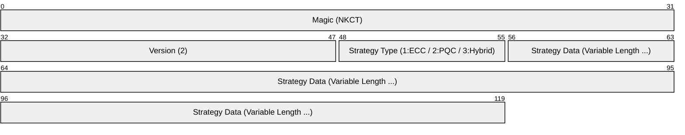

# **nkCryptoTool (Rust Version)**

> CLI 版のツールです。C++ 版と Rust 版でバイナリレベルの相互互換性を維持しています。

**nkCryptoToolは、次世代暗号技術を含む高度な暗号処理をコマンドラインで手軽にセキュアに実行できるツールです。**

Rust版は、C++版の設計思想を継承しつつ、Rustのメモリ安全性とTokioによる高性能な非同期パイプラインを組み合わせて再構築されました。

* **データの暗号化・復号**: 秘密の情報を安全にやり取りできます。
* **認証付き暗号 (AES-256-GCM)**: すべての暗号化処理において、データの機密性に加え、改ざんを検知する完全性も保証するAES-256-GCMモードを採用。
* **デジタル署名・検証**: ファイルの改ざんを検出し、作成者を証明できます。
* **マルチバックエンド構成**: 高性能な **OpenSSL** バックエンドと、ポータブルな **純 Rust (RustCrypto)** バックエンドを選択可能。
* **ECC (楕円曲線暗号) & PQC (耐量子計算機暗号)**: NIST標準の P-256 および ML-KEM/ML-DSA に対応。さらにこれらを組み合わせた **ハイブリッド暗号** もサポート。
* **TPM (Trusted Platform Module) による秘密鍵の保護**: 秘密鍵をマシンのハードウェア (TPM 2.0) に紐付けて安全に保護。
* **超高速ストリーミング処理**: Tokio による非同期パイプライン設計により、巨大なファイルも **3.5 GiB/s を超える圧倒的な速度** で暗号化・復号が可能。ディスク I/O の限界性能を最大限に引き出します。

## **マルチバックエンド・アーキテクチャ**

本ツールは、用途に応じて2つの暗号エンジンを切り替えてビルドできます。**どちらのバックエンドで作成された鍵や暗号化データも、もう一方のバックエンドで相互に利用可能です。**

| バックエンド | 特徴 | 推奨ユースケース |
| :--- | :--- | :--- |
| **OpenSSL** (デフォルト) | 高度に最適化されたアセンブリ実装を使用。 | サーバー、大規模データ処理、既存のC++版との併用。 |
| **RustCrypto** (純 Rust) | 外部ライブラリ不要でポータビリティが高い。 | コンテナ、OpenSSL未導入環境、セキュリティ監査重視。 |

## **ビルド方法**

### **1. OpenSSL バックエンド (Default)**
ビルドには OpenSSL 3.0 以降の開発用ライブラリが必要です。

```bash
cargo build --release
```

### **2. 純 Rust バックエンド (RustCrypto)**
外部のCライブラリに依存せず、Cargoのみでビルド可能です。

```bash
cargo build --release --no-default-features --features backend-rustcrypto
```

## **使用法**

### **鍵ペアの生成**

* 暗号化鍵ペア:
  `nk-crypto-tool --mode ecc --gen-enc-key` (ECC)
  `nk-crypto-tool --mode pqc --gen-enc-key` (ML-KEM)
* TPM保護を有効にする場合 (`--use-tpm`):
  `nk-crypto-tool --mode ecc --gen-enc-key --use-tpm`

### **暗号化・復号**

* 暗号化:
  `nk-crypto-tool --mode ecc --encrypt --recipient-pubkey <pub.key> --output-file <enc.bin> <input.txt>`
* 復号:
  `nk-crypto-tool --mode ecc --decrypt --user-privkey <priv.key> --output-file <dec.txt> <enc.bin>`

### **署名・検証**

* 署名:
  `nk-crypto-tool --mode ecc --sign --signing-privkey <priv.key> --signature <file.sig> <input.txt>`
* 検証:
  `nk-crypto-tool --mode ecc --verify --signing-pubkey <pub.key> --signature <file.sig> <input.txt>`

### **ネットワークモード（チャット / ファイル転送）**

* チャット (サーバ):
  `nk-crypto-tool --mode pqc --listen 0.0.0.0:9000 --chat --signing-privkey <priv.key> --signing-pubkey <peer_pub.key>`
* チャット (クライアント):
  `nk-crypto-tool --mode pqc --connect example.com:9000 --chat --signing-privkey <priv.key> --signing-pubkey <peer_pub.key>`
* ピア許可リストを併用 (推奨):
  `nk-crypto-tool ... --peer-allowlist <allowlist.txt>`
  許可リストは 1 行 1 件の SHA3-256(公開鍵 raw bytes) を hex で記述します。
* 認証必須化はデフォルト動作です。テスト用途に限り `--allow-unauth` で無効化できますが、本番では使用しないでください。

詳細は [`SECURITY.md`](./SECURITY.md) と [`SPEC.md`](./SPEC.md) を参照。

## **鍵の互換性と標準フォーマット**

本ツールで生成される鍵ペアは、異なる実装（C++版/Rust版）や異なるバックエンド（OpenSSL/WolfSSL/RustCrypto）の間で、変換なしにそのまま相互利用可能です。

### **1. ECC (楕円曲線暗号)**
*   **構造**: NIST P-256 (prime256v1) 曲線を使用。
*   **形式**: 業界標準の **PEM (Privacy-Enhanced Mail)** 形式で保存。
    *   **秘密鍵**: PKCS#8 構造（TPM保護なしの場合）
    *   **公開鍵**: SubjectPublicKeyInfo (SPKI) 構造
*   これにより、`ssh-keygen` や `openssl` コマンド等、標準的なツールとの高い親和性を確保しています。

### **2. PQC (耐量子計算機暗号)**
*   **アルゴリズム**: NIST標準の ML-KEM (Kyber) および ML-DSA (Dilithium) を採用。
*   **ASN.1 構造**:
    *   **公開鍵 (SubjectPublicKeyInfo)**:
        ```asn1
        SEQUENCE {
          algorithm        AlgorithmIdentifier, -- 種類 (OID: 2.16.840.1.101.3.4.4.2 等)
          subjectPublicKey BIT STRING           -- 生の公開鍵バイナリ
        }
        ```
    *   **秘密鍵 (PKCS#8 / PrivateKeyInfo, RFC 5208)**:
        ```asn1
        SEQUENCE {
          version             INTEGER (0),
          privateKeyAlgorithm AlgorithmIdentifier,
          privateKey          OCTET STRING       -- 生の秘密鍵バイナリ (拡張鍵)
        }
        ```
        秘密鍵は FIPS 203/204 が定義する **expanded private key** をそのまま OCTET STRING に格納します（シード保存は採用していません）。
    *   **暗号化秘密鍵 (Encrypted PKCS#8, PBES2)**: パスフレーズを指定して鍵を生成した場合、上記の `PrivateKeyInfo` は標準的な **PBES2 (RFC 5958 / RFC 8018)** スキームで AES 暗号化されます。RustCrypto バックエンドは復号をサポートします。
*   **OID (Object Identifier)**: 全実装で以下の標準識別子を使用します（出典: **NIST CSOR**, **FIPS 203/204**）。
    *   ML-KEM-512 / 768 / 1024: `2.16.840.1.101.3.4.4.{1,2,3}`
    *   ML-DSA-44 / 65 / 87: `2.16.840.1.101.3.4.3.{17,18,19}`
*   これにより、Rust版で生成した PQC 鍵を C++版で直接読み込むといった、バイナリレベルの相互運用性を実現しています。


### **3. TPM 保護**
*   秘密鍵を TPM 2.0 で保護する場合、独自の **TPM Wrapped Blob** 形式（PEMラップ）を採用していますが、このパースロジックも C++/Rust 間で統一されています。

## **パフォーマンス**

2.0 GiB のランダムデータを用いた v56 時点のベンチマーク結果（x86_64 / Linux / tmpfs 上で計測）。
Tokio による非同期 I/O パイプラインにより、ディスク I/O や暗号エンジンの限界に近い性能を発揮します。

| バックエンド | モード | 暗号化 | 復号 |
| :--- | :--- | :--- | :--- |
| **OpenSSL (Rust)** | ECC (P-256) | ~3.3 GiB/s | ~3.3 GiB/s |
| **OpenSSL (Rust)** | PQC (ML-KEM-1024) | **~3.2 GiB/s** | **~2.5 GiB/s** |
| **OpenSSL (Rust)** | Hybrid (ML-KEM-1024 + P-256) | **~3.4 GiB/s** | **~2.7 GiB/s** |
| **RustCrypto (Rust)** | ECC (P-256) | ~1.2 GiB/s | ~1.2 GiB/s |
| **RustCrypto (Rust)** | PQC (ML-KEM-1024) | ~1.1 GiB/s | ~1.2 GiB/s |
| **RustCrypto (Rust)** | Hybrid (ML-KEM-1024 + P-256) | ~1.2 GiB/s | ~1.2 GiB/s |

*   **OpenSSL バックエンド (Rust)**: 暗号化エンジンに OpenSSL の高度なアセンブリ最適化を使用しつつ、Rust の非同期 I/O パイプラインで並列化。
    *   **PQC / Hybrid モードの native サポートには OpenSSL 3.5 以降が必要です。** それ以前のバージョンでは PQC 鍵生成・暗号化に対応しません。
*   **RustCrypto バックエンド**: 外部 C ライブラリ非依存で、ECC・PQC・Hybrid のすべてに単独で対応。
*   **相互運用性**: いかなる組み合わせで暗号化されたデータも、全てのバックエンドで相互に復号可能です。
*   ベンチ値はビルドフラグ・CPU 機能（AES-NI 等）・ファイルシステム・ストレージにより変動します。再現するには `target/release/nk-crypto-tool` をビルド後、2 GiB のテストデータで計測してください。

## **統一ヘッダーフォーマット (Unified Header Format)**

本ツールで暗号化されたファイル (`.nkct`) および署名ファイル (`.nkcs`) は、C++/Rust間および全バックエンド間での完全な相互運用性を確保するため、以下の統一ヘッダー形式を採用しています。

### **バイナリレイアウト (.nkct / 暗号化ファイル)**

最新の暗号化ファイルでは **Version 2** ヘッダーを採用しており、使用された AEAD アルゴリズム名がヘッダーに含まれます。これにより、AES-256-GCM と ChaCha20-Poly1305 を動的に切り替えて復号することが可能です。



**Strategy Data の構成 (Version 2):**
*   **ECC**: `CurveName`, `DigestAlgo`, `EphemeralPubKey`, `Salt`, `IV`, `AEADAlgo`
*   **PQC**: `KEMAlgo`, `DSAAlgo`, `KEM-CT`, `Salt`, `IV`, `AEADAlgo`
*   **Hybrid**: `ECCHeaderLength`, `ECCHeader`, `PQCHeaderLength`, `PQCHeader` (Hybrid自体の外枠バージョンは1)

### **バイナリレイアウト (.nkcs / 署名ファイル)**

署名ファイルは現在 **Version 1** を使用しています。


すべての数値は**リトルエンディアン (Little-Endian)** で記録されます。

※ 文字列やバイナリ配列は、`[4バイトの長さ(uint32_t)][実データ]` の形式で連続して格納されます。

## **相互運用性 (Interoperability)**

本プロジェクトは、異なる環境間での「完全な透明性」を目標に設計されています。

*   **実装・バックエンド間の完全互換**: C++版（OpenSSL/wolfSSL）と Rust版（OpenSSL/RustCrypto）は、バイナリレベルで 100% 互換です。
*   **鍵の交換可能性 (Key Interchangeability)**: いかなるバックエンドで生成された鍵ペア（ECC/PQC/Hybrid）も、他のすべてのバックエンドで**変換なしにそのまま利用可能**です。
    *   例: C++ wolfSSL版で生成した PQC 秘密鍵を、Rust 純 Rust (RustCrypto) 版でロードして復号できます。
*   **クロスプラットフォーム復号**: OpenSSL版で暗号化したファイルを RustCrypto版で復号（およびその逆）が可能です。
*   **標準フォーマットの採用**: 鍵は PKCS#8/SPKI、署名は ASN.1 DER 形式、暗号化は標準的な AES-256-GCM (1 file, 1 tag) を採用しており、標準的な `openssl` コマンドラインツール等とも高い親和性があります。

## **ライセンス**

This software is licensed under the MIT License.
See the LICENSE.txt file for details.
