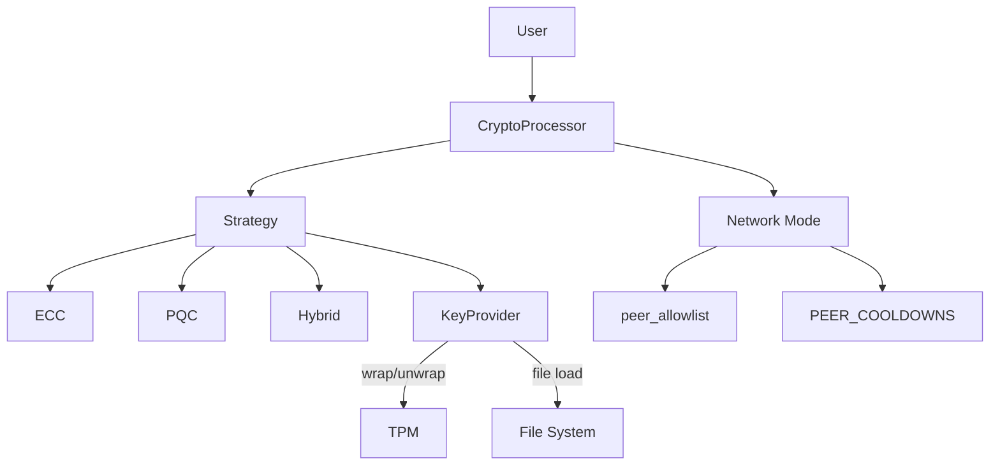
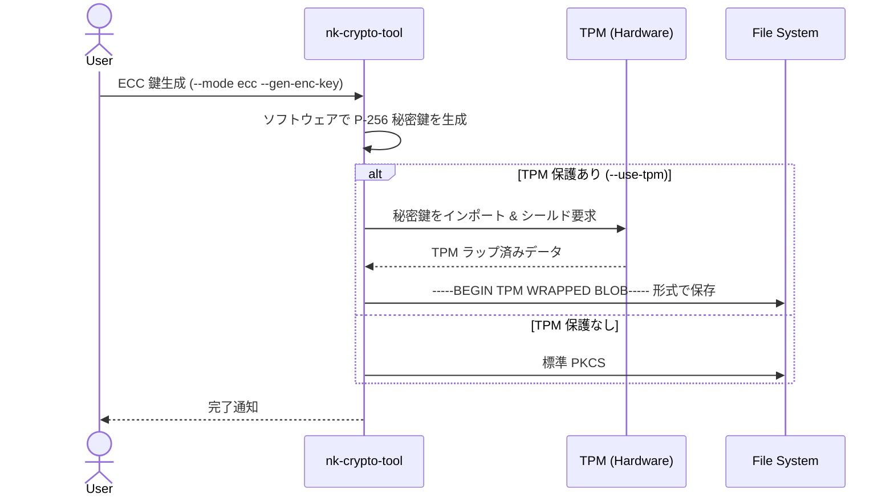
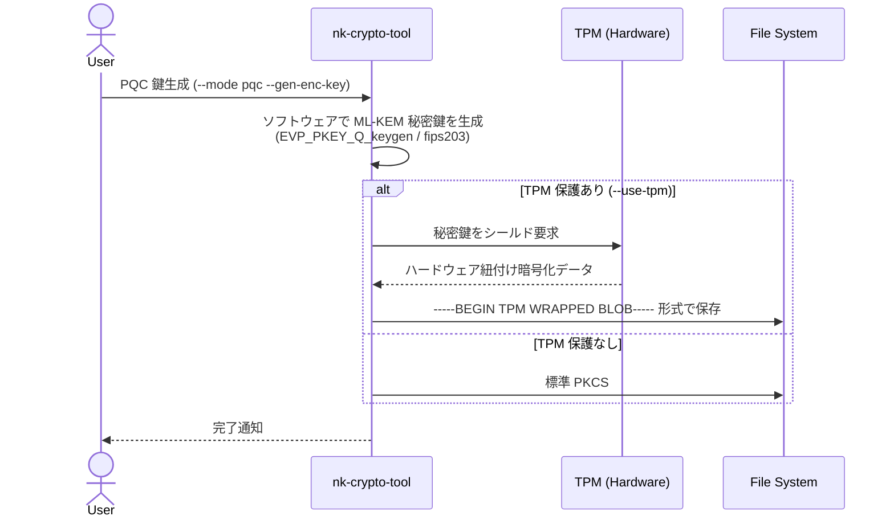
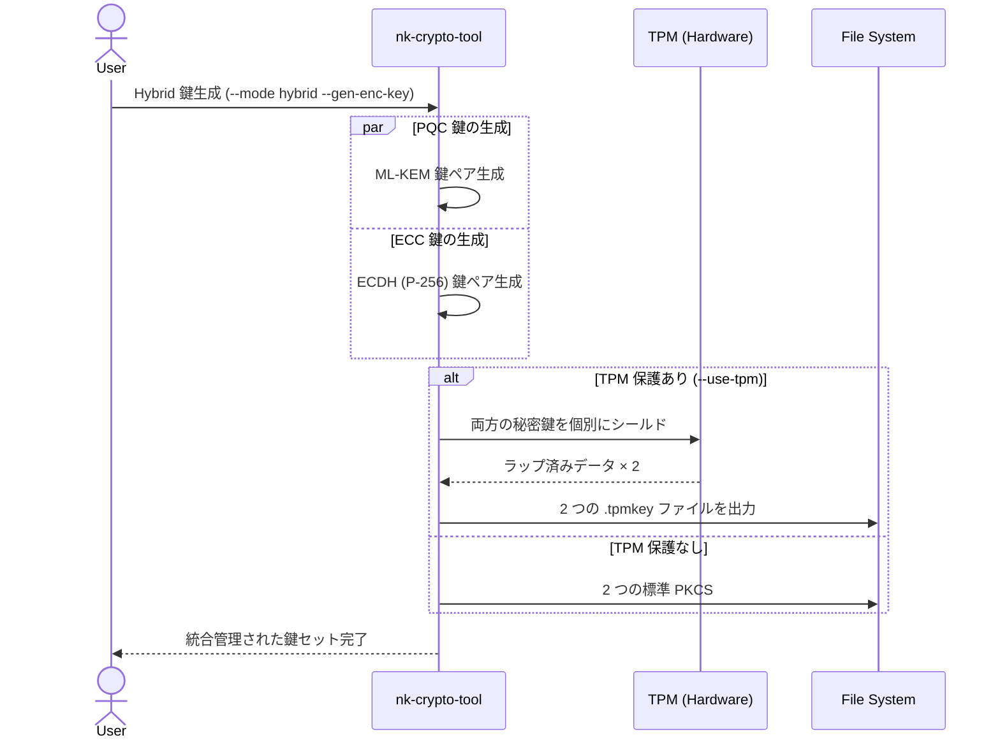
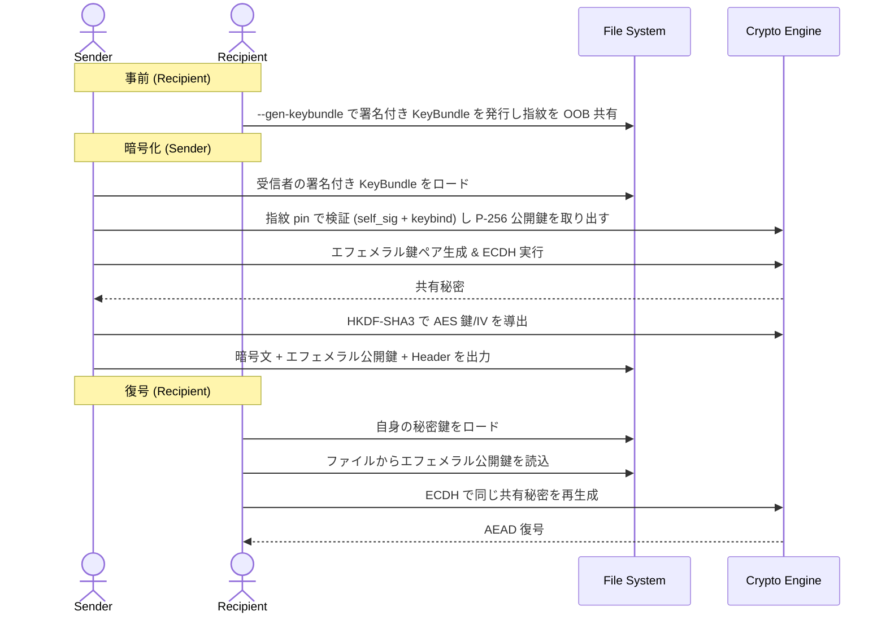
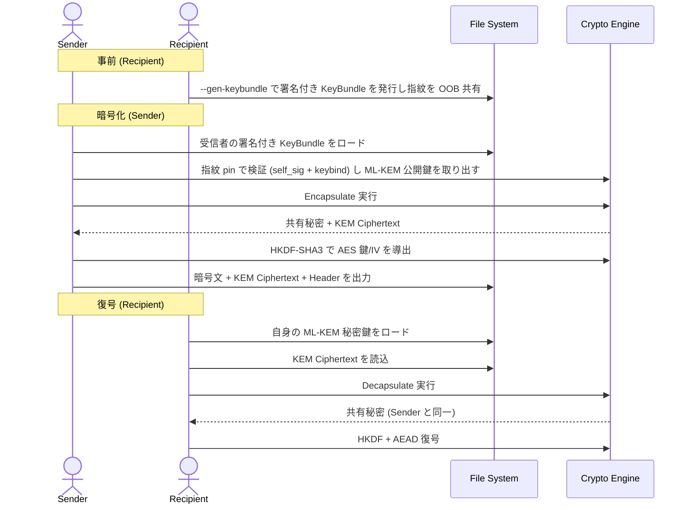
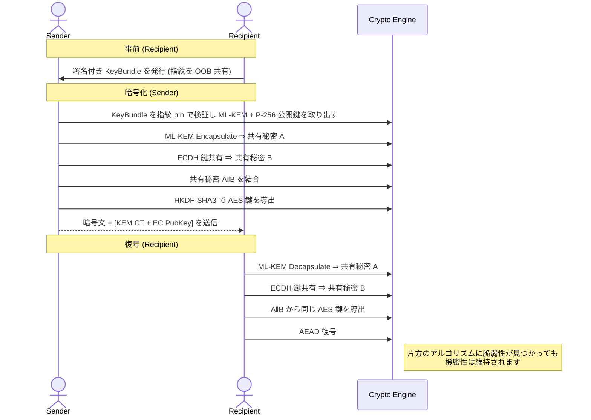
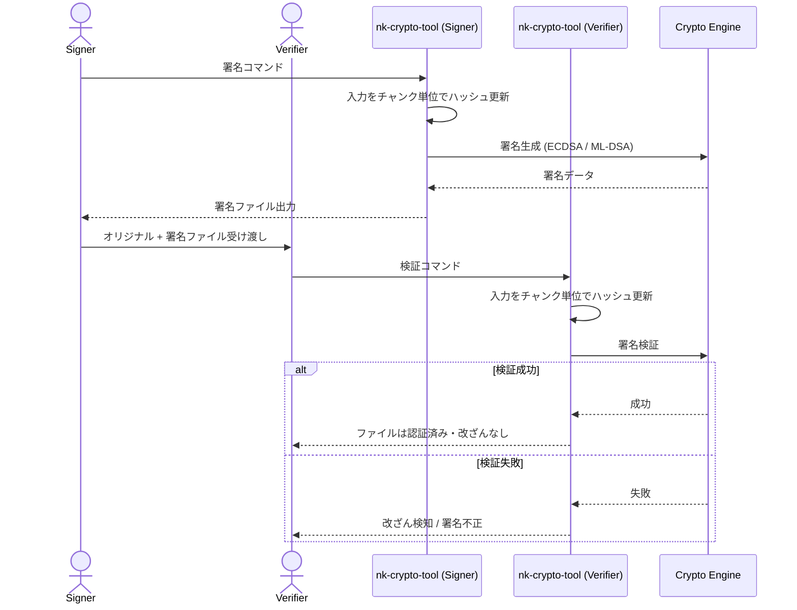
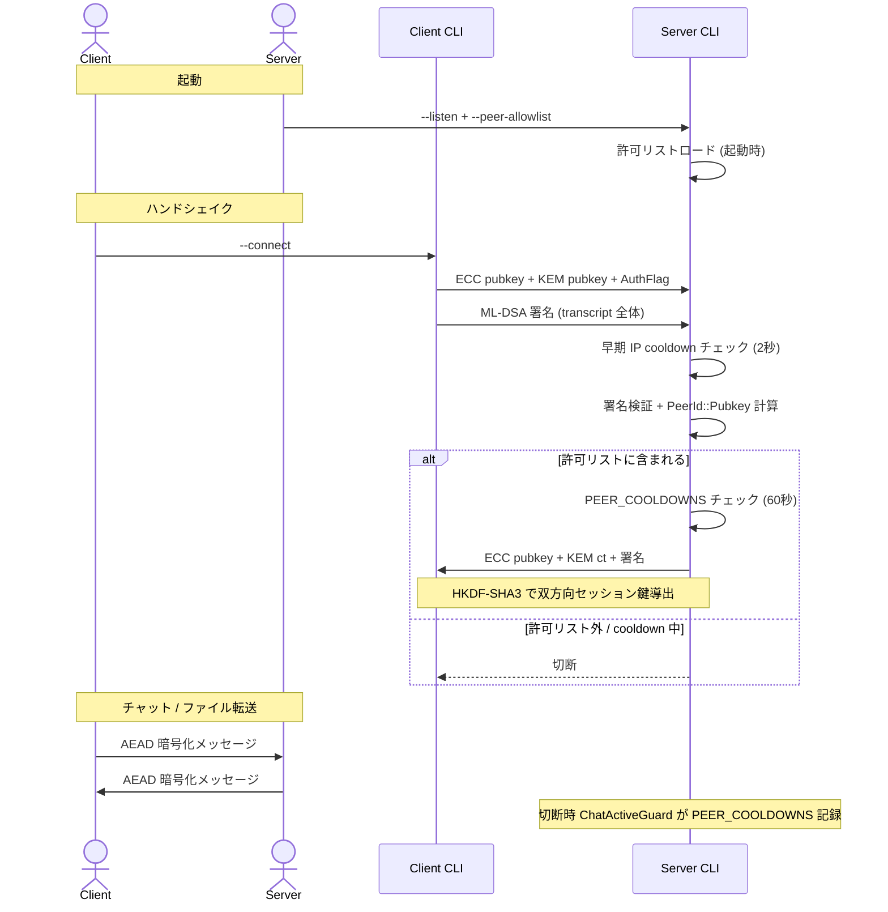
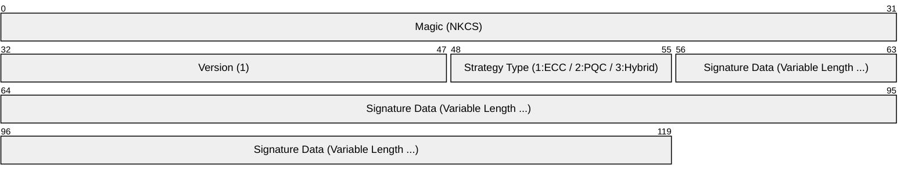

# **nkCryptoTool (Rust Version)**

> ## **📌 本実装の位置付け**
>
> **本 Rust 版が nkCryptoTool プロジェクトのプライマリ実装です**。新機能・性能改善・運用機能の追加は本版で行われます。CLI だけでなく、Slint による GUI にも対応。[C++ 版](../nkCryptoTool/) とバイナリレベルの相互互換性を維持しています。
>
> ### 開発・保守ポリシー
>
> - **新規開発・機能追加は本 Rust 版で行います**。
>   - 性能最適化 (10 GiB ファイルでも C++ 版同等の ~3 GiB/s)
>   - チャットモード、`--peer-allowlist`、PeerId ベース DoS 防御
>   - Lazy Loading 秘密鍵によるメモリダンプ攻撃耐性
>   - ASN.1 構造的パースによる堅牢な鍵検証
> - **[C++ 版](../nkCryptoTool/) は歴史的リファレンス実装として維持**されています。
>   - 致命的なセキュリティ脆弱性 (CVE 級) は両方に適用
>   - 一般的な機能追加・最適化は本 Rust 版のみ
>   - C++ 版は wolfSSL バックエンド利用や C/C++ 既存アプリ統合用途で残存
> - **新規プロジェクトには本 Rust 版を推奨します**。

**nkCryptoToolは、次世代暗号技術を含む高度な暗号処理をコマンドラインで手軽にセキュアに実行できるツールです。**

Rust版は、C++版の設計思想を継承しつつ、Rustのメモリ安全性とTokioによる高性能な非同期パイプラインを組み合わせて再構築されました。

> **▶ すぐ使いたい人へ**: ユースケース別（暗号化 / 復号 / 署名 / 検証 / P2P ssh / P2P scp）の
> コピペで動くコマンド集は **[USAGE.md](./USAGE.md)** にまとめてあります。この README は
> 機能一覧・性能・アーキテクチャの説明が中心です。
>
> なお本文プローズ中の `nkct` は実行バイナリ `nk-crypto-tool` の略です（コマンド例では
> `nk-crypto-tool` を使用）。

## **デモ: 踏み台レス PQC P2P シェル**


NAT 配下のホストへ**踏み台なし・ポート開放なし**でシェル接続する様子（bazzite x86_64 →
nkwire arm64、実機ホールパンチ）。ステータスバーが接続経路・レイテンシ・暗号スイートを
ライブ表示する: `●Direct P2P ｜ Latency:4ms ｜ P-256+ML-KEM-768 / AES-256-GCM`。

- 使い方: [`P2P_SSH_USAGE_GUIDE.md`](./P2P_SSH_USAGE_GUIDE.md)
- 他手段との比較: [`P2P_SHELL_COMPARISON.md`](./P2P_SHELL_COMPARISON.md)
- 実証エビデンス: [`P2P_INTEROP_EVIDENCE.md`](./P2P_INTEROP_EVIDENCE.md)

## **デモ: 踏み台レス PQC P2P シェル — Linux → Windows (ConPTY)**


Linux クライアントから実 Windows ホストへ、**踏み台なし・ポート開放なし・相互 ML-DSA-65
認証**でシェル接続する様子（bazzite x86_64 → DESKTOP-UCP2T48、Wi-Fi ↔ 有線の実機
ホールパンチ・直結経路）。`whoami` / `ver` / `hostname` が Windows 側 (ConPTY) で実行され、
ステータスバーが `●Direct P2P ｜ Latency:3ms ｜ P-256+ML-KEM-768 / AES-256-GCM` を表示する。
同一コードが openpty (Unix) と ConPTY (Windows) を `portable-pty` で吸収し、プロセス起動
ユーザの権限で動作する（Tier-1 同一ユーザ）。

同一ホスト内 Linux ↔ Linux 版（ループバック iroh）: [`docs/p2p_shell_linux_demo.gif`](./docs/p2p_shell_linux_demo.gif)。

## **デモ: 踏み台レス PQC P2P シェル + ファイル転送 (scp)**


同じ PQC 認証 P2P トランスポート上で、**対話リモートシェル**（`p2p ssh` で `remote:~$`
プロンプトに入り ls / cat / id / uname を実行）と**ファイル転送**（`p2p scp`）を行う様子。
各接続が `Server authenticated successfully (auth: ML-DSA-65)` を示し、scp は fingerprint
単位の read/write ポリシーとパス confinement 付き。put→ローカル削除→get で往復を実証している。

- scp 設計: [`P2P_SCP_DESIGN.md`](./P2P_SCP_DESIGN.md)
- 他ファイル転送との比較: [`P2P_SCP_COMPARISON.md`](./P2P_SCP_COMPARISON.md)

## **デモ: PQC P2P scp — 1 GiB 転送のライブ進捗バー**


`--serve-scp` サーバへ 1 GiB のファイルを put / get する様子。転送中に
`[scp] send/recv NN%  X/Y MiB  Z MiB/s` の進捗行がライブ更新される（stderr が TTY の
ときだけ描画するので、バックグラウンドのサーバでは出ない）。default-deny の fingerprint
read/write ポリシーと mutual ML-DSA-65 認証の上で、1 GiB が往復してバイト一致する。

## **デモ: 入れ子 / チェーン PQC P2P（シェルの中で scp サーバを起動）**


p2p シェルで「ホスト A」に入り、**その A のシェルの中で `nkct --serve-scp` を起動**すると、
A が新たな scp エンドポイントになる。外側の scp クライアントはその ticket で A のファイルを
取得できる。**2 本の独立した PQC P2P ホップ**（それぞれ mutual ML-DSA-65 認証）が連なり、
どこにもポート開放は要らない。shell と scp は 1 プロセスでは排他だが、シェルの中で起動する
scp は別プロセスなので両立する。

## **デモ: 署名付き recipient bundle + One-Time Prekey inbox で非同期 PQC 配送（PQ-FS）**


送信者と受信者が**一度も同時にオンラインにならない**非同期配送。信頼しない
store-and-forward inbox がエンベロープを中継するだけで、**inbox は平文も鍵も一切見ない**。
映像は4ステップで進む:

1. **inbox 起動** — 信頼しない中継 inbox を立ち上げ、slot ticket（`nkct1…`）を発行する。
2. **受信者** — 自分の ML-DSA-65 identity を単一アンカーに、静的 X-Wing 鍵・NodeId・
   inbox スロットを束ねた**署名付き recipient bundle** を publish し、One-Time Prekey を
   4 本 inbox に補充してオフラインになる。画面には out-of-band で共有する 64 桁の
   fingerprint が表示される。
3. **送信者** — その fingerprint に bundle を pin して検証し（`... verified`）、prekey を
   1 本引いて `--strict-pqfs` で full PQ-FS でファイルをシールし（`Sealed`）、inbox に投函する。
4. **受信者** — 後刻オンラインに戻って inbox を poll し、復号する（`Decrypted` / `recv complete`）。

最後に、untrusted な inbox 越しに**バイト単位で一致**した平文が復号されて表示される。
bundle 署名は native ctx `nkct-recipient-bundle-v1` で file / prekey / handshake 署名と
ドメイン分離される（[KEY_EXCHANGE_DESIGN.md](./KEY_EXCHANGE_DESIGN.md) 参照）。

## **デモ: ペアリング（KeyBundle 自動登録 = `ssh-copy-id` 相当）→ 認可付き shell / scp**


未登録クライアントが**ワンタイムトークン**で自分を登録し、そのまま同じ ML-DSA-65 指紋で
confined shell と path-jail された scp を張るまでを 4 ステップで示す（loopback iroh・相互 ML-DSA-65 認証）:

1. **PAIR** — `--peer-allowlist` は**空**の状態から始まる。サーバは OTP を発行し、クライアントは
   `--copy-bundle` で自己署名した KeyBundle を送る。サーバは*接続本人の*指紋（handshake 指紋 ==
   bundle owner 指紋）を照合してから allowlist に追記する（トークン保持者が他人の bundle を代理登録できない）。
2. **AUTHORIZE** — ペアリングは allowlist 追加**のみ**。管理者が shell-policy / scp-policy を書いて
   初めて capability が付く（**default-deny を維持**）。
3. **SHELL** — 許可コマンド (`uname -a`) は実行され、cmd-allow 外 (`cat /etc/shadow`) はサーバが拒否する。
4. **SCP** — write jail 内への転送は成功し、jail 外のパスは拒否される。

ペアリングは専用 ALPN `nkct/pairing/1`（緩和認証はこの ALPN 限定）。使い方は [USAGE.md §7](./USAGE.md)。

## **チケットを端末に QR 表示（外部ツール不要）**


`nkct --qr '<ticket>'`（または `… | nkct --qr -` で stdin）で、接続チケットを**その場で
端末に QR 描画**する。同梱の `qrcode` クレートを使うので `qrencode` などの外部ツールは不要・
オフラインで動く。サーバ起動時にも同じ QR が自動表示される。

## **主な機能**

* **データの暗号化・復号（署名付き KeyBundle 経由）**: 受信者の暗号鍵を、その ML-DSA-65 identity が署名した **KeyBundle** として受け取り、out-of-band で確認した指紋に pin して検証してから暗号化します。生の公開鍵をそのまま信頼しないので、配送経路での鍵すり替え (MITM) を防ぎます。
* **柔軟な認証付き暗号 (AEAD) の選択**:
    * **AES-256-GCM (デフォルト)**: ハードウェア加速 (AES-NI 等) が利用可能な環境で最高のパフォーマンスを発揮します。
    * **ChaCha20-Poly1305**: ハードウェア支援がない低電力デバイスや古い CPU 環境において、AES を上回る高速なソフトウェア処理が可能です。
    * 実行時に `--aead-algo` オプションで動的に切り替え可能。
* **デジタル署名・検証**: ファイルの改ざんを検出し、作成者を証明できます。
* **マルチバックエンド構成**:
    * **OpenSSL** (デフォルト): OpenSSL 3.5+ のネイティブ PQC (ML-KEM/ML-DSA) サポートを利用。
    * **RustCrypto** (純 Rust): 外部 C ライブラリ非依存で `fips203` / `fips204` 等を採用。コンテナや監査重視環境に最適。
* **ECC (楕円曲線暗号) & PQC (耐量子計算機暗号)**: NIST 標準の P-256、ML-KEM (FIPS 203)、ML-DSA (FIPS 204) に対応。さらに RFC 9180 の設計思想に基づき PQC + ECC を組み合わせた **ハイブリッド暗号** もサポート。
* **TPM (Trusted Platform Module) による秘密鍵の保護**: 秘密鍵をマシンのハードウェア (TPM 2.0) に紐付けて安全にラッピング保存。原本からの再ラッピングやアンラップにも対応。
* **超高速ストリーミング処理**: 同期 I/O パイプラインとバッファ再利用設計により、10 GiB 以上の巨大ファイルでも安定した高スループット (OpenSSL backend の暗号化で **最大 ~3.4 GiB/s**) を実現。低メモリ消費 (常時 10 MiB 程度) で動作します。
* **セキュアな P2P ネットワークモード (Iroh)**: [Iroh](https://iroh.computer/) トランスポートによる強力な接続性。
    * **自動 NAT 越え**: ポート開放不要。リレーサーバーによる確実な疎通。
    * **NodeId ベースのアドレッシング**: IP の露出を最小限に。
    * **PQC ハンドシェイク (V3.1)**: ML-KEM + ML-DSA による量子耐性。
    * **MITM 対策**: Ticket 形式に PQC 鍵指紋を統合し、中間者攻撃を検知。
    * **プロトコル分離**: ALPN によるチャットとファイル転送の安全な共存。
* **踏み台レス PQC P2P シェル / ポートフォワード**: NAT 配下のホストへ踏み台・ポート開放
  なしで対話シェル (`--shell`)・ローカル/リモートフォワード (`-L`/`-R`) を張る。ハイブリッド
  P-256‖ML-KEM-768 KEM + ML-DSA-65 認証 (指紋ピンニング)、`--tui` でライブ接続バー、
  MLS グループ連動の認可 (Phase 6)、監査ログ・レート制限を備える。
  詳細は [`P2P_SSH_USAGE_GUIDE.md`](./P2P_SSH_USAGE_GUIDE.md)。
* **ペアリング (KeyBundle 自動登録 = `ssh-copy-id` 相当)**: 未登録クライアントを**ワンタイム
  トークン**で初回だけ登録 (`--serve-pairing` / `--copy-bundle`)。クライアントの指紋を
  `--peer-allowlist` に追加し KeyBundle を保存する。接続本人が鍵所持を証明した identity だけを
  登録 (handshake 指紋 == bundle owner 指紋を照合)、default-deny は維持 (allowlist 追加のみ・
  実行 policy は別)。使い方は [USAGE.md §7](./USAGE.md)。 Slint を用いた直感的な GUI を搭載。`--gui` オプションで起動可能で、QR コードのスキャンやチャット機能、ファイル転送をグラフィカルに実行できます。
* **MLS (RFC 9420) グループチャット (オプション機能)**: `--features mls` で有効化。
  Ed25519 ‖ ML-DSA-65 + X25519 ‖ ML-KEM-768 (X-Wing) のハイブリッド PQC ciphersuite
  (private-use ID `0xF101`) で 3 人以上のグループ E2EE を実現。sqlite 永続化と
  Post-Compromise Security (`remove_member` で即時失効) を備える。
  CLI (`--mls-cmd ...`) と GUI (`--features gui-mls` + `--mls-gui`) の両対応。
  詳細は [`MLS_GROUP_CHAT_REPORT.md`](./MLS_GROUP_CHAT_REPORT.md) を参照。

## **セキュリティ (Security)**

本プロジェクトは、強力なセキュリティ保証を念頭に設計されています。

### **設計上の主要な保証**

* **メモリ安全性**: Rust の所有権システムにより、バッファオーバーフロー・use-after-free 等のメモリ破壊系脆弱性が原理的に発生しません。
* **秘密情報のゼロ化**: 平文・鍵・共有秘密などすべての機密情報は `Zeroizing<T>` でラップされ、Drop 時に自動でメモリゼロクリア。
* **swap 防止**: 重要鍵領域は `mlock(2)` でディスクへのスワップを禁止。
* **コアダンプ無効化**: プロセス起動時に `setrlimit(RLIMIT_CORE, 0)` でコアダンプを禁止し、異常終了時のディスク露出を防止。
* **Lazy Loading 鍵管理**: ネットワークモードの署名秘密鍵は**毎ハンドシェイクごとに必要時のみロード**し、即座に破棄。プロセス全期間メモリ常駐させず、`/proc/<pid>/mem` 等の攻撃面を最小化。
* **ASN.1 構造的パース**: PKCS#8/SPKI の鍵読み込みは `pkcs8` / `spki` クレートによる厳格な構造検証で行われ、OID 不一致などの異常は明示的に拒否。

詳細は [`SECURITY.md`](./SECURITY.md) (脆弱性報告ポリシー) と [`SPEC.md`](./SPEC.md) (技術仕様) を参照してください。

### **チャット機能のセキュリティ評価**

Iroh トランスポート + V3.1 PQC ハンドシェイクによるチャット機能は、現時点で **「PQC ネイティブ × 中央サーバなし × FIPS 標準準拠 × OSS」を全て満たす唯一のクラス**に属します。

* ✅ 一般的な脅威 (ISP・公衆 WiFi・Telegram 級サーバ侵入・商用 SaaS 召喚状) に対し**ほぼ完璧な防御**
* ✅ 量子計算機が将来登場した時の "Harvest Now, Decrypt Later" 攻撃に対し**解読不能** (ML-KEM-768)
* ✅ Signal / WhatsApp / iMessage と同等以上、Telegram のデフォルトチャットとは**比較にならない強さ**
* ⚠️ 完璧ではない領域 (Post-Quantum Forward Secrecy / メタデータ秘匿) は今後の改善対象

**詳細な脅威モデル別評価・競合比較・正直な弱点**については [`SECURITY_PROFILE.md`](./SECURITY_PROFILE.md) を参照してください。

### **プロセス終了時の鍵保護**

`SIGKILL`、`abort`、OOM killer 等の強制終了が発生した場合、Rust の `Drop` ベースのクリーンアップは実行されません。このシナリオにおける本ツールの安全性は以下のように担保されています:

1. **OS レベルのプロセス隔離**: 終了したプロセスのメモリは、再割り当て前にカーネルがクリアするため、他プロセスへ漏洩しません。
2. **コアダンプ無効化**: `setrlimit` で `RLIMIT_CORE = 0` を設定済み。異常終了時にメモリ内容がディスクに書き出されません。
3. **swap 防止**: `mlock` により、機密データがスワップ領域 (ディスク) に書き出されることを防ぎます。
4. **物理メモリ攻撃 (cold boot 等) は対象外**: ハードウェアレベルの攻撃はソフトウェアでは防御不可能なため、本ツールの脅威モデル外。

ユーザー空間で動作する暗号化アプリケーションにおける**実用的なセキュリティ境界**を体現した設計となっています。

## **マルチバックエンド・アーキテクチャ**

本ツールは、用途に応じて 2 つの暗号エンジンを切り替えてビルドできます。**どちらのバックエンドで作成された鍵や暗号化データも、もう一方のバックエンドで相互に利用可能です。**

| バックエンド | 特徴 | 推奨ユースケース |
| :--- | :--- | :--- |
| **RustCrypto** (デフォルト, 純 Rust) | 外部 C ライブラリ非依存。`fips203` / `fips204` クレート使用。バルク AEAD のスループットは OpenSSL より低い（下記注参照）。 | コンテナ、OpenSSL 未導入環境、セキュリティ監査重視、モバイル |
| **OpenSSL** | 高度に最適化されたアセンブリ実装。OpenSSL 3.5+ で PQC (ML-KEM/ML-DSA) もネイティブサポート。大容量ファイル暗号化が最速。 | サーバー、大規模データ処理、既存の C++ 版との併用 |
| **OpenSSL (Vendored)** | **[NEW]** OpenSSL 3.6.2 をソースからビルドして静的リンク。環境依存を排除。 | Windows、古い Linux (Ubuntu 24.04 等)、静的バイナリ配布 |

## **バックエンド選択ガイド**

デフォルトの `backend-rustcrypto` は依存ゼロで全プラットフォームで動作するため、**まずはデフォルトのままで問題ありません**。下表は「あえて OpenSSL を選ぶ理由」がある場合の指針です。

| 目的 / 環境 | 推奨 backend |
|---|---|
| 既定（依存ゼロ・全 OS・モバイル・監査重視） | `backend-rustcrypto`（デフォルト） |
| 大規模データ / サーバーで最大スループット（system OpenSSL 3.5+ あり） | `backend-openssl` |
| 上記の性能を環境非依存・静的バイナリで得たい | `backend-openssl-vendored` |
| 既存の C++ 版と鍵・暗号データを密に併用 | `backend-openssl` / `-vendored` |

> 注: system OpenSSL が 3.5 未満の環境（Ubuntu 24.04 / Debian 12 / RHEL 9 等）で OpenSSL を使う場合は、PQC keygen が失敗するため `backend-openssl-vendored` を選んでください。
>
> 性能注: バルクファイル暗号化のスループットは OpenSSL が大きく上回ります。AES-NI 有効環境の実測（2 GiB, ECC, AES-256-GCM）で OpenSSL は暗号化で約 2.6 倍・復号で約 3.3 倍高速でした。数十 GB 規模を日常的に扱う用途では OpenSSL 系を推奨します。デフォルトの RustCrypto は依存ゼロ・移植性を優先した選択です。

## **ビルド方法**

### **依存関係**

* **Rust**: 1.75 以上 (Edition 2021)
* **OpenSSL バックエンド使用時**: OpenSSL **3.0 以降** (PQC を使う場合は **3.5 以降** を強く推奨)
* **TPM 機能を使用する場合**: `tpm2-tools` パッケージ

### **ビルド手順**

#### **1. OpenSSL バックエンド**
ビルドには OpenSSL 3.0 以降の開発用ライブラリが必要です。デフォルトは RustCrypto なので、OpenSSL を使うには `--no-default-features --features backend-openssl` を明示します。

* **Ubuntu/Debian:**
    ```bash
    sudo apt update && sudo apt install build-essential libssl-dev
    cargo build --release --no-default-features --features backend-openssl
    ```
* **Fedora/RHEL:**
    ```bash
    sudo dnf install gcc openssl-devel
    cargo build --release --no-default-features --features backend-openssl
    ```
* **macOS (Homebrew):**
    ```bash
    brew install openssl@3
    cargo build --release --no-default-features --features backend-openssl
    ```

ビルド成果物: `target/release/nk-crypto-tool`

#### **2. OpenSSL バックエンド (Vendored/静的リンク)**
OpenSSL 3.6.2 をソースからビルドし、バイナリに静的リンクします。システム側の OpenSSL に依存したくない場合や Windows でのビルドに使用します。

**要件:** Perl 5.10+, Cコンパイラ, (Windows のみ) NASM

```bash
cargo build --release --no-default-features --features backend-openssl-vendored
```

※ 初回ビルドには 10〜15 分程度かかります。

#### **3. 純 Rust バックエンド (RustCrypto, Default)**
外部の C ライブラリに依存せず、Cargo のみでビルド可能です。デフォルトバックエンドなので、フラグなしの `cargo build --release` でもこの構成になります。

```bash
cargo build --release
# あるいは明示的に:
cargo build --release --no-default-features --features backend-rustcrypto
```

ビルド成果物: `target/release/nk-crypto-tool` (RustCrypto バックエンド版)

#### **4. GUI 機能の有効化**
GUI 機能（Slint）を有効にしてビルドする場合は、`gui` フィーチャを指定します。

```bash
cargo build --release --features gui
```

また、OSの通知機能やカメラによるQRコードスキャン、画面保護などの機能も個別にフィーチャ（`gui-camera`, `gui-notifications`, `gui-screen-protection`, `gui-file-transfer`）として提供されており、`--all-features` で全て有効化できます。

## **鍵管理アーキテクチャ**


```mermaid
flowchart TD
    User --> CryptoProcessor
    CryptoProcessor --> Strategy

    Strategy --> ECC
    Strategy --> PQC
    Strategy --> Hybrid

    Strategy --> KeyProvider
    KeyProvider -->|wrap/unwrap| TPM
    KeyProvider -->|file load| FS[File System]

    CryptoProcessor --> Network[Network Mode]
    Network --> Allowlist[peer_allowlist]
    Network --> Cooldown[PEER_COOLDOWNS]
```

- **KeyProvider による抽象化**: 暗号操作を鍵ストレージの実装から分離。メインロジックは具体的な保護メカニズム (TPM, ファイル, etc.) に依存しません。
- **セキュアな TPM バックエンド**: TPM 2.0 HMAC セッションと `posix_spawn` ベースの安全なプロセス実行 (シェル排除) を活用。
- **ネットワーク層の DoS 防御**: peer_allowlist + PeerId-based cooldown による多層防御 (詳細は SECURITY.md / SPEC.md)。

## **TPM による秘密鍵の保護**

本ツールは、TPM (Trusted Platform Module) を使用して秘密鍵を安全にラッピング (暗号化) して保存する機能を備えています。

### **特徴**

* **TPM 2.0 HMAC セッション**: パスワードを TPM に直接送るのではなく、HMAC セッションによるセキュアな通信路を確立。マザーボード上のバス盗聴やリプレイ攻撃から保護されます。
* **独自ラッピング方式**: ECC および PQC の秘密鍵を `-----BEGIN TPM WRAPPED BLOB-----` という独自ヘッダーを持つ形式で保存します。
* **ポータビリティの確保**: 秘密鍵を TPM 内部で生成するのではなく、ソフトウェアで生成した鍵を TPM でシールドする方式。原本 (生鍵) を安全に保管しておけば、故障時や他環境への移行時に再ラッピングが可能です。
* **シェル排除による安全性**: `tpm2-tools` の呼び出しに `system()` や `/bin/sh` を一切使用せず、`std::process::Command` の引数ベクター直接渡しにより OS コマンドインジェクションを物理的に遮断。

### **TPM 関連の操作**

* **TPM 保護鍵ペアの生成**:
    ```bash
    nk-crypto-tool --mode pqc --gen-enc-key --use-tpm --key-dir ~/.keys
    ```
* **既存の生鍵を TPM でラッピング**:
    ```bash
    nk-crypto-tool --mode ecc --use-tpm --wrap-existing <raw_private_key.key>
    ```
* **TPM 保護鍵を解除 (アンラップ)**:
    ```bash
    nk-crypto-tool --mode ecc --use-tpm --unwrap-key <tpm_wrapped_key.key>
    ```

### **注意点 (Linux)**

Linux 環境では、TPM デバイス (`/dev/tpmrm0` 等) へのアクセス権限が必要です。通常、これらのデバイスは `tss` グループに属しているため、TPM 機能を利用するには以下のいずれかが必要です。

* `sudo` による実行 (root 権限)
* 実行ユーザーを `tss` グループに追加: `sudo usermod -aG tss $USER` を実行後、再ログイン

### **TPM とネットワークモードについて**

現バージョンでは、**TPM 保護された鍵はネットワークモード (リスナー側) では未サポート**です。ローカル操作 (`--encrypt`/`--decrypt`/`--sign`/`--verify`) のみで TPM が利用できます。ネットワーク用途では PBES2 暗号化 PEM を利用してください。

## **使用法**

`nk-crypto-tool` は、ECC モード (`--mode ecc`)、PQC モード (`--mode pqc`)、Hybrid モード (`--mode hybrid`) の 3 つのモードで動作します。

### **鍵ペアの生成**

* **暗号化鍵ペア (ECC)**: `nk-crypto-tool --mode ecc --gen-enc-key`
* **署名鍵ペア (ECC)**: `nk-crypto-tool --mode ecc --gen-sign-key`
* **暗号化鍵ペア (PQC, ML-KEM)**: `nk-crypto-tool --mode pqc --gen-enc-key`
* **署名鍵ペア (PQC, ML-DSA)**: `nk-crypto-tool --mode pqc --gen-sign-key`
* **暗号化鍵ペア (Hybrid)**: `nk-crypto-tool --mode hybrid --gen-enc-key`
    * これにより、ML-KEM と ECDH の鍵ペアがそれぞれ生成されます (例: `public_enc_hybrid_mlkem.key`, `private_enc_hybrid_mlkem.key`, `public_enc_hybrid_ecdh.key`, `private_enc_hybrid_ecdh.key`)
* **受信者向け KeyBundle の発行 (`--gen-keybundle`)**: 生成済みの暗号化公開鍵を自分の ML-DSA-65 identity で署名して束ね、送信者に配布する署名付きユニット (`.nkkb`) を出力する。送信者はこれを暗号化に使う（下記「暗号化 — 署名付き KeyBundle 経由」参照）。鍵ペアではなく配布物なので、先に暗号化鍵ペアと署名鍵ペアの両方が必要。
* **TPM 保護を有効化**: `--use-tpm` を追加
* **アルゴリズム選択**: `--kem-algo ML-KEM-768` (デフォルト) / `--dsa-algo ML-DSA-65` (デフォルト)
* **保存先指定**: `--key-dir <path>`

**Note**: パスフレーズはデフォルトで対話入力されます。CI 等の自動化用途では `NK_PASSPHRASE` 環境変数で指定可能 (セキュリティ警告が表示されます)。

### **暗号化 — 署名付き KeyBundle 経由**

生の受信者公開鍵の直接指定 (`--recipient-pubkey` 等) は **廃止** されました。生鍵は
identity 束縛も真正性も持たず MITM が鍵をすり替えられるため、送信側は受信者の **署名済み
NKKB KeyBundle** に暗号化します。KeyBundle は受信者の ML-DSA-65 identity (単一アンカー) が
暗号化公開鍵を署名した自己完結ユニットで、送信側は out-of-band で受け取った指紋で pin
すれば束縛された全鍵を transitive に信頼できます。

1. **受信者**: 一度だけ、自分の暗号化公開鍵を束ねた署名済み KeyBundle を作り、印字される
   指紋を out-of-band で送信側に渡す。KeyBundle の identity は暗号化 `--mode` に依らず常に
   ML-DSA-65 (pqc/hybrid モードの `--gen-sign-key` で生成) を使う。
    ```bash
    # 暗号化鍵 (例: pqc) と ML-DSA-65 identity を用意済みとして
    nk-crypto-tool --mode pqc --gen-keybundle --key-dir <dir> \
        --signing-privkey <dir>/private_sign_pqc.key \
        --keybundle-handle alice --keybundle-output alice.nkkb
    # → "…fingerprint: <64-hex>" を表示。これを電話等で送信側に共有する
    ```
    `--keybundle-expiry-secs <N>` で有効期限 (現在から N 秒) を付与でき、期限切れは送信側の
    `--encrypt` 入口で拒否される。

2. **送信者**: pin した指紋で KeyBundle を検証し、束ねられた鍵で暗号化する。`--mode` が
   束の usage を選ぶ (pqc→ML-KEM / ecc→P-256 / hybrid→両方)。
    ```bash
    nk-crypto-tool --mode pqc --encrypt \
        --recipient-keybundle alice.nkkb \
        --recipient-fingerprint <64-hex> \
        --output-file <encrypted.bin> <input.txt>
    ```
    `--mode ecc` / `--mode hybrid` も同じ形 (KeyBundle が対応 usage の鍵を持つ必要がある)。

* **AEAD アルゴリズムの指定**: 全モードで `--aead-algo <ALGO>` (例: `AES-256-GCM` (default), `ChaCha20-Poly1305`)

### **復号**

復号時、使用された AEAD アルゴリズムはファイルヘッダーから自動認識されます。明示的指定不要です。

* **ECC モード**:
    ```bash
    nk-crypto-tool --mode ecc --decrypt --user-privkey <priv.key> --output-file <decrypted.txt> <encrypted.bin>
    ```
* **Hybrid モード**:
    ```bash
    nk-crypto-tool --mode hybrid --decrypt \
        --user-mlkem-privkey <mlkem_priv.key> \
        --user-ecdh-privkey <ecdh_priv.key> \
        --output-file <decrypted.txt> <encrypted.bin>
    ```

### **署名・検証**

* **署名**:
    ```bash
    nk-crypto-tool --mode ecc --sign --signing-privkey <priv.key> --signature <file.sig> <input.txt>
    ```
    オプション: `--digest-algo SHA3-512` (default), `SHA3-256`, `SHA-256` 等
* **検証**:
    ```bash
    nk-crypto-tool --mode ecc --verify --signing-pubkey <pub.key> --signature <file.sig> <input.txt>
    ```

### **ネットワークモード (チャット / ファイル転送)**

P2P トランスポート Iroh を使用した、PQC 認証付きの安全な通信。

* **チャット (サーバ)**:
    ```bash
    nk-crypto-tool --mode pqc --listen --chat \
        --signing-privkey <priv.key> --signing-pubkey <peer_pub.key>
    ```
    表示された `nkct1...` Ticket を対向に共有してください。
* **チャット (クライアント)**:
    ```bash
    nk-crypto-tool --mode pqc --connect <TICKET> --chat \
        --signing-privkey <priv.key> --signing-pubkey <peer_pub.key>
    ```
* **高度なオプション**:
    - `--no-relay`: リレーサーバーを無効化し、ダイレクト接続のみを許可。
    - `--relay-url <url>`: 特定のプライベートリレーを使用。
    - `--discovery <none|local>`: 動的 peer discovery (既定 `none`)。`local` は mDNS で NodeId を LAN 上の現在のアドレスへ解決し、ticket に焼かれたアドレスが古くなっても (IP 変更後など) 自己修復する。非同期 inbox/prekey フローを `--no-relay` で運用する際に有用。プレゼンスは **LAN 内のみ**に広告され公開サービスには出ない ([SECURITY_PROFILE.md §5.2](./SECURITY_PROFILE.md) 参照)。
* **ピア許可リスト併用 (推奨)**:
    ```bash
    nk-crypto-tool ... --peer-allowlist <allowlist.txt>
    ```
    許可リストは 1 行 1 件の SHA3-256 (公開鍵 raw bytes) を hex で記述します。
* **認証必須化はデフォルト動作**です。

> **⚠️ 注意**: 従来の TCP 直接接続モード (`--transport tcp`) は**削除されました**。トランスポートは iroh のみです（QUIC ベースで NAT 越え・相互認証ハンドシェイクを提供）。QUIC が通らない経路（TCP-only な ZTNA fabric 等）は iroh では非対応という制約が残ります。

詳細は [`SECURITY.md`](./SECURITY.md) と [`SPEC.md`](./SPEC.md) を参照。

### **MLS グループチャット (オプション機能 / `--features mls`)**

3 人以上で End-to-End 暗号化チャットを行うためのモード。RFC 9420 (MLS) を準拠し、
[`mls-rs`](https://crates.io/crates/mls-rs) を **完全にハイブリッド PQC ciphersuite で**
ラップした自前 `CipherSuiteProvider` (private-use suite ID `0xF101`) を実装している。

* **暗号スイート構成 (`0xF101`)**:
    - 署名: Ed25519 ‖ ML-DSA-65 (FIPS 204) — 連結ハイブリッド
    - KEM: X25519 ‖ ML-KEM-768 (FIPS 203) — X-Wing 結合 (draft-connolly-cfrg-xwing-kem-01)
    - KDF/Hash: SHA-256 / SHAKE-256
    - AEAD: AES-128-GCM
    - 古典側か PQC 側のどちらか一方が破られても、もう一方が保護を維持する。
* **永続化**: sqlite (`mls-rs-provider-sqlite` 経由)。デフォルト保存先は
  `$HOME/.local/share/nkct/groups.db` (パーミッション `0o600`、`PRAGMA journal_mode=WAL`、
  `busy_timeout=5000`)。
* **トランスポート**: 既存の Iroh エンドポイントに新規 ALPN `nkct/mls/1` を追加。
  1 ストリーム = 1 `MlsMessage`、u32 LE 長さプレフィックス。
* **Forward Secrecy / Post-Compromise Security**: MLS の TreeKEM ratchet と
  `remove_member` Commit により、エポック更新で過去の鍵が無効化される。
  退会したメンバーは新 epoch の Application message を**復号できない**ことを
  PCS テストで pin している (`remove_member_blocks_new_epoch_decrypt`)。

#### CLI 使用例 (2 人グループ)

```bash
# 1) Bob: 自分のアドレスを Ticket として出力
nk-crypto-tool --mls-cmd print-local-address --mls-storage bob.db --no-relay
# nkct1... (これを Alice に共有)

# 2) Bob: KeyPackage を書き出し
nk-crypto-tool --mls-cmd export-key-package \
    --mls-output bob.kp --mls-storage bob.db --no-relay

# 3) Alice: グループ作成
nk-crypto-tool --mls-cmd create-group --mls-name "team" \
    --mls-storage alice.db --no-relay
# Created group "team": 2a84737f31fe9198...

# 4) Bob: Welcome を待ち受け (別ターミナル)
nk-crypto-tool --mls-cmd accept-one --mls-storage bob.db --no-relay

# 5) Alice: Bob を招待 (bob.kp と Bob の Ticket を使う)
nk-crypto-tool --mls-cmd add-member \
    --mls-group-id 2a84737f... --mls-key-package bob.kp \
    --mls-recipient-ticket nkct1... \
    --mls-storage alice.db --no-relay

# 6) Alice: 対話チャット (Bob の Ticket を recipient として指定)
nk-crypto-tool --mls-cmd chat-group --mls-group-id 2a84737f... \
    --mls-recipient-ticket nkct1... \
    --mls-storage alice.db --no-relay
```

#### サブコマンド一覧

| `--mls-cmd` | 用途 |
|---|---|
| `create-group` | 新規グループを作成 (1 人) |
| `list-groups` | ローカル sqlite 上の GroupId 一覧 |
| `list-members` | グループのメンバー (leaf index) 一覧 |
| `export-key-package` | KeyPackage バイト列を出力 |
| `add-member` | KeyPackage 受領者をグループへ招待 (Welcome 配送) |
| `remove-member` | leaf index 指定でメンバー削除 (PCS Commit ブロードキャスト) |
| `accept-one` | `nkct/mls/1` 上の 1 フレームを受信して処理 |
| `send` | 1 通の application message を送信 |
| `chat-group` | 双方向対話 (stdin → 送信、受信 → stdout) |
| `print-local-address` | 自分の `PeerAddr` を Ticket 文字列として出力 |

#### GUI (`--features gui-mls`)

```bash
cargo build --release --features gui-mls
./target/release/nk-crypto-tool --mls-gui --no-relay
```

GUI は左カラムに Groups リスト + Create / 自分の Ticket、右カラムに選択中グループの
Members / Messages / 入力欄 / Add Member サブフォーム。すべての操作は CLI と同じ
`crate::group::cli::*` ハンドラを呼ぶため、CLI と GUI で別永続化スキーマや別実装は
存在しない。

> **設計上の注**: ハイブリッド suite (`0xF101`) のみを公開するため、クラシカルピア
> (RFC 9420 標準スイートのみ実装) とは通信できない。Plan §1 「PQC mandatory」が
> 意図された制約。

詳細仕様は [`MLS_GROUP_CHAT_PLAN.md`](./MLS_GROUP_CHAT_PLAN.md) と
[`MLS_GROUP_CHAT_REPORT.md`](./MLS_GROUP_CHAT_REPORT.md) を参照。

## **処理フロー**

### **鍵ペア生成シーケンス**

#### **1. ECC モデル**


```mermaid
sequenceDiagram
    actor User
    participant CLI as nk-crypto-tool
    participant TPM as TPM (Hardware)
    participant FS as File System

    User->>CLI: ECC 鍵生成 (--mode ecc --gen-enc-key)
    CLI->>CLI: ソフトウェアで P-256 秘密鍵を生成
    alt TPM 保護あり (--use-tpm)
        CLI->>TPM: 秘密鍵をインポート & シールド要求
        TPM-->>CLI: TPM ラップ済みデータ
        CLI->>FS: -----BEGIN TPM WRAPPED BLOB----- 形式で保存
    else TPM 保護なし
        CLI->>FS: 標準 PKCS#8 形式で保存 (Optional: PBES2 暗号化)
    end
    CLI-->>User: 完了通知
```

#### **2. PQC モデル**


```mermaid
sequenceDiagram
    actor User
    participant CLI as nk-crypto-tool
    participant TPM as TPM (Hardware)
    participant FS as File System

    User->>CLI: PQC 鍵生成 (--mode pqc --gen-enc-key)
    CLI->>CLI: ソフトウェアで ML-KEM 秘密鍵を生成<br/>(EVP_PKEY_Q_keygen / fips203)
    alt TPM 保護あり (--use-tpm)
        CLI->>TPM: 秘密鍵をシールド要求
        TPM-->>CLI: ハードウェア紐付け暗号化データ
        CLI->>FS: -----BEGIN TPM WRAPPED BLOB----- 形式で保存
    else TPM 保護なし
        CLI->>FS: 標準 PKCS#8 (Optional: PBES2 暗号化) 形式で保存
    end
    CLI-->>User: 完了通知
```

#### **3. Hybrid モデル**


```mermaid
sequenceDiagram
    actor User
    participant CLI as nk-crypto-tool
    participant TPM as TPM (Hardware)
    participant FS as File System

    User->>CLI: Hybrid 鍵生成 (--mode hybrid --gen-enc-key)
    par PQC 鍵の生成
        CLI->>CLI: ML-KEM 鍵ペア生成
    and ECC 鍵の生成
        CLI->>CLI: ECDH (P-256) 鍵ペア生成
    end
    alt TPM 保護あり (--use-tpm)
        CLI->>TPM: 両方の秘密鍵を個別にシールド
        TPM-->>CLI: ラップ済みデータ × 2
        CLI->>FS: 2 つの .tpmkey ファイルを出力
    else TPM 保護なし
        CLI->>FS: 2 つの標準 PKCS#8 ファイルを出力
    end
    CLI-->>User: 統合管理された鍵セット完了
```

### **暗号化・復号シーケンス**

#### **1. ECC モデル (ECDH)**


```mermaid
sequenceDiagram
    actor Sender
    actor Recipient
    participant FS as File System
    participant Engine as Crypto Engine

    Note over Sender, Recipient: 事前 (Recipient)
    Recipient->>FS: --gen-keybundle で署名付き KeyBundle を発行し指紋を OOB 共有

    Note over Sender, Recipient: 暗号化 (Sender)
    Sender->>FS: 受信者の署名付き KeyBundle をロード
    Sender->>Engine: 指紋 pin で検証 (self_sig + keybind) し P-256 公開鍵を取り出す
    Sender->>Engine: エフェメラル鍵ペア生成 & ECDH 実行
    Engine-->>Sender: 共有秘密
    Sender->>Engine: HKDF-SHA3 で AES 鍵/IV を導出
    Sender->>FS: 暗号文 + エフェメラル公開鍵 + Header を出力

    Note over Sender, Recipient: 復号 (Recipient)
    Recipient->>FS: 自身の秘密鍵をロード
    Recipient->>FS: ファイルからエフェメラル公開鍵を読込
    Recipient->>Engine: ECDH で同じ共有秘密を再生成
    Engine-->>Recipient: AEAD 復号
```

#### **2. PQC モデル (KEM)**


```mermaid
sequenceDiagram
    actor Sender
    actor Recipient
    participant FS as File System
    participant Engine as Crypto Engine

    Note over Sender, Recipient: 事前 (Recipient)
    Recipient->>FS: --gen-keybundle で署名付き KeyBundle を発行し指紋を OOB 共有

    Note over Sender, Recipient: 暗号化 (Sender)
    Sender->>FS: 受信者の署名付き KeyBundle をロード
    Sender->>Engine: 指紋 pin で検証 (self_sig + keybind) し ML-KEM 公開鍵を取り出す
    Sender->>Engine: Encapsulate 実行
    Engine-->>Sender: 共有秘密 + KEM Ciphertext
    Sender->>Engine: HKDF-SHA3 で AES 鍵/IV を導出
    Sender->>FS: 暗号文 + KEM Ciphertext + Header を出力

    Note over Sender, Recipient: 復号 (Recipient)
    Recipient->>FS: 自身の ML-KEM 秘密鍵をロード
    Recipient->>FS: KEM Ciphertext を読込
    Recipient->>Engine: Decapsulate 実行
    Engine-->>Recipient: 共有秘密 (Sender と同一)
    Recipient->>Engine: HKDF + AEAD 復号
```

#### **3. Hybrid モデル (PQC + ECC 二重防壁)**

PQC (ML-KEM) と ECC (ECDH) を組み合わせ、**両方の暗号が同時に破られない限り安全**な、究極の機密性を実現するフローです。


```mermaid
sequenceDiagram
    actor Sender
    actor Recipient
    participant Engine as Crypto Engine

    Note over Sender, Recipient: 事前 (Recipient)
    Recipient->>Sender: 署名付き KeyBundle を発行 (指紋を OOB 共有)

    Note over Sender, Recipient: 暗号化 (Sender)
    Sender->>Engine: KeyBundle を指紋 pin で検証し ML-KEM + P-256 公開鍵を取り出す
    Sender->>Engine: ML-KEM Encapsulate ⇒ 共有秘密 A
    Sender->>Engine: ECDH 鍵共有 ⇒ 共有秘密 B
    Sender->>Engine: 共有秘密 A‖B を結合
    Sender->>Engine: HKDF-SHA3 で AES 鍵を導出
    Sender-->>Recipient: 暗号文 + [KEM CT + EC PubKey] を送信

    Note over Sender, Recipient: 復号 (Recipient)
    Recipient->>Engine: ML-KEM Decapsulate ⇒ 共有秘密 A
    Recipient->>Engine: ECDH 鍵共有 ⇒ 共有秘密 B
    Recipient->>Engine: A‖B から同じ AES 鍵を導出
    Recipient->>Engine: AEAD 復号
    Note right of Engine: 片方のアルゴリズムに脆弱性が見つかっても<br/>機密性は維持されます
```

### **デジタル署名・検証シーケンス**


```mermaid
sequenceDiagram
    actor Signer
    actor Verifier
    participant SignerCLI as nk-crypto-tool (Signer)
    participant VerifierCLI as nk-crypto-tool (Verifier)
    participant Engine as Crypto Engine

    Signer->>SignerCLI: 署名コマンド
    SignerCLI->>SignerCLI: 入力をチャンク単位でハッシュ更新
    SignerCLI->>Engine: 署名生成 (ECDSA / ML-DSA)
    Engine-->>SignerCLI: 署名データ
    SignerCLI-->>Signer: 署名ファイル出力

    Signer->>Verifier: オリジナル + 署名ファイル受け渡し

    Verifier->>VerifierCLI: 検証コマンド
    VerifierCLI->>VerifierCLI: 入力をチャンク単位でハッシュ更新
    VerifierCLI->>Engine: 署名検証
    alt 検証成功
        Engine-->>VerifierCLI: 成功
        VerifierCLI-->>Verifier: ファイルは認証済み・改ざんなし
    else 検証失敗
        Engine-->>VerifierCLI: 失敗
        VerifierCLI-->>Verifier: 改ざん検知 / 署名不正
    end
```

### **ネットワークハンドシェイク (チャット / ファイル転送)**

`--listen` / `--connect` で動作する PQC 認証付きセッションのフロー。


```mermaid
sequenceDiagram
    actor Client
    actor Server
    participant CLI_C as Client CLI
    participant CLI_S as Server CLI

    Note over Client, Server: 起動
    Server->>CLI_S: --listen + --peer-allowlist
    CLI_S->>CLI_S: 許可リストロード (起動時)

    Note over Client, Server: ハンドシェイク
    Client->>CLI_C: --connect
    CLI_C->>CLI_S: ECC pubkey + KEM pubkey + AuthFlag
    CLI_C->>CLI_S: ML-DSA 署名 (transcript 全体)
    CLI_S->>CLI_S: 早期 IP cooldown チェック (2秒)
    CLI_S->>CLI_S: 署名検証 + PeerId::Pubkey 計算
    alt 許可リストに含まれる
        CLI_S->>CLI_S: PEER_COOLDOWNS チェック (60秒)
        CLI_S->>CLI_C: ECC pubkey + KEM ct + 署名
        Note over CLI_C, CLI_S: HKDF-SHA3 で双方向セッション鍵導出
    else 許可リスト外 / cooldown 中
        CLI_S-->>CLI_C: 切断
    end

    Note over Client, Server: チャット / ファイル転送
    Client->>Server: AEAD 暗号化メッセージ
    Server->>Client: AEAD 暗号化メッセージ

    Note over CLI_S: 切断時 ChatActiveGuard が PEER_COOLDOWNS 記録
```

## **鍵の互換性と標準フォーマット**

本ツールで生成される鍵ペアは、異なる実装 (C++ 版/Rust 版) や異なるバックエンド (OpenSSL/wolfSSL/RustCrypto) の間で、**変換なしにそのまま相互利用可能**です。

### **1. ECC (楕円曲線暗号)**

* **構造**: NIST P-256 (prime256v1) 曲線を使用。
* **形式**: 業界標準の **PEM (Privacy-Enhanced Mail)** 形式で保存。
    * **秘密鍵**: PKCS#8 構造 (TPM 保護なしの場合、PBES2 暗号化対応)
    * **公開鍵**: SubjectPublicKeyInfo (SPKI) 構造
* `ssh-keygen` や `openssl` コマンド等、標準的なツールとの高い親和性を確保しています。

### **2. PQC (耐量子計算機暗号)**

* **アルゴリズム**: NIST 標準の ML-KEM (Kyber) および ML-DSA (Dilithium)
* **ASN.1 構造**:
    * **公開鍵 (SubjectPublicKeyInfo)**:
        ```asn1
        SEQUENCE {
          algorithm        AlgorithmIdentifier, -- OID: 2.16.840.1.101.3.4.4.2 等
          subjectPublicKey BIT STRING           -- 生の公開鍵バイナリ
        }
        ```
    * **秘密鍵 (PKCS#8 / PrivateKeyInfo, RFC 5208)**:
        ```asn1
        SEQUENCE {
          version             INTEGER (0),
          privateKeyAlgorithm AlgorithmIdentifier,
          privateKey          OCTET STRING       -- 生の秘密鍵バイナリ (拡張鍵)
        }
        ```
        FIPS 203/204 が定義する **expanded private key** をそのまま OCTET STRING に格納します (シード保存は採用していません)。
    * **暗号化秘密鍵 (Encrypted PKCS#8, PBES2)**: パスフレーズ指定時、上記の `PrivateKeyInfo` は標準的な **PBES2 (RFC 5958 / RFC 8018)** スキームで AES 暗号化されます。RustCrypto バックエンドが復号に対応。

* **OID (Object Identifier)** — 全実装で以下の標準識別子を使用 (出典: NIST CSOR, FIPS 203/204):

| アルゴリズム | OID |
| :--- | :--- |
| ML-KEM-512 / 768 / 1024 | `2.16.840.1.101.3.4.4.{1,2,3}` |
| ML-DSA-44 / 65 / 87 | `2.16.840.1.101.3.4.3.{17,18,19}` |

これにより、Rust 版で生成した PQC 鍵を C++ 版で直接読み込むといった、バイナリレベルの相互運用性を実現しています。

### **3. TPM 保護**

秘密鍵を TPM 2.0 で保護する場合、独自の **TPM Wrapped Blob** 形式 (PEM ラップ) を採用しています。このパースロジックも C++/Rust 間で統一されています。

## **統一ヘッダーフォーマット (Unified Header Format)**

本ツールで暗号化されたファイル (`.nkct`) および署名ファイル (`.nkcs`) は、C++/Rust 間および全バックエンド間での完全な相互運用性を確保するため、以下の統一ヘッダー形式を採用しています。

### **フォーマットバージョンの位置付け**

| Version | 状態 | 概要 |
| :--- | :--- | :--- |
| **v1** | 読み込みのみ (legacy) | AEAD 名を持たない初期形式。読み込み時は `AES-256-GCM` 固定として扱う。 |
| **v2** | 読み込みのみ (後方互換) | 単一 AES-GCM メッセージ方式。AEAD 名をヘッダーに格納。 |
| **v3** | **現行・新規暗号化の既定** | チャンク単位 AEAD (Streaming AEAD)。チャンクごとに独立した認証タグ。 |

新規暗号化は既定で v3 を出力します。v1 / v2 のファイルはこれまで通り復号可能で、後方互換テストにより継続的に検証されています。テスト・互換性検証用途に限り、環境変数 `NKCT_FORCE_V2=1` で v2 出力を選択できます (本番ユースケースでは推奨しません)。

### **v2 (LegacySingleMessage) の制限**

v2 はファイル全体を 1 個の AES-GCM コンテキストで暗号化し、末尾に 16 バイトの認証タグを 1 つだけ付与する形式でした。シンプルですが以下の制限がありました。

* **All-or-nothing 復号**: ファイル末尾の唯一のタグを検証するまで認証完了とならず、その間にストリーミング書き出した中間平文は「未認証」の状態でした。本ツールは 2-pass 復号 (Pass1 verify-only → Pass2 temp 書き込み) でこのリスクを緩和していますが、フォーマット自体としてはチャンクレベルの認証境界を持ちません。
* **チャンク並べ替え (Reordering) を検知できない**: ファイル中盤の暗号文ブロックを入れ替えても末尾タグの検証は通る可能性があり、内部順序の改竄をフォーマット側で防ぐ手段がありませんでした。
* **異なるファイルからのチャンク差し替え (Mix-and-match) を検知できない**: ヘッダー上の Salt/IV はファイル単位ですが、暗号本体に「このファイル固有」のバインドが入っていなかったため、別ファイルとの混合に対するフォーマット保証がありませんでした。
* **末尾切り詰め (Truncation) を内容で検知できない**: 暗号文を末尾から切り取った状態が「自然な短いファイル」と区別できず、サイズ情報を別途持たない限りフォーマットだけでは検出できませんでした。
* **大規模ファイルでの fail-late**: 数 GiB のファイルでも認証成功は末尾タグ検証時の 1 度だけ。途中での早期エラー検出は不可能でした。

### **v3 (ChunkedAead) で実現されたこと**

v3 は Tink STREAM / AWS Encryption SDK と同系統の **チャンク単位 AEAD** を採用し、上記の制限を仕様レベルで解消しました。

* **チャンクごとの独立認証**: ファイルを `Chunk Size` (既定 1 MiB) 区切りで分割し、各チャンクを独立した AEAD 操作で暗号化。チャンクごとに 16 バイトのタグが付き、復号側はチャンク単位で順次認証できます。
* **Reordering 攻撃の検知**: 各チャンクの AAD に **4 バイトのカウンタ** (big-endian) と **1 バイトの Flags** を含め、さらにノンスにも `[ 8B Prefix ] || [ 4B Counter (BE) ]` の形でカウンタを焼き込みます。任意の 2 チャンクを入れ替えると AAD とノンス両方が不一致になり、即座に `SignatureVerification` で失敗します。
* **Mix-and-match 攻撃の検知**: AAD 先頭の **File Session ID = SHA-256(serialized header bytes)[..16]** が「このファイル固有」の値となるため、別ファイルから持ち込んだチャンクを差し込んでも復号できません。
* **Truncation 攻撃の検知**: 最終チャンクのみ AAD の Flags = `0x01` (`V3_FLAG_FINAL`)。EOF に到達した時点でこのフラグが立っていなければ `CryptoError::TruncationDetected` を返してテンポラリファイルを破棄します。末尾チャンクを切り取った攻撃や、途中までしか書き込まれなかった破損ファイルが確実に弾かれます。
* **チャンクサイズ改ざんの検知**: `Chunk Size` はヘッダーに含まれ、File Session ID = SHA-256(header) を経由して AAD にバインドされます。ヘッダー上の `Chunk Size` を 1 ビットでも書き換えると、すべてのチャンクの AAD が変化して `SignatureVerification` 失敗となります (ヘッダー全体の改ざん検知にもなります)。
* **HKDF info ラベルによる鍵分離**: 共有秘密 (ECDH / ML-KEM / Hybrid) から HKDF-Expand を **異なる info ラベルで 2 回**派生させ、暗号鍵とノンス Prefix を独立化しています。
    * `encryption_key = HKDF-Expand(prk, info="nkct-v3-enc-key",      32)`
    * `nonce_prefix   = HKDF-Expand(prk, info="nkct-v3-nonce-prefix",  8)`
* **チャンクカウンタのオーバーフロー対策**: 4 バイトカウンタは `checked_add` で管理。万一 2^32 チャンクを超えた場合は `CryptoError::CounterOverflow` で即座に処理を中断します (Chunk Size 1 MiB の場合、約 4 PiB のファイルが理論上限)。
* **Fail-early 認証**: 大規模ファイルでも先頭から順にチャンク単位で検証されるため、改竄や破損は最初の影響チャンクで検出されます。
* **AEAD 共通化**: ECC / PQC / Hybrid の対称暗号フェーズは `StreamingAeadProcessor` に集約され、3 つの strategy の `encrypt_into` / `decrypt_into` / `finalize_*` の重複実装は解消されました。

### **バイナリレイアウト (.nkct / 暗号化ファイル)**


```mermaid
packet-beta
0-31: "Magic (NKCT)"
32-47: "Version (2 or 3)"
48-55: "Strategy Type (1:ECC / 2:PQC / 3:Hybrid)"
56-119: "Strategy Data (Variable Length ...)"
```

| オフセット | サイズ | 内容 | 説明 |
| :--- | :--- | :--- | :--- |
| 0 | 4 bytes | マジック | `NKCT` |
| 4 | 2 bytes | バージョン | `2` または `3` (uint16_t) |
| 6 | 1 byte | 戦略タイプ | `1: ECC`, `2: PQC`, `3: Hybrid` |
| 7〜 | 可変 | ストラテジーデータ | アルゴリズム名、Salt、IV、KEM 暗号文等 |
| 末尾 (v3 のみ) | 4 bytes | Chunk Size | `uint32_t` LE (既定 `1048576` = 1 MiB) |

**Strategy Data の構成 (Version 2 / 3 共通):**

* **ECC**: `CurveName`, `DigestAlgo`, `EphemeralPubKey`, `Salt`, `IV`, `AEADAlgo`
* **PQC**: `KEMAlgo`, `DSAAlgo`, `KEM-CT`, `Salt`, `IV`, `AEADAlgo`
* **Hybrid**: `ECCHeaderLength`, `ECCHeader`, `PQCHeaderLength`, `PQCHeader` (v2 では外枠バージョン `1` / v3 では外枠バージョン `3`、末尾に `Chunk Size` 追加)

**ボディレイアウト (v3 のみ):**

ヘッダー直後から EOF まで、以下を繰り返します。

| 種別 | 暗号文長 | タグ長 | AAD Flags |
| :--- | :--- | :--- | :--- |
| 中間チャンク | `Chunk Size` バイト | 16 バイト | `0x00` |
| 最終チャンク | 0〜`Chunk Size` バイト | 16 バイト | `0x01` |

ファイルサイズが `Chunk Size` の整数倍ちょうどの場合、空の最終チャンクは作らず、**最後の実データチャンクに Flags=0x01** を付与します。空ファイル (サイズ 0) の場合のみ、平文 0 バイトの最終チャンクを 1 つだけ出力します。

**チャンクごとの AEAD パラメータ (v3):**

| 項目 | 値 |
| :--- | :--- |
| 鍵 | `encryption_key` (HKDF info=`nkct-v3-enc-key`, 32 B) |
| ノンス | `nonce_prefix (8 B)` ‖ `counter (4 B big-endian)` (合計 12 B) |
| AAD | `file_session_id (16 B)` ‖ `counter (4 B BE)` ‖ `flags (1 B)` |
| `file_session_id` | `SHA-256(serialized header bytes)[..16]` |

**後方互換性**: 復号側はマジック直後のバージョン番号で v1 / v2 / v3 を分岐します。v1 (AEAD 名なし) は `AES-256-GCM` 固定として扱い、v2 は単一メッセージ方式で復号、v3 はチャンク単位で復号します。テスト `tests/streaming_v3.rs` に v2 → v3 デコーダの後方互換テストを含みます。

### **バイナリレイアウト (.nkcs / 署名ファイル)**

署名ファイルは現在 **Version 1** を使用しています。


```mermaid
packet-beta
0-31: "Magic (NKCS)"
32-47: "Version (1)"
48-55: "Strategy Type (1:ECC / 2:PQC / 3:Hybrid)"
56-119: "Signature Data (Variable Length ...)"
```

すべての数値は **リトルエンディアン (Little-Endian)** で記録されます。
※ 文字列やバイナリ配列は、`[4バイトの長さ(uint32_t)][実データ]` の形式で連続して格納されます。

## **パフォーマンス**

4.0 GiB のランダムデータを用いた **2026-05 再計測**のベンチマーク結果 (x86_64 / Linux / tmpfs 上, 全6構成を実測)。
v3 `ChunkedAead` 形式 + バッファ再利用最適化を適用した現行コードの値。

| バックエンド | モード | 暗号化 | 復号 ※ |
| :--- | :--- | :--- | :--- |
| **OpenSSL (Rust)** | ECC (P-256) | ~3.4 GiB/s | ~2.9 GiB/s |
| **OpenSSL (Rust)** | PQC (ML-KEM-768) | ~3.1 GiB/s | ~2.7 GiB/s |
| **OpenSSL (Rust)** | Hybrid (ML-KEM + P-256) | ~3.4 GiB/s | ~2.9 GiB/s |
| **RustCrypto (Rust)** | ECC (P-256) | ~1.1 GiB/s | ~0.6 GiB/s |
| **RustCrypto (Rust)** | PQC (ML-KEM-768) | ~1.2 GiB/s | ~0.7 GiB/s |
| **RustCrypto (Rust)** | Hybrid | ~1.1 GiB/s | ~0.7 GiB/s |

* **※ 復号は2パス構成**: v3 `ChunkedAead` の復号は「全チャンク認証 (Pass 1) → 平文書き出し (Pass 2)」の2パス (THREAT 37-1: 未認証平文をディスクに書かない) のため、暗号文を2回読む。復号スループットが暗号化より構造的に低いのはこのため (RustCrypto は純 Rust AEAD のため特に顕著)。チャンク毎タグ化に伴うバッファ確保・ゼロ化のオーバーヘッドはバッファ再利用最適化で解消済み (OpenSSL は v2 単一タグ方式と同等)。
* **大規模ファイル対応**: 10 GiB 以上の巨大ファイルでも性能低下が発生しないストリーミング設計 (常時 **10 MiB 以下** の RSS で動作)。
* **計測法**: `--encrypt` / `--decrypt` の wall-clock を各3反復・中央値。暗号文の読みは tmpfs (RAM) のため CPU 律速。実ディスク (NVMe) では書き込み帯域が律速になり値は下がる。

ベンチ値はビルドフラグ・CPU 機能 (AES-NI 等)・ファイルシステム・ストレージにより変動します。

## **相互運用性 (Interoperability)**

本プロジェクトは、異なる環境間での「完全な透明性」を目標に設計されています。

* **実装・バックエンド間の完全互換**: C++ 版 (OpenSSL/wolfSSL) と Rust 版 (OpenSSL/RustCrypto) は、バイナリレベルで 100% 互換です。
* **鍵の交換可能性 (Key Interchangeability)**: いかなるバックエンドで生成された鍵ペア (ECC/PQC/Hybrid) も、他のすべてのバックエンドで**変換なしにそのまま利用可能**です。
    * 例: C++ wolfSSL 版で生成した PQC 秘密鍵を、Rust 純 Rust (RustCrypto) 版でロードして復号できます。
* **クロスバックエンド復号**: OpenSSL 版で暗号化したファイルを RustCrypto 版で復号 (およびその逆) が可能です。
* **標準フォーマットの採用**: 鍵は PKCS#8/SPKI、署名は ASN.1 DER 形式、暗号化は標準的な AES-256-GCM / ChaCha20-Poly1305 を採用しています。v3 ではこれらを **Tink STREAM / AWS Encryption SDK 系のチャンク単位 AEAD** で運用し、Reordering / Mix-and-match / Truncation 攻撃をフォーマットレベルで検知します。標準的な `openssl` コマンドラインツールとは鍵交換 (PKCS#8/SPKI) の層で親和性があります。

## **ドキュメント**

* [`SECURITY.md`](./SECURITY.md): セキュリティポリシー、脅威モデル、メモリ保護モデル、運用ベストプラクティス
* [`SPEC.md`](./SPEC.md): プロトコル仕様、PQC アルゴリズム詳細、ネットワーク (NKCT) プロトコル、DoS 防御設計、不変性 (invariants) 定義
* [`KEY_ROTATION_GUIDE.md`](./KEY_ROTATION_GUIDE.md): ローカルファイル暗号化向け長期 KEM 鍵ローテーション運用ガイド（暴露の時間的封じ込め）
* [`PENDING_ROADMAP_v56.md`](./PENDING_ROADMAP_v56.md): 今後の機能拡張ロードマップ

## **ライセンス**

This software is licensed under the **MIT License**.
See the [LICENSE.txt](LICENSE.txt) file for details.

### **依存ライブラリのライセンス**

本実装は以下の主要ライブラリに依存しています。すべて寛容なライセンスで配布されています:

* `openssl` / `openssl-sys`: Apache-2.0 OR MIT
* `fips203` / `fips204`: Apache-2.0 (NIST 標準実装)
* `pkcs8` / `spki` / `der`: Apache-2.0 OR MIT (RustCrypto)
* `tokio`: MIT
* `zeroize`: Apache-2.0 OR MIT
* `parking_lot`: Apache-2.0 OR MIT

すべての依存ライブラリの完全なライセンステキストは、ビルド時に `cargo about` 等で生成可能です。
