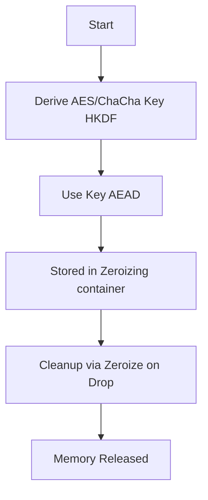
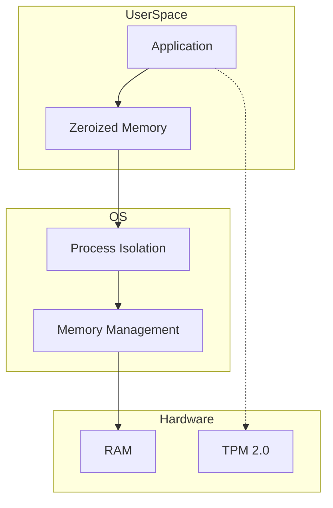

nkCryptoTool is designed with a strong focus on minimizing exposure of sensitive key material.

This document describes its security design and guarantees.
It reflects the current implementation.

# Security Policy

## Overview

nkCryptoTool is designed with a strong focus on minimizing exposure of sensitive key material.
The architecture separates cryptographic operations from key protection and enforces strict memory lifecycle controls using Rust's safety guarantees and specialized crates.

---

## Security Design Principles

### 1. Ephemeral Key Usage

Sensitive data protection keys (e.g., AEAD keys) are:

* Generated or derived only when needed
* Never persisted to disk
* Stored only in memory for the shortest possible duration
* Key lifetime is strictly bound to the processing scope using Rust's ownership model.

Keys are derived using HKDF-SHA3-256 and exist only during active cryptographic operations.

---

### 2. Memory Protection

Sensitive data is protected in memory using:

* `SecureBuffer` which uses `mlock` (where supported) to prevent the page from being **swapped to disk**.
* Explicit zeroization using the `zeroize` crate (via `#[derive(Zeroize)]` and `Zeroizing<T>` wrappers).
* Streaming I/O via Tokio for large data processing to avoid unnecessary copies.

All sensitive buffers and ephemeral keys are stored in `Zeroizing` containers to ensure they are wiped before deallocation.

**Scope of `mlock` protection**: `mlock` only prevents the OS from paging the memory out to swap. It does **not** prevent in-RAM scraping by an attacker with `ptrace` capability or read access to `/proc/<pid>/mem`. See "Known Limitations" below.

---

### 3. Guaranteed Cleanup (RAII)

Key material is tied to object lifetime using Rust's RAII (Resource Acquisition Is Initialization):

* `Drop` implementations are guaranteed to run during normal execution and panic-based stack unwinding
* Sensitive buffers are explicitly wiped (zeroed) before deallocation via the `zeroize` crate
* This ensures that no plaintext residue remains in memory after the operation completes.

---

### 4. Hybrid Post-Quantum Cryptography (PQC)

The tool implements a hybrid cryptographic approach to ensure security against both classical and quantum computers:

* **Key Encapsulation**: Combines ML-KEM (FIPS 203) with ECDH (Prime256v1/X25519).
* **Digital Signatures**: Uses ML-DSA (FIPS 204) for all authentication tasks.
* **Handshake**: A PQC-secure handshake with mutual authentication provides forward secrecy and identity verification.

---

### 5. Secure Key Management Abstraction

Key handling supports advanced protection mechanisms:

* **TPM 2.0 Support**: Enables wrapping/unwrapping of keys using a Hardware Security Module (TPM).
* **Encrypted PEM**: Keys can be stored on disk encrypted with a passphrase-derived key (using Argon2/PBKDF2 equivalents).
* **Decoupling**: Cryptographic operations are decoupled from key storage through the `KeyProvider` trait.

The system does not rely on TPM for bulk encryption, only for secure key wrapping.

---

### 6. TPM Security

When TPM is used:

* Operations are performed using TPM 2.0 HMAC sessions to protect against interception.
* No secrets are passed via command-line arguments.
* Communication with TPM is performed directly via `tpm2-tools` with secure argument handling.

**Current scope**: TPM-backed key protection is supported only for **local file operations** (encrypt / decrypt / sign / verify). The network mode (chat / file transfer over TCP) **does not currently support TPM-wrapped keys** and will reject them at handshake. For network use, plain or PBES2-encrypted keys must be supplied.

---

### 7. Process-Level Hardening

To prevent sensitive data leakage:

* Core dumps are disabled at process startup (`libc::setrlimit(RLIMIT_CORE, 0)`)
* Shell execution is avoided; all external commands (like TPM tools) are executed with explicit argument vectors.
* Memory locking (`mlock`) is used for active keys to prevent them from being written to swap space.

---

## Security Boundaries

### Guaranteed Protections

The system ensures:

* No plaintext key material is written to disk.
* No exposure of keys through command-line arguments or environment variables (except when explicitly opted-in for convenience).
* Memory is wiped on normal execution and panic paths.
* No cross-process memory leakage (enforced by OS isolation).

---

### Known Limitations

The following are outside the scope of user-space protections:

* Physical memory attacks (e.g., cold boot attacks).
* Compromised or untrusted operating system kernels.
* Privileged attackers (e.g., root access, ptrace).
* Abrupt process termination that prevents cleanup (e.g., `SIGKILL`, hardware failure).
* In-RAM scraping by same-user processes (the `cached_signing_key` cache used in network mode persists for the process lifetime; an attacker able to `ptrace` or read `/proc/<pid>/mem` can recover it).

In such cases:

* Sensitive data may temporarily remain in RAM.
* However, it is never written to disk due to `mlock` and disabled core dumps.

To harden against same-user memory scraping, deploy on systems with `kernel.yama.ptrace_scope=2` (admin-only attach) or `=3` (no attach) and run the tool under a dedicated UID.

---

## Threat Model

This tool is designed to protect against:

* Accidental data leakage to disk.
* Casual memory inspection (zeroization on drop, no swap via `mlock`, disabled core dumps).
* Network-based replay, slow-sender, and many-key DoS attacks.
* Man-in-the-middle attacks on the network handshake (when authentication is enabled).

**Assumed attacker capabilities (in scope):**
* Unprivileged local user without `ptrace` capability.
* Network eavesdropper or active man-in-the-middle.
* Adversary controlling many peer keypairs attempting DoS via chat-slot occupation.

This tool does **not** defend against:

* Physical attacks on memory hardware (cold boot, hardware probing).
* Kernel-level compromise or root attackers.
* Same-user attackers with `ptrace` capability or read access to `/proc/<pid>/mem` (the network-mode signing-key cache is exposed).
* Advanced side-channel attacks (e.g., power analysis, fine-grained timing).

---

## Best Practices for Deployment

For maximum security:

* Run on a trusted operating system with a modern kernel.
* Use TPM-backed key protection (`--use-tpm`) for long-term keys **used in local file operations**. (Network mode does not currently consume TPM-wrapped keys.)
* Enable mutual authentication using ML-DSA signatures (the default; do not pass `--allow-unauth`).
* In chat mode, use `--peer-allowlist` to restrict access to known peer fingerprints.
* Regularly rotate signing keys.
* Restrict `ptrace` (e.g., `kernel.yama.ptrace_scope=2`) on the host running the network mode to harden the in-memory signing-key cache.

---

## Key Management Best Practices

### Long-term Signing Key Rotation
Since nkCryptoTool does not utilize a central Certificate Authority (CA), the security relies on the secrecy of long-term signing keys.

* **Rotation:** Rotate signing key pairs periodically (e.g., annually).
* **Compromise:** If a private key is suspected to be compromised, revoke it out-of-band and generate a new pair.
* **Storage:** Use TPM protection whenever possible.

### Availability and Anti-Replay
To ensure server availability and protect against session-level attacks:

*   **Handshake Timeout:** 15 seconds default (`--handshake-timeout`, configurable). Prevents half-open handshake DoS.
*   **Idle Timeouts:** Strict idle timeout (300 seconds) across all data transfer stages.
*   **Cumulative Session Timeouts:** Aggregate 2-hour timeout for both file transfer (`CUMULATIVE_TIMEOUT`) and chat (`CHAT_SESSION_TIMEOUT`) to bound resource occupation.
*   **Resource Capping:** Simultaneous connections are limited to 100 via a global semaphore. Handshake vectors (`read_vec`) are capped at 8 KiB.
*   **Anti-Replay (Chat Mode):** A memory-limited sliding window of used nonces (up to 100,000) is maintained per session; oldest entries are evicted on overflow.
*   **Peer Identity Cooldown (Chat):** After a chat session ends, the peer (identified by long-term ML-DSA pubkey fingerprint, or by source IP for unauthenticated peers) is barred from reconnecting for 60 seconds.
*   **Peer Allowlist (Optional):** `--peer-allowlist <file>` restricts chat to a fixed set of known peer fingerprints, raising the cost of "many-key DoS" attacks.
*   **Authentication Default:** `--allow-unauth` defaults to `false`. Mutual ML-DSA authentication is required by default.
*   **CPU Load Mitigation:** Handshake costs (ML-KEM/ML-DSA) and strict timeouts provide defense against CPU exhaustion. Heavy crypto runs on `tokio::task::spawn_blocking`.

---

## Reporting Security Issues

If you discover a security vulnerability, please report it responsibly:

* Open a GitHub issue (if non-sensitive), or
* Contact the maintainer privately at `nkoriyama@gmail.com`.

Please include:

* Description of the issue.
* Steps to reproduce.
* Potential impact.

## Design Invariants Integration

The security guarantees described in this document rely on the invariants defined in `SPEC.md` (Section 11).

In particular:

- **Zeroization guarantees** depend on:
  - No-Copy Principle
  - Boundary Preservation
  - Explicit Destruction
- **Network-level protections** depend on:
  - Symmetry Principle
  - State Machine Consistency
- **Memory protection guarantees** assume:
  - Memory-Agnostic Security
  - Backend Distrust Model

Violation of these invariants may invalidate the guarantees described in this document.

---

## Summary

nkCryptoTool enforces a layered security model:

* **Cryptography**: Hybrid (Classical + PQC) keys, ephemeral session keys derived per handshake via HKDF-SHA3-256.
* **Memory**: `mlock` to prevent swap, `zeroize` on drop, disabled core dumps. `mlock` does not defend against in-RAM scraping.
* **Network**: Mutual authentication required by default, replay protection (sliding-window nonce store, 100k entries), per-peer cooldown (60 s), optional peer allowlist, configurable handshake timeout.
* **Disk**: PKCS#8 / PBES2-encrypted private keys. `secure_write` enforces atomic writes with `O_NOFOLLOW`-equivalent semantics and 0o600 permission.

This design maximizes protection within the constraints of user-space cryptographic security.

**This document reflects the actual implementation (v55) and is kept in sync with the codebase.**

