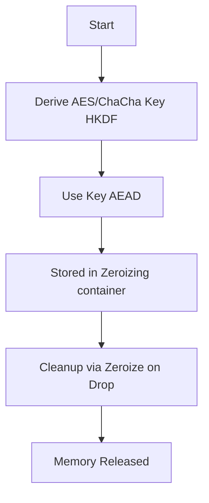
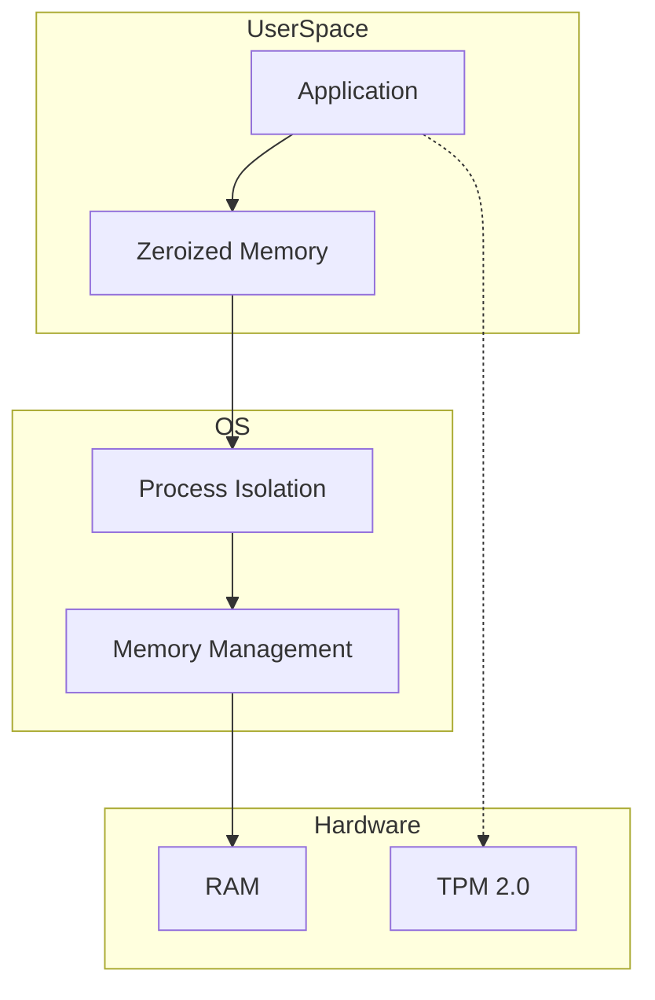

nkCryptoTool is designed with a strong focus on minimizing exposure of sensitive key material.

This document describes its security design and guarantees.
It reflects the current implementation.

# Security Policy

## Overview

nkCryptoTool is designed with a strong focus on minimizing exposure of sensitive key material.
The architecture separates cryptographic operations from key protection and enforces strict memory lifecycle controls using Rust's safety guarantees and specialized crates.

---

## Security Design Principles

### 1. Ephemeral Key Usage

Sensitive data protection keys (e.g., AEAD keys) are:

* Generated or derived only when needed
* Never persisted to disk
* Stored only in memory for the shortest possible duration
* Key lifetime is strictly bound to the processing scope using Rust's ownership model.

Keys are derived using HKDF-SHA3-256 and exist only during active cryptographic operations.

---

### 2. Memory Protection

Sensitive data is protected in memory using:

* `SecureBuffer` which uses `mlock` (where supported) to prevent swapping to disk
* Explicit zeroization using the `zeroize` crate (via `#[derive(Zeroize)]` and `Zeroizing<T>` wrappers)
* Memory-mapped files (`mmap`) for large data processing to avoid unnecessary copies

All sensitive buffers and keys are stored in `Zeroizing` containers to ensure they are wiped before deallocation.

---

### 3. Guaranteed Cleanup (RAII)

Key material is tied to object lifetime using Rust's RAII (Resource Acquisition Is Initialization):

* `Drop` implementations are guaranteed to run during normal execution and panic-based stack unwinding
* Sensitive buffers are explicitly wiped (zeroed) before deallocation via the `zeroize` crate
* This ensures that no plaintext residue remains in memory after the operation completes.

---

### 4. Hybrid Post-Quantum Cryptography (PQC)

The tool implements a hybrid cryptographic approach to ensure security against both classical and quantum computers:

* **Key Encapsulation**: Combines ML-KEM (FIPS 203) with ECDH (Prime256v1/X25519).
* **Digital Signatures**: Uses ML-DSA (FIPS 204) for all authentication tasks.
* **Handshake**: A PQC-secure handshake with mutual authentication provides forward secrecy and identity verification.

---

### 5. Secure Key Management Abstraction

Key handling supports advanced protection mechanisms:

* **TPM 2.0 Support**: Enables wrapping/unwrapping of keys using a Hardware Security Module (TPM).
* **Encrypted PEM**: Keys can be stored on disk encrypted with a passphrase-derived key (using Argon2/PBKDF2 equivalents).
* **Decoupling**: Cryptographic operations are decoupled from key storage through the `KeyProvider` trait.

The system does not rely on TPM for bulk encryption, only for secure key wrapping.

---

### 6. TPM Security

When TPM is used:

* Operations are performed using TPM 2.0 HMAC sessions to protect against interception.
* No secrets are passed via command-line arguments.
* Communication with TPM is performed directly via `tpm2-tools` with secure argument handling.

---

### 7. Process-Level Hardening

To prevent sensitive data leakage:

* Core dumps are disabled at process startup (`libc::setrlimit(RLIMIT_CORE, 0)`)
* Shell execution is avoided; all external commands (like TPM tools) are executed with explicit argument vectors.
* Memory locking (`mlock`) is used for active keys to prevent them from being written to swap space.

---

## Security Boundaries

### Guaranteed Protections

The system ensures:

* No plaintext key material is written to disk.
* No exposure of keys through command-line arguments or environment variables (except when explicitly opted-in for convenience).
* Memory is wiped on normal execution and panic paths.
* No cross-process memory leakage (enforced by OS isolation).

---

### Known Limitations

The following are outside the scope of user-space protections:

* Physical memory attacks (e.g., cold boot attacks).
* Compromised or untrusted operating system kernels.
* Privileged attackers (e.g., root access, ptrace).
* Abrupt process termination that prevents cleanup (e.g., `SIGKILL`, hardware failure).

In such cases:

* Sensitive data may temporarily remain in RAM.
* However, it is never written to disk due to `mlock` and disabled core dumps.

---

## Threat Model

This tool is designed to protect against:

* Accidental data leakage.
* Memory scraping from user-space processes.
* Network-based replay and slow-sender attacks.
* Disk persistence of sensitive material.

**Assumed attacker capabilities:**
* Unprivileged local user.
* Ability to inspect process memory (limited).
* Network eavesdropper or active man-in-the-middle.

This tool does **not** defend against:

* Physical attacks on memory hardware.
* Kernel-level compromise.
* Advanced side-channel attacks (e.g., power analysis).

---

## Best Practices for Deployment

For maximum security:

* Run on a trusted operating system with a modern kernel.
* Use TPM-backed key protection (`--use-tpm`) for long-term keys.
* Enable mutual authentication using ML-DSA signatures.
* Regularly rotate signing keys.

---

## Key Management Best Practices

### Long-term Signing Key Rotation
Since nkCryptoTool does not utilize a central Certificate Authority (CA), the security relies on the secrecy of long-term signing keys.

* **Rotation:** Rotate signing key pairs periodically (e.g., annually).
* **Compromise:** If a private key is suspected to be compromised, revoke it out-of-band and generate a new pair.
* **Storage:** Use TPM protection whenever possible.

### Availability and Anti-Replay
To ensure server availability and protect against session-level attacks:

*   **Idle Timeouts:** Strict idle timeout (300 seconds) across all data transfer stages.
*   **Cumulative Session Timeout:** aggregate timeout (2 hours) for the entire data transfer session to prevent "Slow Sender" attacks.
*   **Resource Capping:** Simultaneous connections are limited to 100 via a global semaphore.
*   **Anti-Replay (Chat Mode):** A memory-limited history of used nonces (up to 10,000) is maintained per session.
*   **CPU Load Mitigation:** Handshake costs (ML-KEM/ML-DSA) and strict timeouts provide defense against CPU exhaustion.

---

## Reporting Security Issues

If you discover a security vulnerability, please report it responsibly:

* Open a GitHub issue (if non-sensitive), or
* Contact the maintainer privately at `nkoriyama@gmail.com`.

Please include:

* Description of the issue.
* Steps to reproduce.
* Potential impact.

## Design Invariants Integration

The security guarantees described in this document rely on the invariants defined in `SPEC.md` (Section 11).

In particular:

- **Zeroization guarantees** depend on:
  - No-Copy Principle
  - Boundary Preservation
  - Explicit Destruction
- **Network-level protections** depend on:
  - Symmetry Principle
  - State Machine Consistency
- **Memory protection guarantees** assume:
  - Memory-Agnostic Security
  - Backend Distrust Model

Violation of these invariants may invalidate the guarantees described in this document.

---

## Summary

nkCryptoTool enforces a strict security model:

* Keys are ephemeral and hybrid (Classical + PQC).
* Memory is protected with `mlock` and zeroed via `zeroize`.
* Network sessions are protected against replay and slow-sender attacks.
* Disk exposure is prevented.

This design maximizes protection within the constraints of user-space cryptographic security.

**This document reflects the actual implementation and is kept in sync with the codebase.**

