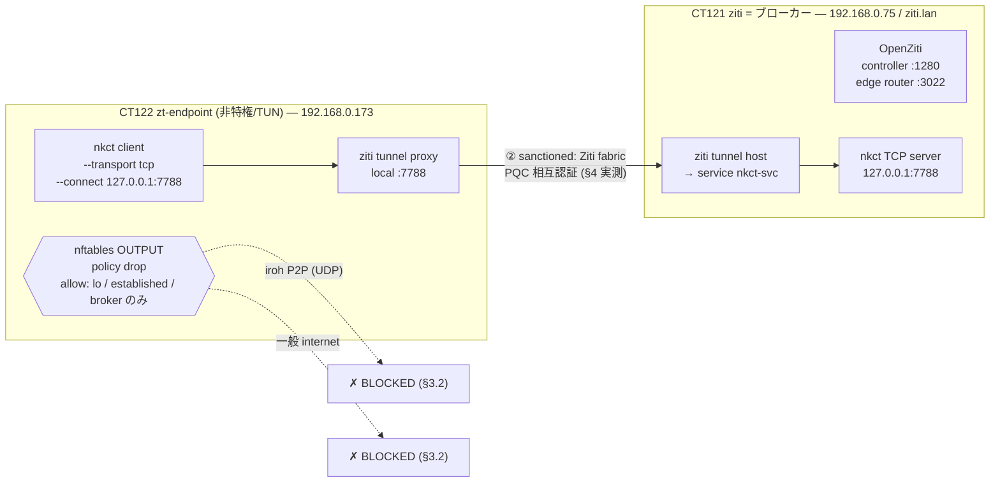

# ZTNA 環境下における nkCryptoTool の可用性

ZTNA(Zero Trust Network Access）や egress を制御するネットワーク下で nkct（P2P
shell / scp / chat / file）がどこまで到達できるか、実測と運用指針。

> 本書は**実測エビデンス + 運用指針**。nkct 側の数値・挙動は本ラボで実測。**商用 ZTNA
> 製品（Zscaler ZPA / Cloudflare Gateway 等）は未実測**の項目を推定として明記する
> （Part 2 の規律に準拠）。関連の性能・到達性実証は
> [`P2P_INTEROP_EVIDENCE.md`](./P2P_INTEROP_EVIDENCE.md)。

## 1. 前提: nkct トランスポートが要求するもの

iroh トランスポートは 3 つに依存する:

1. **outbound UDP** — 直接ホールパンチ（P2P の主経路）。
2. **n0 の DNS/pkarr（`iroh.link`）** — `--discovery n0` のピア発見。
3. **relay（443/TLS）へのフォールバック** — UDP が塞がれたとき。

ZTNA はこの 3 つをよく制限する。よって**可用性は ZTNA の egress posture に完全に依存**する。
根本的な緊張として、**厳格 ZTNA は「un-brokered な egress を止める」ための仕組み**であり、
nkct のネイティブ P2P は**まさにそれが止めたいこと**をやる。

## 2. posture 別 可用性マトリクス

| ZTNA posture | nkct ネイティブ(iroh) | 実測/推定 |
|---|---|---|
| **split-tunnel**（社内アプリのみブローカー、他は素の internet） | ✅ 通る（direct hole-punch） | 推定（素のネットと同等） |
| **full-tunnel・egress 寛容**（UDP 通る・一般 internet 可） | ✅ 通る（relay fallback もあり得る） | **実測: direct・RTT +1ms**（§3.1） |
| **厳格（egress allowlist / broker-only・UDP 遮断）** | ❌ 遮断 | **実測: 全遮断**（§3.2） |
| **アプリ allowlist**（承認アプリのみ通信可） | ❌ エージェント段で遮断 | 推定 |

> **「推定」の確度差**（後の実測が何を検証するかを分けるため）: split-tunnel は egress 的に
> 素の internet と等価なので direct 成立は**高確度**（原理から導ける）。アプリ allowlist は
> エージェント実装依存で**中確度**。§5 の商用 ZTNA / TLS 傍受は製品・設定・シグネチャ依存で
> **低確度**。いずれの推定も**実測で覆りうる**。

## 3. 実測エビデンス

### 3.1 寛容 full-tunnel（WireGuard exit-node, 2026-07-02）

bazzite を Tailscale exit-node（full-tunnel VPN）配下に置き、tailnet 外の OCI VPS へ接続:
**20/20 direct hole-punch 成立・relay 0%・RTT 中央値 5ms（exit-node 1 ホップ分 +1ms）**。
＝ egress が寛容な full-tunnel なら nkct は素通りする。詳細は `P2P_INTEROP_EVIDENCE.md` 第2パス。

### 3.2 厳格 ZTNA（OpenZiti default-deny egress ラボ, 2026-07-03）

nkpve（Proxmox）上に OpenZiti を構築（CT121=controller/router、CT122=enroll 済エンドポイント）。
エンドポイントに **nftables default-deny egress**（許可は Ziti ブローカー 192.168.0.75 のみ）を課し、
「un-brokered egress を禁じる」ZTNA posture を再現:

| 経路 | 結果 |
|---|---|
| ベースライン（制限なし）nkct `--conn-metrics` | **relay=false rtt_ms=1**（LAN 直結で疎通） |
| default-deny 下: Ziti ブローカー(3022) | **到達可（唯一の sanctioned 経路）** |
| default-deny 下: nkct ネイティブ iroh P2P | **BLOCKED**（UDP ホールパンチ遮断→connect timeout 連続、metrics 出ず） |
| default-deny 下: 一般 internet（curl 1.1.1.1） | **BLOCKED** |

＝ 厳格 ZTNA は nkct ネイティブ P2P を**完全に止める**。

## 4. 構成的可用性 — sanction すれば厳格 ZTNA 下でも通る

> **【履歴化 — TCP transport 削除済み】** 本章以降の `--transport tcp` を用いた実証は、**TCP transport が削除された**（deprecated かつ実運用で不使用、鍵交換の identity-misbinding が未修整だったため）時点で**再現不能**になりました。当時の検証記録として残します。**iroh は QUIC(UDP) ベースゆえ、ここで TCP が担っていた「単一 host:port として ZTNA の TCP fabric にトンネルする」用途は代替できません** ── QUIC を通さない TCP-only な ZTNA 経路で nkct を動かす需要が再び生じた場合は、TCP transport の再実装（または QUIC-over-TCP トンネル）が別途必要という制約が残ります。

厳格 ZTNA でも、nkct を**ブローカー許可サービスとして sanction すれば通る**。鍵は（当時の）nkct の
**TCP トランスポート**（`--transport tcp --listen/--connect host:port` = 素の TCP + PQC ハンドシェイク）。
iroh の多宛先 UDP と違い、TCP なら単一 host:port として ZTNA サービスにトンネルできる。

**実測（同ラボ, default-deny egress 下, 2026-07-03）**:
- CT121 に nkct TCP サーバ（127.0.0.1:7788）+ `ziti tunnel host`（サービス `nkct-svc`: host.v1→7788、
  bind=host識別子 / dial=endpoint識別子 の service-policy）。
- CT122 で `ziti tunnel proxy nkct-svc:7788`（**TUN 不要 = 非特権 LXC で動く**）→ local:7788 を張る。
- CT122 の nkct client `--transport tcp --connect 127.0.0.1:7788` → Ziti fabric 経由で CT121 到達。
- **結果: default-deny egress 下でも PQC 相互認証が成立**（client `Server authenticated / Handshake
  completed`、server `Client authenticated (pinned key)`）。ネイティブ iroh は同条件で遮断される。

### 二層の共存（本ラボが実証したこと）

- **ネットワーク層（ZTNA/Ziti）**: 誰が・どの経路で外に出られるかを default-deny + ブローカーで制御。
- **アプリ層（nkct）**: その sanctioned 経路の上で、ML-KEM + ML-DSA 相互認証 + 指紋ピン + AEAD を重ねる。

ZTNA が「経路の認可」、nkct が「端点の暗号認証」を担い、**排他でなく積層**する
（設計思想は [`TRUST_BOOTSTRAP_DESIGN.md`](./TRUST_BOOTSTRAP_DESIGN.md) の
「ネットワーク ZTNA が許可した経路の上に nkct のアプリ層相互認証を重ねる」の実データ裏付け）。

## 5. 制約と注意

- **TCP トランスポートは chat / file のみ**。shell / scp / forward は iroh 専用なので、**sanction
  経路（TCP）では現状 shell/scp は使えない**。ZTNA 下で shell/scp を通したい場合は relay 経路
  （下記 6.b の自己ホスト relay）を使う。
- **iroh（多宛先 UDP P2P）は単純な Ziti サービス化が困難**（ホールパンチ + n0 DNS + relay の
  複数宛先）。sanction には TCP トランスポートを使うのが要点。
- **透過インターセプタ（`ziti tunnel tproxy/run`）は非特権 LXC で init 失敗**（NET_ADMIN /
  iptables mangle 要）。`ziti tunnel proxy`（アプリ層ポートフォワード）は TUN 不要で動く。
- **AUP/ポリシー**: 会社支給端末・業務 ZTNA 上で nkct を使ってブローカー外へ出るのは、多くの
  組織で **ZTNA/利用規定違反**になり得る。ZTNA はまさに un-sanctioned な egress を止めるための
  仕組み。自分が管理する環境・許可された枠で。
- **商用 ZTNA は未実測**（Zscaler ZPA / Cloudflare Gateway / Netskope 等）。予測を確度で分ける:
  - **高確度（アーキテクチャから導ける）**: iroh relay は 443/TLS 上で確立するので、UDP を全遮断
    しても **443 が開いていれば relay 経路は生存しうる**。
  - **低〜不確実（製品・設定・シグネチャ依存）**: TLS 傍受プロキシ・CONNECT-only プロキシ下で
    iroh relay（QUIC/HTTPS）が素通りするかは、プロキシ実装次第で**大きく振れる**（厳しい見込み
    だが確度は低い）。
  - **これらの推定は実測で覆りうる**。「未実測（まだ測っていない）」と「外れうる（測ったら違う
    かも）」は別の留保で、特に TLS 傍受下の relay 挙動はプロキシ実装依存で**予測が外れうる**。
    判定は対象環境で `--conn-metrics` を実測するのが最速（direct/relay/失敗を一発で出す）。

## 6. 運用指針（nkct を ZTNA 下で使いたい管理者へ）

- **寛容な ZTNA**（split / permissive full-tunnel）: そのまま通る。何もしなくてよい（§3.1）。
- **厳格な ZTNA**: 2 通り。
  - **(a) TCP トランスポートを ZTNA サービスとして sanction**（§4）。chat/file が通る。shell/scp は不可。
  - **(b) 自己ホスト relay を ZTNA 許可ドメイン・443 に立て、`--relay-url` で指す**。iroh 経路のまま
    relay-only で通せる可能性（TLS 傍受があると厳しい・要検証）。shell/scp も iroh 経路なので候補。
- 判定は**対象環境で `--conn-metrics` を実測**するのが最速。direct/relay/失敗が 1 行で出る。

## 7. 再現（ラボ構成）

Proxmox（nkpve）上に LXC 3 台で「厳格 ZTNA posture + sanctioned 経路」を再現した構成:

- **① default-deny egress**: CT122 の nftables が broker(192.168.0.75)以外への egress を全遮断
  → nkct ネイティブ iroh P2P も一般 internet も止まる（§3.2 実測）。
- **② sanctioned 経路**: nkct の TCP トランスポートを Ziti サービス(`nkct-svc`)化
  → default-deny 下でも Ziti fabric 経由で PQC 相互認証が成立（§4 実測）。
- **CT123 `zt-agent`**（特権/TUN・停止・参照残置）: 透過 tproxy 検証機 → §8。

- ホスト: Proxmox（nkpve）。CT121 `ziti`（debian-12・非特権・2c/2GB/8GB、OpenZiti v2.0.0
  `ziti edge quickstart`、controller `:1280` + router `:3022`）。CT122 `zt-endpoint`（TUN passthrough、
  enroll 済、nkct musl バイナリ、proxy-mode 本番構成）。CT123 `zt-agent`（**特権 LXC**・
  透過 tproxy 検証用、§8。停止・参照残置）。
- **v2.0.0 の罠**: advertise アドレスに素の IP は SAN 検証で fatal → **ホスト名 `ziti.lan`**
  を advertise（クライアントの `/etc/hosts` に `192.168.0.75 ziti.lan`）。
- egress 制御: `nft` で `chain output { policy drop; oif lo accept; ct state established,related accept;
  ip daddr <broker> accept }`。

## 8. 透過インターセプト（tproxy）の知見

`ziti tunnel proxy`（§4）はローカルポート + `nkct --connect 127.0.0.1:port` の明示接続だが、
より ZTNA エージェントらしい**透過インターセプト**（アプリは実サービス名に繋ぐだけ）も検証した。

- **非特権 LXC では init 失敗**（`failed to initialize an interceptor`）。NET_ADMIN / iptables
  mangle / TPROXY が要る。→ **特権 LXC + ホストで tproxy 系モジュール**（`nf_tproxy_ipv4`,
  `xt_TPROXY`, `nft_tproxy`）を load すると**インターセプタは初期化成功**:
  DNS server（127.0.0.1:53）+ サービス名の仮想 IP 割当（`nkct.ziti → 100.64.0.2`）+
  `iptables -t mangle NF-INTERCEPT ... -j TPROXY` ルールまで自動生成される。
- ただし **`ziti tunnel tproxy` の TPROXY ルールは PREROUTING**＝**ゲートウェイ透過**
  （このホストを経由する*下流ホスト*の transit を捕捉）向け。**同一ホスト上のローカルアプリ**は
  ローカル生成トラフィックが OUTPUT を通り PREROUTING に来ないため捕捉されない（fwmark ルート /
  ルーティングテーブルも未設定）。→ 実測でローカル nkct は intercept されず reset。
- **結論**: 端点自身のアプリを透過 intercept したいなら **C 版 `ziti-edge-tunnel`（TUN ベース）**
  を使う（本番エンドポイントエージェントはこちらが定石。ただし debian-12 の openziti apt repo には
  当該パッケージが無く、別途入れる必要）。それ以外（同一ホストのローカルアプリ）は **proxy-mode
  が確実**（§4・§9 の本番構成で採用）。特権 CT の tproxy は**ゲートウェイ ZTNA**（下流を守る）に有効。

## 9. 本番運用構成（ラボ・systemd + 永続 nftables）

§4 の sanctioned 経路を「毎回手起動」でなく**再起動耐性のある systemd + 永続ファイア
ウォール**に固めた実構成（nkpve 上, 全サービス enabled・CT onboot=1）:

| ノード | サービス（systemd） | 役割 |
|---|---|---|
| **CT121 `ziti`** | `ziti-quickstart` | controller `:1280` + edge router `:3022` |
| | `nkct-tcp` | nkct TCP サーバ `127.0.0.1:7788`（PQC・指紋ピン） |
| | `ziti-host` | `ziti tunnel host` で service `nkct-svc` を 7788 へ終端 |
| **CT122 `zt-endpoint`** | `ziti-proxy` | `ziti tunnel proxy nkct-svc:7788` で local:7788 を提供 |
| | `nftables`（`/etc/nftables.conf`） | **default-deny egress**（許可は lo / established / ブローカー） |

- **実測（本番構成・再起動耐性込み）**: CT122 で nftables default-deny + ziti-proxy が systemd
  常駐した状態で、**internet=遮断**・**nkct `--transport tcp --connect 127.0.0.1:7788` = PQC 相互認証
  成立**（`Handshake completed / File sent`、サーバ側 `Client authenticated (pinned key)`）。
- **永続性**: 全 systemd サービス `enabled`、CT `onboot=1`。`/etc/nftables.conf` は `nftables.service`
  が boot 時にロード → **再起動後も ZTNA posture（default-deny）と sanctioned 経路が自動復帰**。
- **本番強化の余地**: (1) controller/router は quickstart ではなく **openziti-controller /
  openziti-router パッケージ**（systemd・PKI ローテ・HA）へ移行推奨。(2) 透過が要る端点は
  **C 版 ziti-edge-tunnel**（§8）。(3) admin パスワード/PKI/証明書更新の運用。(4) ブローカーの
  外部到達（LAN 外エンドポイント）は edge router の公開 or 追加ルータ。

## 10. 結論

- **可用性は ZTNA の egress posture に完全依存**: 寛容なら素通り（実測 +1ms）、厳格なら
  ネイティブ P2P は全遮断（実測）。
- **厳格 ZTNA 下でも sanction すれば通る**: TCP トランスポートを ZTNA サービス化すれば、
  ブローカー経路の上で nkct の PQC 相互認証が成立（実測）。ネットワーク ZTNA と nkct アプリ層
  認証は積層する。**systemd + 永続 nftables で再起動耐性のある本番構成に固められる**（§9）。
- 制約: sanction 経路（TCP）では shell/scp 不可・iroh 直の sanction は困難・同一ホストの透過は
  C 版 tunneler 要（§8）・商用 ZTNA は未実測。

## 関連

- `P2P_INTEROP_EVIDENCE.md` — 到達性・性能の実測（本書の前提）。
- `TRUST_BOOTSTRAP_DESIGN.md` — 二層共存の設計思想。
- `P2P_SCP_COMPARISON.md` — 他ファイル転送との比較。
