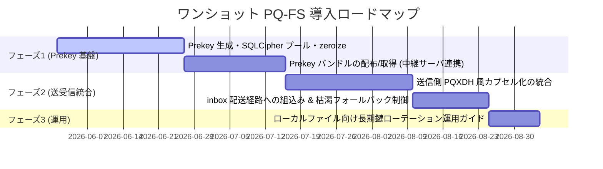

<!--
  本書は当初 P2P トランスポート層への PQ-FS 導入設計として Gemini(agy) に依頼した
  成果物だが、2026-05-30 の現行コード検証により前提が誤りと判明したため改稿した。
  【検証結果】ライブ P2P ハンドシェイク (src/p2p/processor.rs) は既に相互 ephemeral
  ハイブリッド (ECDH ephemeral-ephemeral + ML-KEM をクライアント ephemeral 鍵に encap)
  であり PQ-FS 達成済み。Claude が精読し agy も全面同意。
  → 本書の対象は「ライブ P2P」ではなく「非同期・ワンショット経路」のみに再スコープした。
  実装着手前に末尾「未決定の論点」を確定すること。
-->

# 設計提案書: 非同期・ワンショット暗号化への Post-Quantum Forward Secrecy (PQ-FS) 導入

本提案書は、`nkCryptoTool-rust` の**非同期・ワンショット暗号化経路**（ローカルファイル暗号化 / inbox 経由の非同期配送）におけるポスト量子前方秘匿性（PQ-FS）の欠如を解決し、将来的な量子コンピュータ（CRQC）による Harvest-Now-Decrypt-Later (HNDL) 攻撃から過去の暗号文を保護するための設計を提案します。

> [!IMPORTANT]
> **スコープ訂正（2026-05-30）**: 当初本書はライブ P2P トランスポートを対象としていたが、
> 現行コード検証の結果、**ライブ P2P（チャット・同期ファイル転送）は既に PQ-FS を達成済み**
> であることが判明した（後述 §0）。したがって本書の設計対象は **非同期・ワンショット経路のみ** に限定する。

---

## 0. 現行コード検証結果（ライブ P2P は対象外）

`src/p2p/processor.rs` のハンドシェイクを精読した結果、ライブ P2P トランスポート（`ALPN_CHAT` / `ALPN_FILE` 共通の `handle_server_connection` / `run_connect`）は既に PQ-FS を達成していることを確認した。

- **クライアント `run_connect`**: `pqc_keygen_kem()` で**毎接続 ephemeral な** KEM 鍵ペアを生成し `client_kem_pub` を送信。
- **サーバ `handle_server_connection`**: `pqc_encap(kem_algo, client_kem_pub)` で**クライアントの ephemeral KEM 公開鍵**に encap し `kem_ct` を返す。
- **ECDH** は両側とも `generate_ecc_key_pair` で毎接続 ephemeral 生成。
- **サーバの静的 KEM 鍵 `server_kem_pub`** は送信されるが、クライアント側で**指紋照合（MITM 検出）専用**に使われるのみで、HKDF 入力（`combined_ss = ss_ecc ‖ kem_ss`）には一切関与しない。

$$\begin{aligned}
SS_{ecc} &= \text{ECDH}(C_{ecc\_eph}, S_{ecc\_eph}) \quad(\text{両側 ephemeral}) \\
KEM_{ss} &= \text{ML-KEM-768}(C_{kem\_eph}) \quad(\text{クライアント ephemeral 鍵に encap}) \\
\text{session\_key} &= \text{HKDF-SHA3-256}(\text{salt}, SS_{ecc} \mathbin{\Vert} KEM_{ss})
\end{aligned}$$

KEM では鍵ペアを提示する側（=クライアント）が ephemeral であれば共有秘密全体が ephemeral 依存となり、双方向通信に対して完全な FS が成立する（TLS 1.3 / SIGMA と同型。サーバが独立した ephemeral KEM 鍵を持つ必要はない）。認証は ML-DSA 静的鍵による transcript 署名で別途担保している。**よって将来 CRQC + サーバ静的鍵窃取が起きても、使い捨て KEM 秘密鍵（セッション後 zeroize 済み）への encap は復元不能であり、過去のライブ通信は守られる。**

このため、当初の設計候補（旧 §2〜§4 の 1 RTT HEK ハンドシェイク化等）は**既に実装されている要件の再設計に相当し不要**であり、以下では削除する。

---

## 1. 残存する PQ-FS ギャップ（本書の対象）

### 1.1 Harvest-Now-Decrypt-Later (HNDL) 脅威 — ワンショット経路
非同期・ワンショット暗号化（[pqc.rs](src/strategy/pqc.rs) / [hybrid.rs](src/strategy/hybrid.rs)）では、受信者がオフラインのため双方向の ephemeral 交換ができず、受信者の**長期固定 KEM 公開鍵**に encap する：

$$\begin{aligned}
SS_{ecc} &= \text{ECDH}(\text{sender\_ephemeral}, \text{recipient\_static}) \\
KEM_{ss} &= \text{ML-KEM-768}(\text{static\_recipient\_key}) \\
\text{session\_key} &= \text{HKDF-SHA3-256}(\text{salt}, SS_{ecc} \mathbin{\Vert} KEM_{ss})
\end{aligned}$$

- **現在守れる範囲 (Pre-Quantum FS)**:
  - 古典的攻撃者に対しては、$SS_{ecc}$ の送信者側が ephemeral であるため、長期秘密鍵が漏洩しても古典的には過去の暗号文は解読されません。
- **現在守れない範囲 (Post-Quantum FS なし)**:
  - 量子計算機を持つ攻撃者は、過去の暗号文をすべて保存（Harvest-Now）しておきます。
  - 将来、受信者の**長期固定 KEM 秘密鍵（static recipient key）**を窃取し、量子計算機を用いて ECDH ($SS_{ecc}$) を破れば、保存しておいた暗号文から $KEM_{ss}$ と $SS_{ecc}$ の両方を復元でき、過去の暗号文がすべて解読されます（Decrypt-Later）。
  - これは、ML-KEM 側の共有秘密 $KEM_{ss}$ の生成が、受信者の**長期固定鍵**に依存しているためです。

### 1.2 対話型セッション vs ワンショット (非同期) の本質的違い
PQ-FS の達成可能性は、通信モデルの双方向性と同期性に大きく依存します。

| 区分 | ユースケース | 通信特性 | PQ-FS の現状 |
| :--- | :--- | :--- | :--- |
| **対話型セッション** | P2P チャット (`ALPN_CHAT`), 同期ファイル転送 (`ALPN_FILE`) | 双方向・リアルタイム接続 (QUIC/Iroh 経由) | ✅ **達成済み**（§0 参照、相互 ephemeral ハイブリッド）。本書の対象外。 |
| **ワンショット** | ファイル暗号化, Inbox 経由の非同期配送 | 単方向・非同期 (送信時に相手がオフライン) | 🟠 **未対応**。相手がオフラインで双方向 ephemeral 交換ができず、静的 KEM への encap になる。**本書の対象**。 |

---

## 2. 旧設計候補（ライブ P2P 向け）— 削除

> [!NOTE]
> 当初の本書 §2〜§4 は、ライブ P2P ハンドシェイクに PQ-FS を導入するための設計候補
> （候補A: サーバ側 ephemeral 化 / 候補B: PQ Double Ratchet / **候補C: 1 RTT HEK ハンドシェイク**）
> と V3→V4 移行を扱っていた。しかし §0 の検証によりライブ P2P は既に PQ-FS 達成済みと判明したため、
> これらは**不要となり削除した**（本書は未コミットのドラフトだったため、旧版は git 履歴には残らない）。
>
> 補足: 候補C の HEK は「クライアントが**サーバ静的 KEM 鍵にも encap** する」案だったが、これは
> サーバ認証（KEM ベース）の追加であって **FS には寄与しない**。現行コードは ML-DSA 署名で
> サーバを認証しており、静的 KEM 鍵を鍵交換に混ぜない方が暗号プロトコルとして正しい（agy 同意）。
>
> 補足2: メッセージ毎 Double Ratchet（候補B）が提供する **PQ-PCS（ポストコンプロマイズ・セキュリティ）**
> は PQ-FS とは別概念で、ライブチャットの将来拡張として別ロードマップ項目で扱う（本書の対象外）。

---

## 3. ワンショット (ファイル/inbox 非同期) の扱い — 本書の中心

ワンショット暗号化（送信時に受信者がオフライン）の場合、双方向対話が不可能なため、完全な PQ-FS の達成には原理的限界があります。

### 3.1 原理的限界
送信者が受信者の長期固定公開鍵のみを知っている場合、生成される暗号文は受信者の長期秘密鍵のみで復号可能です。したがって、長期秘密鍵の漏洩＋量子計算機による ECDH 突破が起きると、過去の暗号化ファイルはすべて復号可能になります。

### 3.2 緩和策: One-Time Prekey 方式 (Signal PQXDH 模倣)
非同期配送（inbox）を介するユースケースでは、One-Time Prekey 方式で PQ-FS を達成する。本方式は既存の **untrusted Delivery Service**（[inbox.rs](src/network/inbox.rs) の `nkct/inbox/1`）をそのまま拡張する形で実装する。

#### 3.2.1 Prekey バンドルの形式と署名
Prekey は **X-Wing（X25519 ‖ ML-KEM-768）公開鍵**として定義し、サーバが個別に払い出せるよう **1 つずつ ML-DSA-65 で署名**する。

```rust
struct SignedPrekey {
    prekey_id: u32,          // 払い出し・指定・枯渇判定用 ID
    xwing_pub: [u8; 1216],   // ML-KEM-768 pub (1184) ‖ X25519 pub (32)
    signature: Vec<u8>,      // ML-DSA-65: Sign(recipient_peer_id ‖ prekey_id ‖ xwing_pub)
}
```
- 受信者の **identity 鍵（ML-DSA-65）** で署名するため、semi-trusted なサーバは Prekey をすり替えられない（untrusted DS の信頼モデルを維持）。送信者は取得後、チケットで既に信頼している identity 指紋に対して署名を検証する。
- 受信者は ~100 個を生成し、サーバ上残数が閾値（例 20）を下回ったらバックグラウンドで補充する。

#### 3.2.2 鍵スケジュール（静的 ‖ Prekey の二重カプセル化）
送信者は受信者の **静的 X-Wing 公開鍵 $S_r$**（到達性の保証＝フォールバック先）と **取得した Prekey $P_r$**（FS の源泉）の両方に X-Wing encap する。

$$\begin{aligned}
(SS_{static}, ct_{static}) &= \text{XWing.Encap}(S_r) \\
(SS_{prekey}, ct_{prekey}) &= \text{XWing.Encap}(P_r) \\
ikm &= SS_{static} \mathbin{\Vert} SS_{prekey} \\
\text{session\_key} &= \text{HKDF-SHA3-256}(\text{salt},\ ikm,\ \text{info})
\end{aligned}$$

- **FS の成立**: 将来 $S_r$ の秘密鍵が漏洩しても、$SS_{prekey}$（対応する Prekey 秘密鍵は受信者側で復号後に zeroize 済み）が不明なら `session_key` は算出不能 → PQ-FS が成立。静的鍵 encap 分は **到達性の保険**であり、Prekey 分が生きている限り FS を毀損しない（前回ライブ側で「静的鍵混入は FS に無意味」と述べたが、ワンショットでは到達性確保のため必須で、FS は Prekey 側が担う）。
- **【補強②】フォールバックのドメイン分離**: Prekey が得られない静的のみのフォールバック時は、`ikm` を別構成にするのではなく **HKDF `info` でモードを必ず分離**する（`"nkct-pq-fs-v1"` / `"nkct-static-fallback-v1"`）。さらに **使用モードを AEAD ヘッダ（AAD）で認証**し、モード混同・ダウングレード偽装を防ぐ。

#### 3.2.3 効果
受信者の長期秘密鍵が将来漏洩しても、使い捨てられた Prekey の秘密鍵は復号時点で zeroize 済みのため、過去の暗号文は解読されず PQ-FS が達成される。

> [!NOTE]
> **ローカルファイル暗号化における制限**:
> inbox 等を介さないローカルファイルの自己暗号化では、相手（ephemeral 性を提供する主体）が存在しないため Prekey 方式は使えない。唯一の緩和策は長期 KEM 鍵のローテーションを高頻度で行い、古い鍵を確実に破棄（zeroize）すること。

---

## 4. inbox プロトコル拡張と Prekey ストア管理

### 4.1 inbox 新オペレーション（既存 DEPOSIT/POLL 様式準拠）
既存の `0x01 DEPOSIT` / `0x02 POLL` / `0x03 CHECKPOINT` に 3 op を追加する。

- **`PUBLISH (0x04)`**: `0x04 ‖ count(u16) ‖ [SignedPrekey] * count`
  - 認証: POLL と同様 iroh QUIC ハンドシェイクの **NodeId（= recipient ID）** で認証。他人の Prekey 群は上書き不可。
  - サーバ処理: `prekeys` テーブルへ INSERT。
- **`FETCH (0x05)`**: `0x05 ‖ recipient([u8;32])`
  - 認証: なし（DEPOSIT 同様、送信準備のため誰でも引ける）。
  - サーバ処理: 該当 recipient の未使用 Prekey を 1 件 SELECT して返し、**即 DELETE（消費）**。0 件なら `REPLY_EMPTY (0xFE)`（既存の `REPLY_ROLLBACK 0xFE` とは op 文脈が異なるため衝突しない／必要なら別値）。
- **`COUNT (0x06)`**（自動補充用、2026-06-13 追加）: `0x06`（recipient フィールド無し） → `0x00 ‖ count(u32)`
  - 認証: PUBLISH/POLL と同様 **接続元 NodeId（= 自分のスロット）**。wire に recipient を載せないため、**他人のプール残数は覗けない**（被害者プール探索を構造的に封じる）。
  - サーバ処理: `SELECT COUNT(*) FROM prekeys WHERE recipient = <caller>`。
  - 位置づけ: 残数は **semi-trusted な可用性ヒント**。悪意サーバは嘘を返せるが、元々プールを直接削除して枯渇させられる（=COUNT で新たな権限は増えない）。**ダウングレード防御は引き続き送信側 FETCH レート制限 + Strict** が担い、COUNT は正直サーバ時の補充トリガに徹する。受信側 `replenish_to_target` が「残数 < target → 不足分を生成・PUBLISH」を実行。CLI は `--prekey-cmd maintain`（一発、cron/timer 運用）。

> [!WARNING]
> **【補強① 重要】枯渇によるダウングレード攻撃**: FETCH が未認証だと、攻撃者が全 Prekey を引いて枯渇させ、**静的鍵フォールバック（PQ-FS なし）を強制**できる。HNDL を狙う攻撃者は「事前に PQ-FS を無効化してから傍受」が可能になり、本方式の価値を失わせる最大の攻撃である。
> - **緩和**: inbox は iroh QUIC 接続なので FETCH でも**接続元 NodeId は常に取得可能**（既存 DEPOSIT も abuse tracing 用に NodeId を記録, `inbox.rs:25-26`）。**FETCH を接続元 NodeId 単位でレート制限**することで、未認証のまま枯渇 DoS を大幅に抑制できる。枯渇時方針（§未決定の論点 c）はこのレート制限を前提に判断する。
> - **【補強③】FETCH 後 DEPOSIT 失敗による Prekey 浪費**: 送信者が FETCH 成功後に DEPOSIT がネットワーク失敗すると、その Prekey は消費済みなのに未使用となり静かに枯渇が加速する。緩和: 補充の閾値・生成数に余裕を持たせる／受信者側で未使用消費の異常レートを監視する。

### 4.2 受信者側の Prekey 秘密鍵プール (SQLCipher 層)
受信者は生成した One-Time Prekey の**秘密鍵**を既存の SQLCipher に保持する。復号成功後に確実に zeroize+削除することで PQ-FS が成立する。

```sql
CREATE TABLE onetime_prekeys (
    prekey_id   INTEGER PRIMARY KEY,  -- SignedPrekey.prekey_id に対応
    xwing_priv  BLOB NOT NULL,        -- X-Wing 秘密鍵 (X25519 priv ‖ ML-KEM-768 dk), SQLCipher で暗号化保存
    created_at  TIMESTAMP DEFAULT CURRENT_TIMESTAMP
);
```

- **削除トリガー**: 受信ペイロードヘッダの `prekey_id` で秘密鍵をロード → **AEAD タグ検証に成功した場合のみ** 当該行を DELETE し、メモリ上のコピーを zeroize する。検証失敗時は削除しない（不正な暗号文で Prekey を枯渇させられないため）。
- **リプレイ/使い回し耐性**: 消費＝削除のため、同一暗号文の再送は DB に秘密鍵が無く復号失敗（リプレイ耐性）。送信側は **「1 暗号文 = 1 FETCH = 独立 Prekey 消費」** をルールとする（Prekey 使い回しは 2 通目以降が復号不能になる設計上の自然な抑止）。

### 4.3 鍵の Zeroize 処理
- One-Time Prekey 秘密鍵、各 `SS_static` / `SS_prekey`、ブレンド後の `ikm` は `Zeroizing<Vec<u8>>` / `ZeroizeOnDrop` で管理。
- DB からロードした一時秘密鍵は使用後直ちに明示的に `zeroize()` する。

---

## 5. 段階的実装計画 (Implementation Roadmap)

ライブ P2P は PQ-FS 達成済みのため、本計画は**非同期・ワンショット経路の Prekey 拡張**に絞る。



### 5.1 フェーズ 1: Prekey 基盤
- **ゴール**: 受信者が One-Time Prekey を生成・保管し、消費後に確実に zeroize する基盤を作る。
- **実装内容**:
  - Prekey 管理コマンド（生成 / 一覧 / 失効）の追加と `SignedPrekey`（ML-DSA-65 署名付き）構造。
  - SQLCipher の `onetime_prekeys` テーブルと AEAD 検証成功後の削除ロジック。

### 5.2 フェーズ 2: 送受信統合 (PQXDH 風)
- **ゴール**: inbox 非同期配送で、静的 X-Wing ＋ One-Time Prekey をブレンドした PQ-FS を達成する。
- **実装内容**:
  - inbox プロトコル拡張 `PUBLISH (0x04)` / `FETCH (0x05)` と、**FETCH の接続元 NodeId 単位レート制限**（§4.1 補強① の枯渇 DoS 対策）。
  - 送信側での Prekey 取得・署名検証と二重カプセル化（静的 ‖ one-time）の統合。
  - HKDF `info` によるモード分離と AEAD ヘッダでのモード認証（§3.2.2 補強②）。
  - Prekey 枯渇時のフォールバック方針の実装（§未決定の論点 c で確定）。

### 5.3 フェーズ 3: ローカルファイルの運用緩和 ✅ 完了
- **ゴール**: Prekey が使えないローカルファイル自己暗号化向けに、長期 KEM 鍵ローテーション運用を整備する。
- **実装内容**:
  - 鍵ローテーション手順のドキュメント化と（任意の）補助コマンド。
- **成果物**: [KEY_ROTATION_GUIDE.md](../../KEY_ROTATION_GUIDE.md)（脅威モデル・再封緘→旧鍵破棄のトレードオフ・
  pqc/hybrid 手順・媒体別の破棄注意・運用推奨）。補助コマンドは既存 `--encrypt`/`--decrypt` + `shred` で
  完結するため当面不要と判断（機能候補として記録）。

### 5.4 テスト戦略
1. **既知回答テスト (KAT)**:
   - 固定のシード値・秘密鍵を用いて、静的 ‖ one-time のブレンド鍵スケジュールから同一の `session_key` が導出されることを確認する単体テスト。
2. **FS 検証テスト (鍵リークシミュレーション)**:
   - One-Time Prekey 消費後に当該秘密鍵が DB から削除されていることをアサート。さらに**受信者の長期 KEM 秘密鍵を意図的に露出**させても、消費済み Prekey 暗号文が復号できないことをコードレベルでアサートする。
3. **枯渇フォールバックテスト**:
   - Prekey 枯渇時の挙動（拒否 / 静的鍵フォールバック）がポリシー設定どおりに強制されることの検証。

---

## 6. 既知の限界と議論

1. **ワンショットにおける完全 FS の限界**:
   - 相手が完全にオフラインで、かつ Prekey の共有インフラもないローカルファイル暗号化などの環境では、PQ-FS を技術的に保証することは不可能です。この限界はドキュメント等で明記し、長期鍵の定期的な手動ローテーションを推奨する必要があります。
2. **Prekey 枯渇によるダウングレード攻撃（最大の論点）**:
   - 未使用 Prekey が払底すると静的 KEM 鍵のみへフォールバックし、その暗号文は PQ-FS を持ちません。**未認証 FETCH のため攻撃者が意図的に枯渇させ、PQ-FS を無効化してから傍受する（HNDL）ことが可能**です。これが本方式最大の攻撃面（§4.1 補強①）。緩和は FETCH の接続元 NodeId 単位レート制限＋枯渇時方針（§未決定の論点 c）。
3. **署名/認証との関係**:
   - 本設計は「暗号化（機密性）」に対するポスト量子前方秘匿性を扱います。相手のアイデンティティ認証は引き続き `ML-DSA-65` 署名により行われます。もし認証鍵自体が侵害された場合、中間者攻撃（MITM）は防げません（これはすべての FS プロトコルの共通前提です）。
4. **PQ-PCS（参考・対象外）**:
   - ライブチャットの Post-Compromise Security（メッセージ毎 Double Ratchet による自己修復）は PQ-FS とは別概念で、本書の対象外。将来の別ロードマップ項目として扱います。


---

## 確定事項（2026-05-30 ユーザー決定）

> 旧 3 論点のうち「静的 KEM 鍵の配布経路」「Double Ratchet の優先度」はライブ P2P 向けで、
> §0 の検証によりライブ P2P が PQ-FS 達成済みと判明したため**消滅**した。
> ワンショット経路に再スコープした 4 点を以下のとおり確定し、実装フェーズ1に進む。

1. **Prekey 方式を導入する**（旧 (d)）。untrusted DS 上に暗号文が滞留＝HNDL の標的であり、
   透過的に PQ-FS を提供する価値が高いため導入する。
2. **配布インフラ = 既存 inbox DS を拡張**（旧 (b)）。`PUBLISH(0x04)` / `FETCH(0x05)` を追加（§4.1）。
   信頼モデル・インフラが完全一致し、署名付き Prekey の保管/払い出しのみで E2EE を壊さない。
3. **枯渇時はトグル化、既定=静的鍵フォールバック**（旧 (c)）。
   - 既定プロファイル: Prekey 切れ時は静的鍵で暗号化続行（PQ-FS なし、警告ログ）＝可用性優先。
   - `Require Prekey (Strict PQ-FS)` プロファイル: Prekey 切れ時は送信拒否（`CryptoError`）。
   - **いずれも FETCH の接続元 NodeId 単位レート制限を前提**（§4.1 補強①の枯渇ダウングレード DoS 対策）。
4. **ローカルファイル自己暗号化は限界を許容**（旧 (a)）。双方向相手が居ず PQ-FS は理論上不可能のため、
   緩和は「長期 KEM 鍵の定期ローテーション＋旧鍵 zeroize」とし、ドキュメントで明示する（§6-1）。
