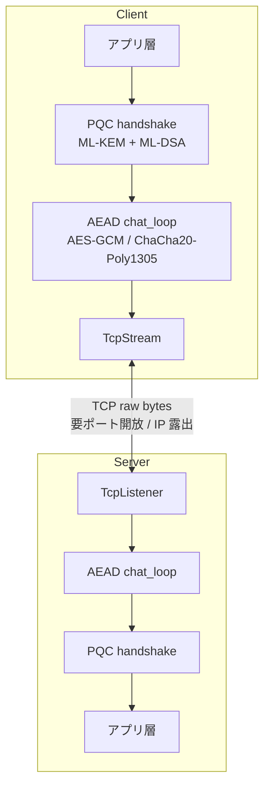
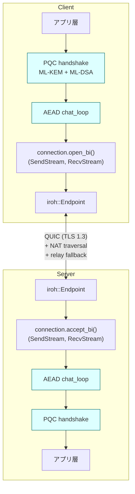

# Iroh 化実装プラン (nkCryptoTool-rust)

作成日: 2026-05-06
対象: `nkCryptoTool-rust` の `--chat --listen --connect` モード

---

## 背景と目的

現状の chat モード (`src/network.rs:96-742`) は **TCP 直接接続** ベース。

| 制約 | 影響 |
|---|---|
| NAT 越え不可 | 双方が同一 LAN もしくは片方がポート開放必須 |
| IP アドレス露出 | 接続時に対向の IP を知る必要がある |
| プライバシー欠如 | ISP/監視者から「誰と誰が通信したか」見える |
| モバイル/移動環境で破綻 | キャリア NAT 配下では事実上接続不能 |

**[Iroh](https://iroh.computer/)** に移行することで:

- NAT 越え自動 (HolePunch + STUN 相当)
- 直接接続失敗時の relay フォールバック (Iroh 公式 relay または自前)
- NodeId (= 公開鍵) ベースのアドレッシングで IP 非依存
- QUIC ベースなので multiplex / 0-RTT 再接続 / 輻輳制御を transport に委譲

PQC ハンドシェイク (`network.rs:159-483`, `run_connect:484-742`) と `chat_loop` (`network.rs:744-955`) の中身は **そのまま流用** できる。書き換わるのはトランスポート層だけ。

---

## アーキテクチャ

### 現状



### Iroh 化後



> 青枠 (PQC handshake / AEAD chat_loop) は既存ロジックをそのまま流用。書き換わるのは Endpoint と bi-stream 周りのみ。

**重要原則**: Iroh の TLS は古典暗号 (ed25519/X25519)。**PQC 層は TLS の上に積む** ことで、TLS が将来量子計算機で破られても PQC 層が残る。これは Signal PQXDH や WireGuard の PQ 拡張提案と同じ二層構造。

---

## TCP → Iroh 置換マップ

| 現状 | Iroh 化後 |
|---|---|
| `TcpListener::bind(addr).await` | `Endpoint::builder().alpns(vec![ALPN]).bind().await` |
| `listener.accept().await → TcpStream` | `endpoint.accept().await → Connecting → Connection → connection.accept_bi().await → (SendStream, RecvStream)` |
| `TcpStream::connect(addr).await` | `endpoint.connect(node_addr, ALPN).await → Connection → connection.open_bi().await` |
| `stream.into_split() → (rx, tx)` | bi-stream は最初から (RecvStream, SendStream) で分離済み |
| `--listen 0.0.0.0:8080` | `--listen` (引数なし) — NodeId と ticket を stdout |
| `--connect 192.168.1.5:8080` | `--connect <ticket>` |
| ポート開放必須 | 不要 (relay fallback) |

`AsyncReadExt` / `AsyncWriteExt` トレイトは Iroh の `RecvStream` / `SendStream` でも実装されているため、**`chat_loop` 内の `read_exact` / `write_all` 系は変更不要**。

---

## ticket フォーマット設計

接続情報 (NodeId + 接続候補アドレス + PQC 公開鍵指紋) を 1 行の文字列にエンコード。

### 構造

```
nkct1<base32(payload)>
```

`payload`:
```
version       : u8        (= 1)
node_id       : [u8; 32]  (Iroh NodeId = ed25519 pubkey)
relay_url_len : u16
relay_url     : [u8; N]
direct_addrs  : Vec<SocketAddr>  (length-prefixed)
pqc_fp_algo   : u8        (0=none, 1=ML-DSA-65, 2=ML-KEM-768, 3=both)
pqc_sign_fp   : [u8; 32]  (SHA3-256 of ML-DSA pubkey, 0埋めで省略可)
pqc_enc_fp    : [u8; 32]  (SHA3-256 of ML-KEM pubkey, 0埋めで省略可)
checksum      : [u8; 4]   (CRC32 over above)
```

**設計上のポイント**:

- `pqc_*_fp` を ticket に含めることで、ハンドシェイク中に提示される PQC 公開鍵を **発信時点で固定された指紋に対して検証** できる。これが MITM 防御の要。
- ticket は QR コード化前提 (`qr` クレートで base32 文字列をそのままエンコード)。
- `version` フィールドで将来の鍵アルゴリズム差し替え (ML-KEM-1024, SLH-DSA など) に備える。
- relay URL は省略可 (`relay_url_len=0`) → direct_addr のみで接続試行。

### CLI 表示例

```
$ nkCryptoTool --chat --listen --my-sign-key alice.priv.pem --my-enc-key alice.enc.pem
[nkct] Listening as NodeId: 7f3c...4a2e
[nkct] PQC fingerprint: ML-DSA=8a91...c2d4 ML-KEM=ee15...90b7
[nkct] Share this ticket with peer:

  nkct1abcdef0123456789...

[nkct] Or scan QR:
  ████ ▄▄▄▄▄ █▀█ █▄▀ ▄▄▄▄▄ ████
  ...
[nkct] Waiting for connection...
```

---

## 実装フェーズ

### Phase 1: PoC (target ~1 週)

**ゴール**: 既存 PQC ハンドシェイクと chat_loop を Iroh 上で動かす。ticket は最小限。

- [ ] `iroh = "0.91"` (or latest stable) を `Cargo.toml` に追加
- [ ] `src/network.rs` を `src/network_tcp.rs` にリネーム (退避)
- [ ] `src/network_iroh.rs` を新規作成
  - [ ] `Endpoint` の構築 (alpn = `b"nkct/chat/1"`)
  - [ ] `listen()` → `accept()` ループ → `connection.accept_bi()` → 既存 `handle_server_connection` の signature を `(SendStream, RecvStream)` 受け取りに調整
  - [ ] `connect()` → ticket parse → `endpoint.connect()` → `connection.open_bi()` → 既存 `run_connect` 流用
- [ ] `chat_loop` のシグネチャを `TcpStream` から `(SendStream, RecvStream)` に変更
- [ ] CLI に `--transport iroh|tcp` を追加 (default: `iroh`)
- [ ] 最低限の ticket: `<base32(NodeId)>` のみ。PQC 指紋は次フェーズ。
- [ ] LAN 内で 2 端末間の接続確認

**判断基準**: 既存の TCP 版テスト (`#[tokio::test]` の chat 系) が Iroh トランスポート上で全て pass する。

### Phase 2: ticket 完全版 (target ~3 日)

**ゴール**: PQC 公開鍵指紋を ticket に bundle、MITM 検知を有効化。

- [ ] `src/ticket.rs` 新規作成
  - [ ] `Ticket` 構造体定義 + serde + `Display`/`FromStr`
  - [ ] base32 エンコード (`data-encoding` クレート)
  - [ ] CRC32 検証
- [ ] `--listen` 時に PQC 公開鍵を読み込んで指紋を計算 (SHA3-256)
- [ ] `--connect <ticket>` 時に ticket から PQC 指紋を抽出
- [ ] PQC ハンドシェイク内で対向の公開鍵を受け取った瞬間、ticket の指紋と照合 (一致しなければ即切断)
- [ ] `qrcode` クレートで stdout に ASCII QR を表示

**判断基準**: ticket を改竄したら接続失敗。指紋不一致で接続失敗。

### Phase 3: NAT 越え検証 (target ~2 日)

**ゴール**: 異なる NAT 配下の 2 端末で接続成立を確認。

- [ ] Iroh 公式 relay (`use1-1.relay.iroh.network` など) で NAT 越え動作確認
- [ ] 自前 relay の建て方を SPEC.md に追記 (Iroh `iroh-relay` バイナリ運用)
- [ ] direct connection / hole-punch / relay 各経路でのレイテンシ測定
- [ ] 接続失敗時のエラーメッセージ整備 (どのフェーズで失敗したか分かるように)

**判断基準**: 自宅光回線の端末 ↔ モバイル回線の端末で接続成立。

### Phase 4: TCP モードを deprecated に (target ~1 日)

**ゴール**: デフォルト Iroh 化、TCP は legacy 扱い。

- [ ] `--transport tcp` 使用時に warning 表示
- [ ] README.md / SPEC.md 更新
- [ ] CHANGELOG に migration note 追加
- [ ] TCP 専用の単体テストは残す (回帰検知用)

---

## 互換性とロールバック

- TCP 版コード (`network_tcp.rs`) は **削除しない**。`--transport tcp` で従来通り動作。
- 設定ファイル `CryptoConfig` に `transport: TransportKind` を追加。`Default` は `Iroh`。
- `--listen-addr` / `--connect-addr` は `--transport tcp` 時のみ有効化 (Iroh モードでは ticket を使う)。

---

## セキュリティ考慮事項

### 維持される性質

- PQC ハンドシェイクとレイヤード AEAD はそのまま → **量子耐性は変化なし**
- `Zeroizing` バッファ (`network.rs:768, 793`) はトランスポート差し替えで影響なし
- Replay 検知 (`seen_nonces`) も同じ

### 新規に発生する考慮点

| 観点 | 内容 | 対策 |
|---|---|---|
| relay 信頼 | Iroh 公式 relay は通信のメタデータ (NodeId 同士の通信時刻) を観測可能 | 自前 relay 運用、または relay 経由を拒否するオプション (`--no-relay`) |
| NodeId と長期 PQC 鍵の binding | NodeId は ed25519 で古典脆弱、PQC 鍵は別管理 | ticket に PQC 指紋を含めて束縛、ハンドシェイク中に検証 |
| ticket の 1 回性 | ticket をログ等で再利用されると impersonation 余地 | ticket に有効期限 (`expiry: u64` UNIX time) を含めるオプション |
| direct_addr 露出 | ticket に IP アドレスが含まれる可能性 | relay-only モード (`--ticket-relay-only`) を提供 |
| ALPN 値の固定 | `b"nkct/chat/1"` を予約 | バージョン上げ時は `nkct/chat/2` に。同一 endpoint で複数 ALPN 受け付け可能。 |

### 削除されるリスク

- IP アドレス露出 (NodeId ベース)
- ポート開放によるアタックサーフェス拡大

---

## 影響を受けるファイル一覧

| ファイル | 変更内容 |
|---|---|
| `Cargo.toml` | `iroh`, `data-encoding`, `qrcode` 追加 |
| `src/main.rs` | CLI 引数追加 (`--transport`, `--ticket-relay-only` etc.)、listen/connect の分岐 |
| `src/config.rs` | `TransportKind` 追加、`listen_addr`/`connect_addr` を `Option` のまま維持 |
| `src/network.rs` → `src/network_tcp.rs` | リネーム、内容変更なし |
| `src/network_iroh.rs` | 新規 (Phase 1) |
| `src/network/mod.rs` | (新規) ファサード、transport 種別で振り分け |
| `src/ticket.rs` | 新規 (Phase 2) |
| `tests/` | Iroh トランスポートでの結合テスト追加 |
| `SPEC.md` | ticket フォーマット仕様、ALPN 仕様追記 |
| `README.md` | 使い方更新 |

---

## 未決事項 (要議論)

1. **Iroh のバージョンピン**: API 安定度を見て `0.91` 系か `1.0` リリース待ちかを決定。
2. **公式 relay 依存の許容度**: デフォルトで Iroh 公式 relay に乗るのは可か、初手から自前 relay 必須か。
3. **ticket の URL 化**: `nkct1...` 形式とは別に `nkct://...` URL スキームを提供するか (OS のリンクハンドラ統合用)。
4. **discovery**: Iroh の DNS-based discovery / mDNS を使うか、ticket 直渡しに限るか。"高秘匿" を主張するなら discovery 全 OFF が筋。
5. **Forward Secrecy**: 現状の PQC ハンドシェイクは static 長期鍵ベースなので、Iroh 化と独立して **ephemeral KEM 鍵 + ratcheting** を別途設計する必要あり。これは別 issue。

---

## 関連

- `issue/nk_chat_app/REVIEW_2026-05-06.md` — 試作 Flutter 版のレビュー。Supabase 依存の根本問題を指摘しており、本プランがその解の一つ。
- `THREAT_ANALYSIS_NN.md` — 既存の脅威分析サイクル。Iroh 化後に新規スコープで分析が必要。
